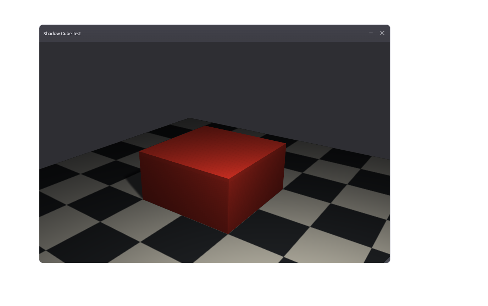
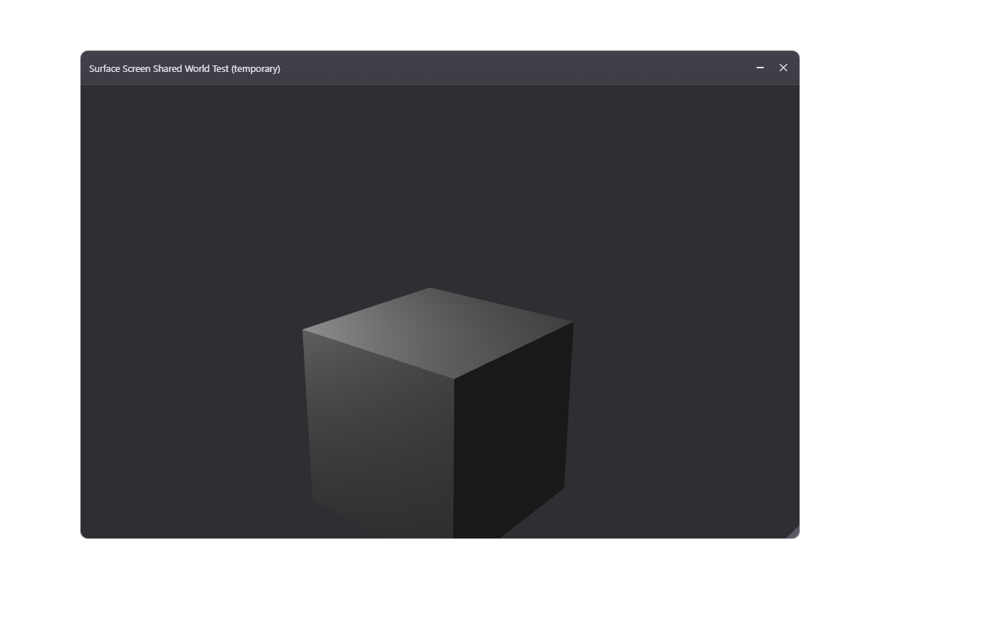
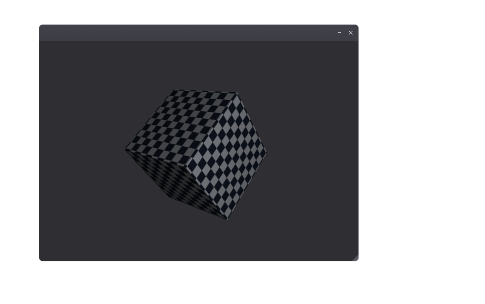
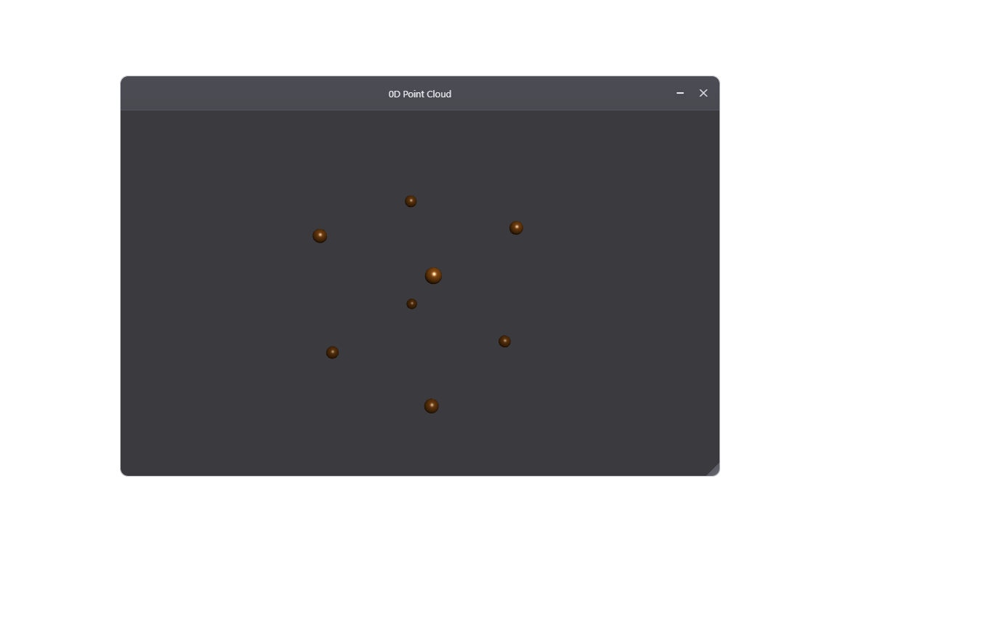
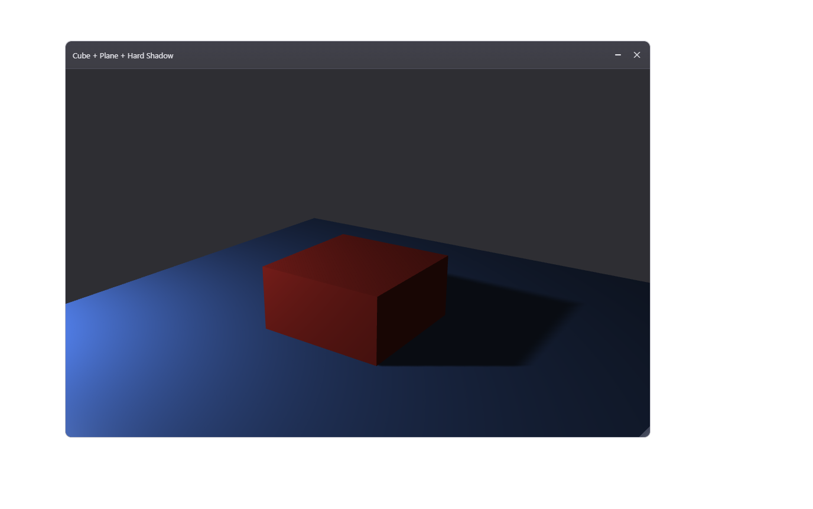
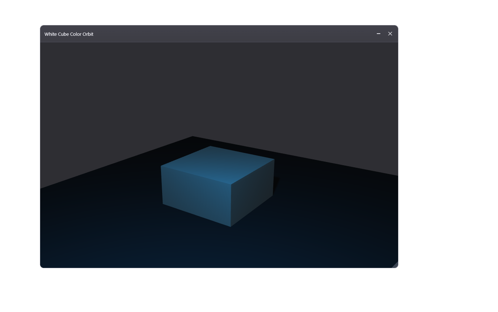

# Vektor Flow

Vektor Flow is a small computational language for shaping data, defining
geometry, and driving interactive visual programs. It is built around a few
ideas that repeat everywhere:

- `:` binds names and builds scopes.
- Blocks return their last row.
- `[]` are vectors, `()` are tuples or structs, `{}` are multisets.
- `>>` pipes values through `$`.
- `::` prints.
- UI geometry is authored in `.vkf` and rendered by the native/WebGPU runtime.

File extension: `.vkf`.

## First Look

```vkf
name: "Ada"
score: 41

message:
    next: score + 1
    "Hello $name, next score is $next"

:: message
```

This prints:

```text
Hello Ada, next score is 42
```

Read this as:

- `name: "Ada"` binds a value.
- `message:` opens a scope.
- The scope returns its last row.
- `$name` and `$next` interpolate values into a string.
- `:: message` prints the value.

## Install And Run

Install from this repository:

```bash
git submodule update --init --recursive
pip install -e .[dev]
```

Run a file:

```bash
vkf examples/hello.vkf
```

Run a short snippet:

```powershell
vkf -e ':: "hello, world"'
vkf -e '..5 >> :: $^2'
```

Use single quotes around inline snippets in PowerShell when the snippet contains
`$`. Double quotes let PowerShell expand `$...` before `vkf` receives the code.

```powershell
vkf -e "..5 >> :: $^2"   # Wrong in PowerShell: `$^2` is expanded by the shell.
vkf -e '..5 >> :: $^2'   # Right: VKF receives `$^2`.
```

`;` separates statements on one line at the current indentation level. These
two snippets mean the same thing:

```vkf
a: 3
:: a
```

```vkf
a: 3; :: a
```

That also works inside blocks:

```vkf
name:
    first: "Viktor"; last: "Jonsson"
    first & " " & last
```

If the snippet is getting longer, put it in a `.vkf` file instead of fighting
shell quoting.

Useful commands:

```bash
vkf examples/language_features.vkf
vkf tokens examples/language_features.vkf --json
vkf package-runtime examples/ui_face_edge_vertex_drag.vkf --with-overlay
```

On Windows, interactive UI examples use the native overlay executable. Build it
when needed:

```powershell
git submodule update --init --recursive
.\scripts\build-vf-overlay.ps1
```

## The Core Mental Model

### Bind With `:`

`:` means "put the value on the right into the name on the left".

```vkf
x: 3
y: 4
:: x + y
```

`=` is equality, not assignment:

```vkf
:: (x = 3)     # true
:: (x = y)     # false
```

### Blocks Return Their Last Row

Any indented block evaluates to its last row.

```vkf
total:
    a: 10
    b: 20
    a + b

:: total       # 30
```

Use `@:` for an early return with a value.

```vkf
classify(n):
    n < 0? @: "negative"
    n = 0? @: "zero"
    @: "positive"

:: classify(-2)
```

Think of `@` as the return channel:

- `@` returns `null`.
- `@: value` returns `value`.
- `@:` with no value returns the current local scope.

That last form follows the same rule as a lone `:`: when the right side is
missing, `:` means "the current local scope as a value".

```vkf
make_point(x, y):
    x: x
    y: y
    @:
```

If you want a block to act as a namespace/struct without returning early, make
the final row a lone `:`.

```vkf
geometry:
    points: [[0, 0], [1, 0], [1, 1]]
    color: [1, 0, 0, 1]
    :

:: geometry.points
```

### Print With `::`

```vkf
:: "hello"
:: (2 + 3)
```

`::` is a print effect. It returns `null`, so a function whose last row is a
print also returns `null`.

```vkf
print_square(x):
    :: x * x

print_square(5)
```

Return a value with `@:` or by making the value the last row.

```vkf
square(x):
    @: x * x
```

### Comments Use `#`

```vkf
# This is a comment.
answer: 42
```

## Values

### Numbers, Strings, Booleans, Null

```vkf
n: 42
pi: 3.1415
name: "Ada"
ready: true
missing: null
```

Double-quoted strings support interpolation:

```vkf
x: 4.2345
:: "x rounded is $x.2f"    # x rounded is 4.23
```

Use `$(...)` when the expression is more than a simple name or field access.

```vkf
a: 2
b: 3
:: "sum=$(a + b)"
```

### Tuples

Tuples are positional values.

```vkf
point: (3, 4)
:: point.0       # 3
:: point.1       # 4
:: point.(0)     # 3, same as point.0
```

Use tuples for fixed positional bundles.

### Structs

Structs are named records.

```vkf
point: (x: 3, y: 4)
:: point.x
:: point.y
```

Struct updates create a new value for that binding.

```vkf
point.z: 5
:: point
```

This means `point.z: 5` rebinds `point` to a new struct with the added or
updated field. As a file or multiline snippet, this works:

```vkf
point: (x: 3, y: 4)
point.z: 5
:: point
```

### Vectors

Vectors use square brackets.

```vkf
values: [1, 2, 3, 4]
:: values.(2)      # 3
```

Finite ranges can build vectors:

```vkf
numbers: [1..5]
:: numbers         # [1, 2, 3, 4, 5]
```

`..n` starts at zero:

```vkf
zero_to_three: [..3]
```

### Axis Tags And Tensor-Style Operations

Attach named axes to vectors with `-> axis`. Matching axis names align; missing
axes broadcast. This makes elementwise math feel close to Einstein notation.

```vkf
a: [1, 2] -> i
b: [10, 20] -> j

outer: a * b
:: outer.idx      # ij
:: outer.(0).(1)  # 20
```

Shared axes multiply elementwise along that axis and broadcast across the rest.

```vkf
matrix: [[1, 2], [3, 4]] -> ij
scale: [10, 20] -> j

scaled: matrix * scale
:: scaled         # ((10, 40), (30, 80))
```

### Multisets

Multisets use `{value: count}` and store multiplicities.

```vkf
a: {1: 2, 2: 1}
b: {1: 1, 3: 1}

:: (a + b)         # union by counts
:: (a - b)         # subtract counts, clamped at zero
:: (a // b)        # floor-divide counts for matching keys
:: (a % b)         # remainder of counts for matching keys
```

Multiset keys are sorted by the language ordering for the key type.

## Functions

A function is a named definition with parameters. It can use an indented block
or stay on one line after the `:`.

```vkf
square(x):
    @: x * x

:: square(7)
```

Single-line functions are valid for short bodies:

```vkf
square(x): x^2
:: square(7)
```

Because function bodies return their last row, short functions can omit `@:`.

```vkf
distance2(x, y):
    x*x + y*y

:: distance2(3, 4)
```

That also means this single-line form is equivalent:

```vkf
distance2(x, y): x*x + y*y
:: distance2(3, 4)
```

### Function Docstrings

A function can start with a string row. The VS Code extension uses that string
with the function signature for hover information.

```vkf
area(width:num, height:num):
    """Return rectangle area."""
    width * height
```

Multiline docstrings use the same style:

```vkf
normalize(v):
    """
    Return v scaled to unit length.
    Expects a non-zero vector.
    """
    v / |v|
```

### Type Annotations

Type annotations sit beside parameters.

```vkf
add(a:num, b:num):
    a + b
```

Type-shaped structs define reusable interfaces.

```vkf
Point: (x:num, y:num)

length2(p:Point):
    p.x*p.x + p.y*p.y
```

### Compile-Time Number Parameters

Shape names inside types are compile-time number parameters. They are inferred
from the arguments, not passed as runtime values.

```vkf
join(x:[num:n], y:[num:m]) -> [num:n+m]:
    x & y

[num:2] a: [1, 2]
[num:3] b: [3, 4, 5]

:: join(a, b)     # [1, 2, 3, 4, 5]
```

Here `n` and `m` resolve at compile time from `a` and `b`. The native backend
emits a C++ template over those sizes, so the return shape `[num:n+m]` becomes a
fixed vector shape for each call.

You can use size expressions in nested records too.

```vkf
State: (left:[num:n], right:[num:m])

push_right(state:State, extra:[num:k]) -> (left:[num:n], right:[num:m+k]):
    (left: state.left, right: state.right & extra)
```

### Varargs And Argument Spread

Argument lists have three special forms:

- `:expr` spreads one value into a call.
- `...name` captures extra positional arguments in a function definition.
- `:::name` captures extra named arguments in a function definition.

### Call-Site Spread With `:expr`

A leading `:` inside a call pours a tuple, vector, list, queue, struct, or map
into the function arguments.

```vkf
volume(x, y, z):
    x * y * z

args: [2, 3, 4]
:: volume(:args)     # 24
```

Records spill by parameter name.

```vkf
point_sum(x, y):
    x + y

point: (y:4, x:3)
:: point_sum(:point) # 7
```

You can combine positional and named spreads in one call:

```vkf
f(x, y, z=0): x*100 + y*10 + z
extra: (y:4, z:5)
:: f(:[1], :extra)   # 145
```

Structs and maps spread by parameter name. Tuples, vectors, lists, and queues
spread positionally.

After named arguments or named spreads begin, later positional arguments are not
allowed.

### Definition-Side Capture With `...name` And `:::name`

Function definitions can also capture leftover arguments.

`...name` collects extra positional arguments into a vector:

```vkf
show(x, ...rest):
    :: x
    :: rest

show(1, 2, 3, 4)
```

`:::name` collects extra named arguments into a struct/map-like value:

```vkf
show(x, :::named):
    :: named.flag
    :: named.mode

show(1, flag:true, mode:"fast")
```

You can use both together, with fixed parameters first:

```vkf
f(num x, num y=4, ...rest:num, :::named:any):
    ::: x
    ::: y
    ::: rest.length()
    ::: named.flag

f(1, 2, 3, 4, flag:true)
```

Rules:

- Fixed parameters come first.
- At most one `...name` capture is allowed.
- At most one `:::name` capture is allowed.
- `...name` must appear before `:::name`.

### Core Types And Type Reflection

Core scalar types are `num`, `int`, `str`, `bool`, and `null`. Containers add
shape:

```vkf
Point: (x:num, y:num)
Pair: (num, num)
Nums: [num:3]
Bag: {str}
```

A loose dot with no member asks for the type of a value.

```vkf
point: (x:3, y:4)

:: point.       # (x:num, y:num)
:: [1, 2, 3].   # [num:3]
```

You can spill a type's members into different containers.

```vkf
point: (x:3, y:4)

:: (:point.)    # (x:num, y:num)  key -> type struct
:: [:point.]    # [num, num]      member types
:: {:point.}    # {x:1, y:1}     member keys
```

## Control Flow

### If With `?`

```vkf
label(n):
    n < 0? @: "negative"
    n = 0? @: "zero"
    @: "positive"
```

Indented conditional bodies are allowed:

```vkf
x > 10?
    :: "large"
    :: "small"
```

### Switch With `??` And `=>`

Use switch form when dispatching on a value.

```vkf
kind: "edge"
color: "gray"

kind??
    "face" => color: "red"
    "edge" => color: "green"
    "vertex" => color: "blue"

:: color
```

UI event loops use the same idea:

```vkf
time: .time

(e: events.get())??>
    ui.MouseMove =>
        handle_move(e)
    ui.MouseDown =>
        handle_down(e)
    time.sleep(0.005)
```

## Pipes And `$`

`>>` evaluates the right side once for each element on the left. `$` is the
current element.

```vkf
squares: [1..5] >> $ * $
:: squares
```

Command-line demo:

```powershell
vkf -e '..5 >> :: $^2'
```

Output:

```text
0
1
4
9
16
25
```

Pipes preserve the container kind where possible.

```vkf
tuple_squares: (1..5) >> $ * $
vector_squares: [1..5] >> $ * $
```

Use functions inside pipes:

```vkf
square(x): x*x

:: [1..5] >> square($)
```

`..3 >> expr` is a compact loop from `0` through `3`.

```vkf
:: ..3 >> "index=$"
```

## Operators

Arithmetic:

```vkf
1 + 2
5 - 3
4 * 7
8 / 2
2 ^ 8
```

Logic:

```vkf
true /\ false     # and
true \/ false     # or
true >< false     # xor
~true             # not
```

Concatenation uses `&`.

```vkf
:: "hello " & "world"
:: [1, 2] & [3, 4]
:: (a: 1) & (b: 2)
```

Absolute value and vector norm use bars:

```vkf
:: |-3|
:: |[3, 4]|
```

### Operator Overloads

Operators can be defined for your own types.

```vkf
Point: (x:num, y:num)

+(a:Point, b:Point):
    (x: a.x + b.x, y: a.y + b.y)

p: (x: 1, y: 2)
q: (x: 3, y: 4)
:: (p + q)
```

Custom print display overloads the `::` operator.

```vkf
::(value: Point):
    :: "Point($value.x, $value.y)"

:: p
```

## Modules And Scope

Import a module into a namespace:

```vkf
math: .math
:: math.sqrt(9)
```

Pour a module into the current scope with `:.module`.

```vkf
:.math
:: sqrt(9)
```

The same pour idea works for structs.

```vkf
point: (x: 3, y: 4)
:point
:: x + y
```

Files and folders are modules too. If `lib/helpers.vkf` exists:

```vkf
helpers: .lib.helpers
:: helpers.some_function()
```

Public names are exported. Names beginning with `_` are private by convention.

## Standard Library

Stdlib modules are explicit. Bind them to a namespace with `name: .module`, or
pour them into scope with `:.module`.

```vkf
math: .math
time: .time
stat: .stat

:: math.sqrt(81)
time.sleep(0.01)
:: stat.mean([1, 2, 3])
```

Current public modules:

- `math`: constants and scalar math such as `pi`, `tau`, `sin`, `cos`, `sqrt`, `log`.
- `stat`: sequence statistics such as `mean`, `median`, `std`, `variance`, `percentile`, `normalize`, `zscore`.
- `time`: timing surface; use `time.sleep(seconds)`, `time.current_time()`, `time.time_stamp()`.
- `io`: file IO: `read_text`, `write_text`, `read_bytes`, `write_bytes`, `read_numbers`.
- `collections`: mutable runtime containers: `map`, `list`, `queue`.
- `capture`: regex helpers: `regex`, `groups`.
- `errors`: catchable error types such as `ParseError`, `EvalError`, `TypeError`.
- `ui`: interactive display namespace. `sleep` is not in `ui`; import `time` for delays.

## UI And Scene Runtime

Vektor Flow's `ui` surface is now more than a widget API. It is a scene and
display runtime for interactive 2D/3D work, with cameras, lights, shadows,
textures, mirrors, screens, event routing, overlay chrome, and packaging for a
native host.

You can author UI in two connected styles:

- A display API around `ui.display`, `ui.Frame`, and helpers such as
  `add_box`, `add_camera`, and `add_light`.
- A deeper `native_scene` packet shape for advanced renderer features such as
  planar mirrors, projected lights, timing-driven animation, and explicit scene
  entities.

### Quick Start

Run a current 3D example:

```bash
vkf examples/ui_scene_3d.vkf
```

Package a native overlay bundle:

```bash
vkf package-runtime examples/ui_face_edge_vertex_drag.vkf --with-overlay
```

Good entry points today:

- `examples/ui_scene_3d.vkf`: compact 3D hero scene with lighting and shadows.
- `examples/ui_shadow_cube_test.vkf`: focused light and shadow setup.
- `examples/ui_readme_mirror_showcase.vkf`: mirror showcase with reflected solids, impostors, and textured geometry.
- `examples/ui_face_edge_vertex_drag.vkf`: interactive topology editing.
- `examples/ui_surface_screen_shared_world_test.vkf`: screen-in-world rendering.

### Authoring Layers

The UI stack is easiest to understand as three layers:

1. VKF authoring code describes geometry, scene entities, frames, and event
   behavior.
2. The runtime turns that into scene and display payloads.
3. The browser/native renderer owns drawing, picking, frame chrome, and GPU
   execution.

For topology-driven interactive scenes, a good mental model is:

- `styles:` defines colors, widths, scales, alpha, and visual policy.
- `reps:` defines how topology becomes renderable geometry.
- `geometry:` defines points, simplices, surfaces, and source data.
- `views:` derives render state from geometry and interaction state.
- `targets:` defines what is hittable.
- `motion:` applies updates from events and runtime state.

That layout is still a strong default for editable geometry scenes such as
`examples/ui_face_edge_vertex_drag.vkf`.

### Display API

The smaller `ui.display` API is still the easiest way to build direct scenes.

```vkf
ui:.ui

d: ui.display
f: d.Frame()
d.add_frame(f, (0.1, 0.1, 0.6, 0.7))

box: d.add_box(center: [0,0,0], scale: [1,2,3], color: "red")
cam: d.add_camera(pos: [4,3,5], target: [0,0,0], fov: 45)
light: d.add_light(pos: [6,8,6], model: "blinn_phong", color: "white")
```

This surface is good for direct scene construction, mutation, and small focused
examples.

### Native Scene Packets

The richer renderer surface is expressed through `native_scene`. That is where
shadows, mirrors, timing, advanced lights, textures, and renderer-specific
entities show up most clearly.

```vkf
ui:.ui
ui.set_mode("overlay")

native_scene: (
    kind: "scene_3d",
    frame_id: "shadow_cube_test_frame",
    title: "Shadow Cube Test",
    rect: [0.08, 0.08, 0.72, 0.78],
    cube: (
        center: [0.0, 0.0, 1.0],
        size: 2.0,
        face_color: [0.92, 0.22, 0.18, 1.0]
    ),
    camera: (
        pos: [3.8, -5.2, 3.4],
        target: [0.0, 0.0, 0.9],
        fov: 34.0,
        up: [0.0, 0.0, 1.0]
    )
)
```

Use this style when you want to describe the renderer's world directly instead
of constructing it piece by piece through higher-level helpers.

### Cameras And Views

Cameras define pose, target, field of view, and up-vector. Scenes may also
carry timing-driven camera motion, multiple dependent views, and offscreen view
rendering that is later reused by mirrors or screens.

When explicit view or projection matrices are provided, they are the authority.
Derived camera helpers like `pos`, `target`, `fov`, and `orbit_step_deg` are
the ergonomic surface, but matrix-based paths are the escape hatch for exact
control.

### Lights

Current scenes already use several lighting ideas:

- Point lights for direct scene lighting.
- Spot/projected-light style setups for directed illumination.
- Light markers/flares to make light sources visible as scene actors.
- Real and virtual light relationships, including reflected/projected cases.

The most common shading model in examples is `blinn_phong`, which is enough to
show depth, gloss, and directional response in current scenes.

### Shadows

The runtime supports shadow-enabled lights and explicit shadow configuration.
Scenes can opt into shadow receivers, choose shadow color/lift, and use light
settings such as source radius/spread to shape the result.

Representative example:

- `examples/ui_shadow_cube_test.vkf`

<!-- readme-asset: ui-shadow-cube -->

*`examples/ui_shadow_cube_test.vkf` — cube, floor receiver, light marker, and visible cast shadow.*

### Mirrors, Reflections, And Screens

Mirrors are part of the scene system, not a fake post-effect. The current
surface already includes:

- Planar mirror-style surfaces.
- Screen surfaces that render another view into geometry.
- Reflected cameras derived from a source camera.
- Virtual/projected lights linked to reflected geometry.
- Aperture-style control for where the reflected/projection view is valid.

Representative examples:

- `examples/ui_readme_mirror_showcase.vkf`
- `examples/ui_floor_mirror_test.vkf`
- `examples/ui_surface_screen_shared_world_test.vkf`

<!-- readme-asset: ui-surface-mirror-demo -->

*`examples/ui_readme_mirror_showcase.vkf` — planar mirror scene with textured solids, proxy geometry, and marker impostors.*

<!-- readme-asset: ui-surface-screen-shared-world -->

*`examples/ui_surface_screen_shared_world_test.vkf` — embedded screen surface rendering another scene view into world geometry.*

### Textures And Materials

Meshes and scene entities can be plain-colored or texture-backed. Existing
examples already use procedural/material-like descriptors such as:

- `checker`
- `stripes`
- `dice`

This lets a short scene communicate much more than flat face color alone.

Representative examples:

- `examples/lit_box_texture.vkf`
- `examples/ui_readme_mirror_showcase.vkf`

<!-- readme-asset: lit-box-texture -->

*`examples/lit_box_texture.vkf` — minimal lit textured box scene for materials and procedural textures.*

### Impostors, Proxy Geometry, And Overlay Expansion

The renderer also supports display modes that are not just raw triangle meshes.
Examples in the repo already use:

- Marker impostors for point/line style rendering.
- Proxy geometry expansion for rounded or thicker visual forms.
- Pixel-space and world-space sizing policies.
- Overlay counts and expansion behavior for 0D/1D scene elements.

This is important because a large part of the current UI surface is about
controlling how abstract scene primitives become readable rendered objects.

Representative source:

- `examples/ui_field_mesh_0d_point_cloud.vkf`
- `examples/ui_floor_mirror_test.vkf` for a larger stress/demo version

<!-- readme-asset: ui-field-mesh-0d-point-cloud -->

*`examples/ui_field_mesh_0d_point_cloud.vkf` — point-style marker rendering inside the scene/runtime stack.*

### Frames, Overlay Chrome, And Interaction

`ui.Frame` still matters. Frames carry the application-facing window model:

- draggable / dockable / resizable panels
- alpha / title / close behavior
- overlay-style placement on the display
- event routing through `ui.events`

The display system is therefore both a renderer and a frame host. Scene content
can live inside movable overlay panels instead of a single monolithic canvas.

### Runtime And Display Model

At runtime, the system separates scene truth from display payloads. The host and
renderer consume scene/display data, runtime packets, and session files such as
`vf-display.json`.

The current system already supports:

- packet-style updates such as display replacement
- browser and native overlay hosts
- staged UI sessions
- event ingress from host to VKF code
- shared-world/offscreen view reuse

This split is why the same authored scene can be inspected in tests, served in a
browser harness, or packaged for the native overlay host.

### Packaging And Host Modes

The current execution tracks are:

- Python interpreter as the broad language reference.
- Native/bundled UI runtime as the packaging target.

Native UI bundles package the overlay runtime, scene program, runtime packets,
and shared geometry/runtime assets.

```bash
vkf package-runtime examples/ui_face_edge_vertex_drag.vkf --with-overlay
```

The produced runtime is intended to run without Python after packaging.

The architecture is split into three systems:

- `transparent-overlay`: minimal C++/Win32/WebView2 transparent overlay host.
- `overlay-ui-engine`: language-neutral graphics, widgets, WebGPU, picking,
  ledgers, and runtime protocol.
- `vektor-flow`: VKF language, compiler, stdlib, and UI adapter layer.

During migration this repo imports `transparent-overlay` at
`native/VfOverlay` and `overlay-ui-engine` at `web/vf-ui` as Git submodules.
The host should not own widgets or geometry, the UI engine should not know VKF
syntax, and VKF should not carry the native overlay implementation.

See `docs/adr/0002-split-overlay-host-ui-engine-vkf-plugin.md` for the recorded
decision.

### Examples By Capability

- Basic 3D scene: `examples/ui_scene_3d.vkf`
- Direct display API: `examples/lit_box.vkf`
- Textures/materials: `examples/lit_box_texture.vkf`
- Shadows: `examples/ui_shadow_cube_test.vkf`
- Mirrors/reflections: `examples/ui_readme_mirror_showcase.vkf`
- Screen-in-world rendering: `examples/ui_surface_screen_shared_world_test.vkf`
- Interactive topology editing: `examples/ui_face_edge_vertex_drag.vkf`
- Point cloud / marker-style rendering: `examples/ui_field_mesh_0d_point_cloud.vkf`
- Animated orbit scene: `examples/ui_cube_white_color_orbit.vkf`
- Larger integration/stress mirror demo: `examples/ui_floor_mirror_test.vkf`

### Screenshots

The README should eventually show rendered scenes, not just code. Planned image
slots:

<!-- readme-asset: ui-scene-3d-hero -->

*`examples/ui_scene_3d.vkf` — compact 3D scene with two moving lights and cast shadows.*

<!-- readme-asset: ui-shadow-cube-gallery -->

*`examples/ui_shadow_cube_test.vkf` — focused shadow scene with floor receiver and visible light marker.*

<!-- readme-asset: ui-mirror-gallery -->

*`examples/ui_readme_mirror_showcase.vkf` — mirror showcase with textured solids, reflected geometry, and impostor accents.*

<!-- readme-asset: ui-screen-gallery -->

*`examples/ui_surface_screen_shared_world_test.vkf` — screen-in-world rendering on scene geometry.*

<!-- readme-asset: ui-impostor-gallery -->

*`examples/ui_field_mesh_0d_point_cloud.vkf` — marker-style point rendering inside a UI frame.*

### Animations

Later we should also capture short GIF/MP4 loops for:

- light orbit / color animation
- camera orbit
- mirror behavior under motion
- topology editing
- point/impostor rendering in motion

<!-- readme-asset: ui-cube-white-color-orbit-animation -->

*Representative still from `examples/ui_cube_white_color_orbit.vkf`. This slot can later be upgraded to GIF/MP4 generation.*

### README Asset Workflow

README scene assets can now be regenerated with:

```powershell
python scripts/render_readme_ui_assets.py
```

The workflow is:

1. Keep language-only snippets executable as text examples.
2. Prefer full `.vkf` example files for scene screenshots.
3. Mark screenshot targets with stable README asset comments such as
   `readme-asset: ui-scene-3d-hero`.
4. Resolve those examples through the existing scene/display extraction path.
5. Stage capture sessions into the built overlay web runtime.
6. Capture PNGs with the Edge/CDP scene harness after scene readiness.
7. Write assets into a README-owned docs image folder and replace these
   placeholders with real images.

## VS Code

The `vscode/` folder contains the Vektor Flow extension.

Features:

- Syntax highlighting for `.vkf`.
- Run command for the current file.
- Function hover with signature and docstring.

Install it from VS Code with:

```text
Developer: Install Extension from Location...
```

Select the `vscode` folder in this repository.

## Useful Examples

```text
examples/hello.vkf
examples/language_features.vkf
examples/native_scene_probe.vkf
examples/ui_event_probe.vkf
examples/ui_face_edge_vertex_drag.vkf
```

Start with `examples/language_features.vkf` if you want a non-UI tour with lots
of printed output. Start with `examples/ui_face_edge_vertex_drag.vkf` if you
want the current interactive geometry model.

## Status

The language and runtime are still moving quickly. The most stable way to learn
the current surface is:

1. Read this README top to bottom.
2. Run `examples/language_features.vkf`.
3. Inspect `examples/ui_face_edge_vertex_drag.vkf`.
4. Use tests as executable documentation when behavior is unclear.
