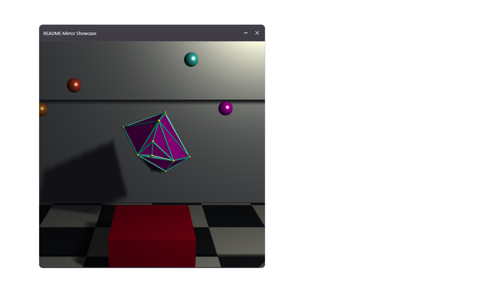

# Vektor Flow

Vektor Flow is a functional, scope-based language for shaping data, describing
geometry, and driving interactive visual programs. The important thing is not
just the syntax. The important thing is the model:

- values are the default
- scopes are first-class
- functions return values or scopes
- "constructors" are just functions returning scopes
- extension happens by spill plus override, not by classes
- plain language values are immutable, but names can be rebound
- runtime resources such as UI buffers or shared memory may still be mutable

That gives VKF a compact surface without making it vague. Most of the language
falls out of a few principles.

## Core Principles

### 1. Bindings Build Scope

`:` does more than assignment-style naming. It is the main way values and local
scope are built.

- `name: value` binds a value
- `name:` opens a scope-producing block
- later rows can reuse earlier names in that scope

### 2. Blocks Are Expressions

A block returns its last row unless it returns early with `@:`. That means you
can build intermediate structure without leaving expression-oriented code.

### 3. Values Are Immutable

Structs, vectors, tuples, and multisets should be read as values.

- `point.z: 5` means "make a new point and rebind `point`"
- `v.0: 4` means "make a new vector and rebind `v`"
- rebinding one name does not mutate another alias

The runtime is still free to optimize this with structural sharing, copy-on-
write, or lowered mutable buffers under the hood.

### 4. Qualified Names Escape Shadowing

Inside a function, calling its own name means recursion. If you want the
library version instead, qualify it.

- `sin(x): sin(x - 1)` is recursion
- `sin(x): .math.sin(x)` explicitly calls the math module

### 5. UI Is Not A Separate DSL

The same language that builds vectors, structs, and functions also builds
frames, widgets, geometry, and renderer packets. UI is a library surface, not a
different language bolted on the side.

File extension: `.vkf`.

## First Look

```vkf
name: "Ada"
score: 41

message:
    next: score + 1
    "Hello $name, next score is $next"

:: message
```

This prints:

```text
Hello Ada, next score is 42
```

Read this as:

- `name: "Ada"` binds a value.
- `message:` opens a scope.
- The scope returns its last row.
- `$name` and `$next` interpolate values into a string.
- `:: message` prints the value.

## Install And Run

Install from this repository:

```bash
git submodule update --init --recursive
pip install -e .[dev]
```

Run a file:

```bash
vkf examples/01_hello.vkf
```

Run a short snippet:

```powershell
vkf -e ':: "hello, world"'
vkf -e '..5 >> :: $^2'
```

Use single quotes around inline snippets in PowerShell when the snippet contains
`$`. Double quotes let PowerShell expand `$...` before `vkf` receives the code.

```powershell
vkf -e "..5 >> :: $^2"   # Wrong in PowerShell: `$^2` is expanded by the shell.
vkf -e '..5 >> :: $^2'   # Right: VKF receives `$^2`.
```

`;` separates statements on one line at the current indentation level. These
two snippets mean the same thing:

```vkf
a: 3
:: a
```

```vkf
a: 3; :: a
```

That also works inside blocks:

```vkf
name:
    first: "Viktor"; last: "Jonsson"
    first & " " & last
```

If the snippet is getting longer, put it in a `.vkf` file instead of fighting
shell quoting.

Useful commands:

```bash
vkf examples/01_hello.vkf
vkf examples/23_spill_and_override.vkf
vkf examples/100_axis_4_panel.vkf
```

### Example Policy

The repo should separate two kinds of examples:

- curated hand-maintained examples in `examples/`
- README-driven generated examples in `examples/generated/readme/`

If a README example is meant to live as a file, the README should be the source
of truth. That means:

- the README block must be a complete runnable `.vkf` module
- the file should be generated from the README, not maintained separately
- partial snippets can stay in the README, but they should not pretend to be
  standalone examples

The intended workflow is:

```bash
python scripts/generate_readme_examples.py
```

That script extracts README blocks explicitly marked as runnable examples and
writes them into `examples/generated/readme/`.

### Learning Path

The examples are intended to be read from low level to high level.

Language foundations:

- `examples/01_hello.vkf`
- `examples/02_bindings.vkf`
- `examples/03_blocks_return_last.vkf`
- `examples/04_early_return.vkf`
- `examples/05_comments_and_semicolons.vkf`

Core values:

- `examples/10_scalars.vkf`
- `examples/11_strings_and_interpolation.vkf`
- `examples/12_tuples.vkf`
- `examples/13_structs.vkf`
- `examples/14_vectors.vkf`
- `examples/15_ranges.vkf`
- `examples/16_multisets.vkf`

Immutability and rebinding:

- `examples/20_struct_field_rebind.vkf`
- `examples/21_vector_index_rebind.vkf`
- `examples/22_alias_rebinding.vkf`
- `examples/23_spill_and_override.vkf`
- `examples/24_immutable_values_mutable_resources.vkf`

Functions and signatures:

- `examples/30_functions_basic.vkf`
- `examples/31_single_line_functions.vkf`
- `examples/32_recursion.vkf`
- `examples/33_docstrings.vkf`
- `examples/34_typed_parameters.vkf`
- `examples/40_default_args.vkf`
- `examples/41_named_args.vkf`
- `examples/42_call_spread_vector.vkf`
- `examples/43_call_spread_struct.vkf`
- `examples/44_variadic_positional.vkf`
- `examples/45_variadic_named.vkf`

Types, flow, and modules:

- `examples/50_struct_types.vkf`
- `examples/51_vector_shape_types.vkf`
- `examples/52_compile_time_shape_params.vkf`
- `examples/53_type_reflection.vkf`
- `examples/60_if.vkf`
- `examples/61_switch.vkf`
- `examples/62_pipes.vkf`
- `examples/63_pipe_with_functions.vkf`
- `examples/64_axis_tags_and_broadcast.vkf`
- `examples/70_arithmetic.vkf`
- `examples/71_logic.vkf`
- `examples/72_concat.vkf`
- `examples/73_norm_and_abs.vkf`
- `examples/74_operator_overload.vkf`
- `examples/75_print_overload.vkf`
- `examples/80_module_import.vkf`
- `examples/81_scope_spill.vkf`
- `examples/82_qualified_call_avoids_recursion.vkf`
- `examples/83_file_module.vkf`
- `examples/90_runtime_resources.vkf`
- `examples/91_shared_buffer_pattern.vkf`

UI showcases:

- `examples/100_axis_4_panel.vkf`
- `examples/110_mirror_showcase.vkf`

On Windows, interactive UI examples use the native overlay executable. Build it
when needed:

```powershell
git submodule update --init --recursive
.\scripts\build-vf-overlay.ps1
```

## The Core Mental Model

### Bind With `:`

`:` means "put the value on the right into the name on the left".

```vkf
x: 3
y: 4
:: x + y
```

`=` is equality, not assignment:

```vkf
:: (x = 3)     # true
:: (x = y)     # false
```

### Blocks Return Their Last Row

Any indented block evaluates to its last row.

```vkf
total:
    a: 10
    b: 20
    a + b

:: total       # 30
```

Use `@:` for an early return with a value.

```vkf
classify(n):
    n < 0? @: "negative"
    n = 0? @: "zero"
    @: "positive"

:: classify(-2)
```

Think of `@` as the return channel:

- `@` returns `null`.
- `@: value` returns `value`.
- `@:` with no value returns the current local scope.

That last form follows the same rule as a lone `:`: when the right side is
missing, `:` means "the current local scope as a value".

```vkf
make_point(x, y):
    x: x
    y: y
    @:
```

If you want a block to act as a namespace/struct without returning early, make
the final row a lone `:`.

```vkf
geometry:
    points: [[0, 0], [1, 0], [1, 1]]
    color: [1, 0, 0, 1]
    :

:: geometry.points
```

### Constructors Are Just Functions Returning Structs

VKF is fundamentally functional and scope-based.

What looks like a constructor in another language is usually just a function
that:

- binds fields into local scope
- optionally spills another struct first
- overrides what it needs
- returns the local scope with `@:` or a final lone `:`

```vkf
Point(x, y):
    x: x
    y: y
    :
```

That means "class extension" is usually just struct composition plus override:

```vkf
ColoredPoint(x, y, color):
    : Point(x, y)
    color: color
    :
```

So the mental model is:

- constructors are ordinary functions
- instances are ordinary structs
- extension is struct spill plus local override
- returning local scope is the bridge that makes this feel class-like without
  needing a class system

This is also the right model for higher-level UI helpers and VKF overrides:
they should prefer returning structs/scopes and overriding fields, not building
special constructor semantics when ordinary function composition is enough.

### Print With `::`

```vkf
:: "hello"
:: (2 + 3)
```

`::` is a print effect. It returns `null`, so a function whose last row is a
print also returns `null`.

```vkf
print_square(x):
    :: x * x

print_square(5)
```

Return a value with `@:` or by making the value the last row.

```vkf
square(x):
    @: x * x
```

### Comments Use `#`

```vkf
# This is a comment.
answer: 42
```

## Values

### Numbers, Strings, Booleans, Null

```vkf
n: 42
pi: 3.1415
name: "Ada"
ready: true
missing: null
```

Double-quoted strings support interpolation:

```vkf
x: 4.2345
:: "x rounded is $x.2f"    # x rounded is 4.23
```

Use `$(...)` when the expression is more than a simple name or field access.

```vkf
a: 2
b: 3
:: "sum=$(a + b)"
```

### Tuples

Tuples are positional values.

```vkf
point: (3, 4)
:: point.0       # 3
:: point.1       # 4
:: point.(0)     # 3, same as point.0
```

Use tuples for fixed positional bundles.

### Structs

Structs are named records.

```vkf
point: (x: 3, y: 4)
:: point.x
:: point.y
```

Struct updates create a new value for that binding.

```vkf
point.z: 5
:: point
```

This means `point.z: 5` rebinds `point` to a new struct with the added or
updated field. As a file or multiline snippet, this works:

```vkf
point: (x: 3, y: 4)
point.z: 5
:: point
```

Structs are immutable values. The dotted rebind syntax creates a new struct
value and then rebinds the left-hand name. It does not mutate an existing
struct in place.

```vkf
a: (x: 1)
b: a
a.x: 2

:: a   # (x: 2)
:: b   # (x: 1)
```

### Vectors

Vectors use square brackets.

```vkf
values: [1, 2, 3, 4]
:: values.(2)      # 3
```

Finite ranges can build vectors:

```vkf
numbers: [1..5]
:: numbers         # [1, 2, 3, 4, 5]
```

`..n` starts at zero:

```vkf
zero_to_three: [..3]
```

Vectors follow the same persistent-update rule as structs: `v.0: 4` means
"create a new vector with index `0` replaced, then rebind `v`."

```vkf
v: [1, 2, 3]
v.0: 4
:: v
```

### Immutable Values, Mutable Resources

Plain VKF values are immutable:

- structs
- vectors
- tuples
- multisets

Bindings are rebindable, so updates look like assignment but behave like
persistent replacement.

Runtime resources are a separate concept. Explicit runtime containers such as
`collections.list(...)`, `collections.map(...)`, queues, shared memory handles,
and GPU-facing buffers may be mutable because they exist to drive effects,
transport, and performance-sensitive systems.

So the language model is:

- values are immutable
- names can be rebound
- runtime resources may be mutable

The implementation may still store immutable values on the heap and optimize
updates with structural sharing or copy-on-write. The semantic rule remains
"new value plus rebinding", not "in-place mutation".

### Axis Tags And Tensor-Style Operations

Attach named axes to vectors with `-> axis`. Matching axis names align; missing
axes broadcast. This makes elementwise math feel close to Einstein notation.

```vkf
a: [1, 2] -> i
b: [10, 20] -> j

outer: a * b
:: outer.idx      # ij
:: outer.(0).(1)  # 20
```

Shared axes multiply elementwise along that axis and broadcast across the rest.

```vkf
matrix: [[1, 2], [3, 4]] -> ij
scale: [10, 20] -> j

scaled: matrix * scale
:: scaled         # ((10, 40), (30, 80))
```

### Multisets

Multisets use `{value: count}` and store multiplicities.

```vkf
a: {1: 2, 2: 1}
b: {1: 1, 3: 1}

:: (a + b)         # union by counts
:: (a - b)         # subtract counts, clamped at zero
:: (a // b)        # floor-divide counts for matching keys
:: (a % b)         # remainder of counts for matching keys
```

Multiset keys are sorted by the language ordering for the key type.

## Functions

A function is a named definition with parameters. It can use an indented block
or stay on one line after the `:`.

```vkf
square(x):
    @: x * x

:: square(7)
```

Single-line functions are valid for short bodies:

```vkf
square(x): x^2
:: square(7)
```

Because function bodies return their last row, short functions can omit `@:`.

```vkf
distance2(x, y):
    x*x + y*y

:: distance2(3, 4)
```

That also means this single-line form is equivalent:

```vkf
distance2(x, y): x*x + y*y
:: distance2(3, 4)
```

### Function Docstrings

A function can start with a string row. The VS Code extension uses that string
with the function signature for hover information.

```vkf
area(width:num, height:num):
    """Return rectangle area."""
    width * height
```

Multiline docstrings use the same style:

```vkf
normalize(v):
    """
    Return v scaled to unit length.
    Expects a non-zero vector.
    """
    v / |v|
```

### Type Annotations

Type annotations sit beside parameters.

```vkf
add(a:num, b:num):
    a + b
```

Type-shaped structs define reusable interfaces.

```vkf
Point: (x:num, y:num)

length2(p:Point):
    p.x*p.x + p.y*p.y
```

### Compile-Time Number Parameters

Shape names inside types are compile-time number parameters. They are inferred
from the arguments, not passed as runtime values.

```vkf
join(x:[num:n], y:[num:m]) -> [num:n+m]:
    x & y

[num:2] a: [1, 2]
[num:3] b: [3, 4, 5]

:: join(a, b)     # [1, 2, 3, 4, 5]
```

Here `n` and `m` resolve at compile time from `a` and `b`. The native backend
emits a C++ template over those sizes, so the return shape `[num:n+m]` becomes a
fixed vector shape for each call.

You can use size expressions in nested records too.

```vkf
State: (left:[num:n], right:[num:m])

push_right(state:State, extra:[num:k]) -> (left:[num:n], right:[num:m+k]):
    (left: state.left, right: state.right & extra)
```

### Varargs And Argument Spread

Argument lists have three special forms:

- `:expr` spreads one value into a call.
- `...name` captures extra positional arguments in a function definition.
- `:::name` captures extra named arguments in a function definition.

### Call-Site Spread With `:expr`

A leading `:` inside a call pours a tuple, vector, list, queue, struct, or map
into the function arguments.

```vkf
volume(x, y, z):
    x * y * z

args: [2, 3, 4]
:: volume(:args)     # 24
```

Records spill by parameter name.

```vkf
point_sum(x, y):
    x + y

point: (y:4, x:3)
:: point_sum(:point) # 7
```

You can combine positional and named spreads in one call:

```vkf
f(x, y, z=0): x*100 + y*10 + z
extra: (y:4, z:5)
:: f(:[1], :extra)   # 145
```

Structs and maps spread by parameter name. Tuples, vectors, lists, and queues
spread positionally.

After named arguments or named spreads begin, later positional arguments are not
allowed.

### Definition-Side Capture With `...name` And `:::name`

Function definitions can also capture leftover arguments.

`...name` collects extra positional arguments into a vector:

```vkf
show(x, ...rest):
    :: x
    :: rest

show(1, 2, 3, 4)
```

`:::name` collects extra named arguments into a struct/map-like value:

```vkf
show(x, :::named):
    :: named.flag
    :: named.mode

show(1, flag:true, mode:"fast")
```

You can use both together, with fixed parameters first:

```vkf
f(num x, num y=4, ...rest:num, :::named:any):
    ::: x
    ::: y
    ::: rest.length()
    ::: named.flag

f(1, 2, 3, 4, flag:true)
```

Rules:

- Fixed parameters come first.
- At most one `...name` capture is allowed.
- At most one `:::name` capture is allowed.
- `...name` must appear before `:::name`.

### Core Types And Type Reflection

Core scalar types are `num`, `int`, `str`, `bool`, and `null`. Containers add
shape:

```vkf
Point: (x:num, y:num)
Pair: (num, num)
Nums: [num:3]
Bag: {str}
```

A loose dot with no member asks for the type of a value.

```vkf
point: (x:3, y:4)

:: point.       # (x:num, y:num)
:: [1, 2, 3].   # [num:3]
```

You can spill a type's members into different containers.

```vkf
point: (x:3, y:4)

:: (:point.)    # (x:num, y:num)  key -> type struct
:: [:point.]    # [num, num]      member types
:: {:point.}    # {x:1, y:1}     member keys
```

## Control Flow

### If With `?`

```vkf
label(n):
    n < 0? @: "negative"
    n = 0? @: "zero"
    @: "positive"
```

Indented conditional bodies are allowed:

```vkf
x > 10?
    :: "large"
    :: "small"
```

### Switch With `??` And `=>`

Use switch form when dispatching on a value.

```vkf
kind: "edge"
color: "gray"

kind??
    "face" => color: "red"
    "edge" => color: "green"
    "vertex" => color: "blue"

:: color
```

UI event loops use the same idea:

```vkf
time: .time

(e: events.get())??>
    ui.MouseMove =>
        handle_move(e)
    ui.MouseDown =>
        handle_down(e)
    time.sleep(0.005)
```

## Pipes And `$`

`>>` evaluates the right side once for each element on the left. `$` is the
current element.

```vkf
squares: [1..5] >> $ * $
:: squares
```

Command-line demo:

```powershell
vkf -e '..5 >> :: $^2'
```

Output:

```text
0
1
4
9
16
25
```

Pipes preserve the container kind where possible.

```vkf
tuple_squares: (1..5) >> $ * $
vector_squares: [1..5] >> $ * $
```

Use functions inside pipes:

```vkf
square(x): x*x

:: [1..5] >> square($)
```

`..3 >> expr` is a compact loop from `0` through `3`.

```vkf
:: ..3 >> "index=$"
```

## Operators

Arithmetic:

```vkf
1 + 2
5 - 3
4 * 7
8 / 2
2 ^ 8
```

Logic:

```vkf
true /\ false     # and
true \/ false     # or
true >< false     # xor
~true             # not
```

Concatenation uses `&`.

```vkf
:: "hello " & "world"
:: [1, 2] & [3, 4]
:: (a: 1) & (b: 2)
```

Absolute value and vector norm use bars:

```vkf
:: |-3|
:: |[3, 4]|
```

### Operator Overloads

Operators can be defined for your own types.

```vkf
Point: (x:num, y:num)

+(a:Point, b:Point):
    (x: a.x + b.x, y: a.y + b.y)

p: (x: 1, y: 2)
q: (x: 3, y: 4)
:: (p + q)
```

Custom print display overloads the `::` operator.

```vkf
::(value: Point):
    :: "Point($value.x, $value.y)"

:: p
```

## Modules And Scope

Import a module into a namespace:

```vkf
math: .math
:: math.sqrt(9)
```

Pour a module into the current scope with `:.module`.

```vkf
:.math
:: sqrt(9)
```

The same pour idea works for structs.

```vkf
point: (x: 3, y: 4)
:point
:: x + y
```

Files and folders are modules too. If `lib/helpers.vkf` exists:

```vkf
helpers: .lib.helpers
:: helpers.some_function()
```

Public names are exported. Names beginning with `_` are private by convention.

## Standard Library

Stdlib modules are explicit. Bind them to a namespace with `name: .module`, or
pour them into scope with `:.module`.

```vkf
math: .math
time: .time
stat: .stat

:: math.sqrt(81)
time.sleep(0.01)
:: stat.mean([1, 2, 3])
```

Current public modules:

- `math`: constants and scalar math such as `pi`, `tau`, `sin`, `cos`, `sqrt`, `log`.
- `stat`: sequence statistics such as `mean`, `median`, `std`, `variance`, `percentile`, `normalize`, `zscore`.
- `time`: timing surface; use `time.sleep(seconds)`, `time.current_time()`, `time.time_stamp()`.
- `io`: file IO: `read_text`, `write_text`, `read_bytes`, `write_bytes`, `read_numbers`.
- `collections`: mutable runtime containers: `map`, `list`, `queue`.
- `capture`: regex helpers: `regex`, `groups`.
- `errors`: catchable error types such as `ParseError`, `EvalError`, `TypeError`.
- `ui`: interactive display namespace. `sleep` is not in `ui`; import `time` for delays.

## UI And Scene Runtime

Vektor Flow's `ui` surface is a scene and display runtime for interactive 2D
and 3D work. The same language that binds values and returns scopes also builds
frames, cameras, lights, geometry, and runtime packets for the native/WebGPU
host.

The curated UI entry points are:

- `examples/100_axis_4_panel.vkf` for 2D/3D crosshair and box axis interaction
- `examples/110_mirror_showcase.vkf` for mirrors, hulls, impostors, reflections, and textured scene geometry

Run them directly:

```bash
vkf examples/100_axis_4_panel.vkf
vkf examples/110_mirror_showcase.vkf
```

Package the runtime:

```bash
vkf package-runtime examples/110_mirror_showcase.vkf --with-overlay
```

### Authoring Layers

The UI stack is easiest to understand as three layers:

1. VKF authoring code describes geometry, frames, and event behavior.
2. The runtime turns that into display payloads and scene/runtime packets.
3. The browser/native renderer owns drawing, picking, frame chrome, and GPU execution.

The important idea is that this is not a separate language. UI code is still
just VKF code returning values and scopes.

### Display API

The smallest UI surface is still `ui.display` plus `ui.Frame` and helpers such
as `add_box`, `add_camera`, and `add_light`.

```vkf
ui:.ui

d: ui.display
f: d.Frame()
d.add_frame(f, (0.1, 0.1, 0.6, 0.7))

box: d.add_box(center: [0,0,0], scale: [1,2,3], color: "red")
cam: d.add_camera(pos: [4,3,5], target: [0,0,0], fov: 45)
light: d.add_light(pos: [6,8,6], model: "blinn_phong", color: "white")
```

This is the ergonomic authoring layer used by the axis showcase.

### Native Scene Packets

The richer renderer surface is expressed through `native_scene`. This is where
mirrors, reflections, proxy geometry, textures, runtime packets, and host-level
scene details are made explicit.

The mirror showcase is the canonical example:

- `examples/110_mirror_showcase.vkf`

<!-- readme-asset: ui-mirror-gallery -->

*`examples/110_mirror_showcase.vkf` — mirror, hull, impostor, and reflection showcase.*

### Runtime Model

At runtime, the system separates authored scene truth from the display payloads
consumed by the renderer. That split is why the same VKF scene can be:

- inspected in tests
- served in the browser harness
- packaged for the native overlay host

The architecture is split into two repositories with one clear host seam:

- `transparent-overlay`: generic C++/Win32/WebView2 host for windows,
  packaged assets, input packets, and compiled modules
- `vektor-flow`: VKF language, compiler, stdlib, examples, docs, tests, and
  the `web/vf-ui` runtime that implements VKF UI and geometry semantics

See `docs/adr/0002-split-overlay-host-ui-engine-vkf-plugin.md` for the
recorded decision.

### README Asset Workflow

README scene assets can be regenerated with:

```powershell
python scripts/render_readme_ui_assets.py
```

The README should stay tied to the curated examples rather than a drifting pile
of one-off scene demos.

## VS Code

The `vscode/` folder contains the Vektor Flow extension.

Features:

- Syntax highlighting for `.vkf`.
- Run command for the current file.
- Function hover with signature and docstring.

Install it from VS Code with:

```text
Developer: Install Extension from Location...
```

Select the `vscode` folder in this repository.

## Useful Examples

```text
examples/01_hello.vkf
examples/23_spill_and_override.vkf
examples/52_compile_time_shape_params.vkf
examples/82_qualified_call_avoids_recursion.vkf
examples/100_axis_4_panel.vkf
examples/110_mirror_showcase.vkf
```

Start with `examples/01_hello.vkf` if you want the smallest possible entry
point. Then walk the numbered examples upward until `examples/100_axis_4_panel.vkf`
and `examples/110_mirror_showcase.vkf`.

## Status

The language and runtime are still moving quickly. The most stable way to learn
the current surface is:

1. Read this README top to bottom.
2. Run the numbered examples in order, starting at `examples/01_hello.vkf`.
3. End with `examples/100_axis_4_panel.vkf` and `examples/110_mirror_showcase.vkf`.
4. Use tests as executable documentation when behavior is unclear.

