# Vektor Flow

**Designed by Viktor Jonsson.**

**VKF automatically lifts ordinary typed functions through vectors while
keeping tuples and records explicit.**

Vektor Flow (VKF) is an experimental language for compact native programs,
structured data, mathematics, and eventually visual applications.

**[Try VKF live at vektorflow.org](https://vektorflow.org/)** — every VKF block on this page is editable in place and runs client-side through WebAssembly when that compiler path is supported. Unsupported programs fail clearly; there is no server execution or fallback rendering.

> [!WARNING]
> VKF 0.4.0 is an unsupported experimental preview. It has bugs, incomplete
> diagnostics, and unstable APIs and syntax. Do not use it for production or
> run untrusted VKF programs.
>
> The 0.4.1 release candidate adds the compiled Windows UI runtime, static
> HTML/CSS composition, and retained WebGPU scenes to the verified `linalg`,
> `physics`, units, and `symbolic` libraries. It has not yet been tagged or
> published.

## Why VKF Is Different

### Ordinary Functions Lift Through Vectors

<!-- readme-example: core/25-structural-compatibility.vkf -->
```vkf
double(value:int) -> int: value * 2

:: double([1, 2, 3])
:: double([[1, 2], [3, 4]])
```

<!-- readme-evidence:start core/25-structural-compatibility.vkf -->

**Recorded stdout (exit code `0`; stderr empty), all platforms:**

```text
[2, 4, 6]
[[2, 4], [6, 8]]
```

<!-- readme-evidence:end -->

`double` accepts `int`, so VKF applies it to every compatible leaf reached
through vector layers. The rule is recursive for nested vectors and uses the
same safe conversions as scalar calls, including `int` to `num`. Exact
overloads win over converted ones. VKF never
searches tuples or records for compatible fields: those values require an exact
parameter type or an explicit operator overload. The [language guide](docs/language-guide.md#4-automatic-vector-function-application)
defines the complete rule.

### Named Axes Express Tensor Intent

<!-- readme-example: core/42-axes.vkf -->
```vkf
matrix: [1, 2, 3]->i * [1, 2, 3]->j
diagonal: [1, 2, 3]->i * [4, 5, 6]->i
tensor: [1, 2]->i * [3, 4]->j * [5, 6]->k

:: matrix
:: diagonal
:: tensor
```

<!-- readme-evidence:start core/42-axes.vkf -->

**Recorded stdout (exit code `0`; stderr empty), all platforms:**

```text
[[1, 2, 3], [2, 4, 6], [3, 6, 9]]
[4, 10, 18]
[[[15, 18], [20, 24]], [[30, 36], [40, 48]]]
```

<!-- readme-evidence:end -->

Matching axes compute element-wise. Distinct axes form outer products, and
additional distinct axes preserve tensor rank.

## Native Material UI Gallery (0.4)

The [gallery program](examples/material_ui_gallery/app.vkf) builds the lit,
shadowed, reflective, textured, and tinted-glass scene with `Frame.add(...)`.
Its controls are separate static [HTML](examples/material_ui_gallery/ui/main.html)
and [CSS](examples/material_ui_gallery/ui/gallery.css); compiled VKF
`ButtonClicked` and `SliderValueChanged` branches change the retained scene.
There is no application JavaScript.

Two smaller source examples make the same split easier to inspect:
[UI plot card](examples/ui_plot_card/app.vkf) and
[UI status board](examples/ui_status_board/app.vkf). Each uses ordinary
`Frame.add(...)` geometry beside a separately loaded `ui/main.html` and
`ui/theme.css`. The npm archive ships all three trees; the Windows portable
archive places them under `samples/ui/`.

The full-compositor capture below replays the four compiled view buttons and a
live glass-alpha change. Both animations are regenerated in a fully headless
Edge session and contain the static HTML/CSS, frame chrome, and WebGPU viewport.
Each state is also captured independently through VKF's frame-texture API as a
[renderer-only oracle](docs/public/images/readme-ui/material-ui-gallery-renderer.gif).

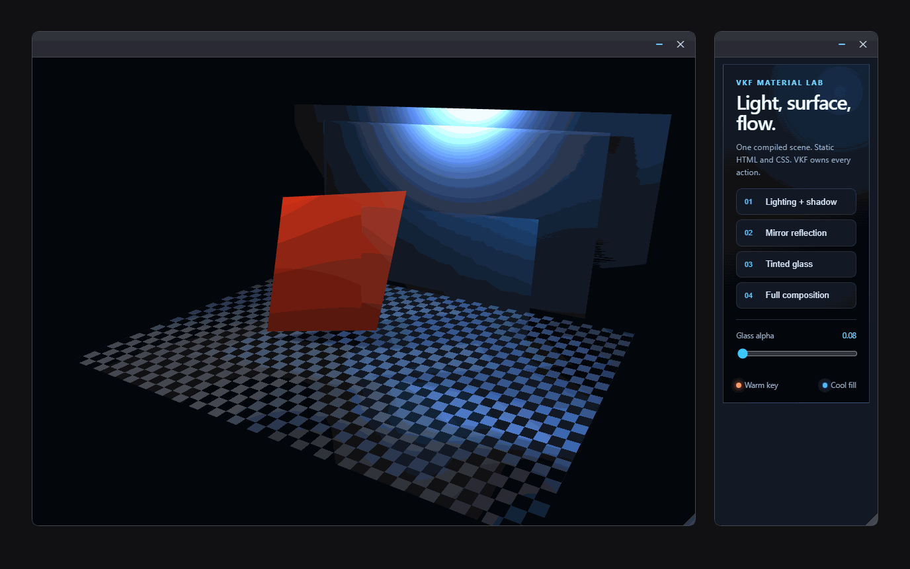

<!-- scene-gallery:start -->
## Scene example gallery

These 20 complete programs are deliberately small: each source is followed by
its result, and each heading opens the executable source. The checked-in
[capture manifest](examples/scene_gallery/manifest.json) hash-locks every source
and PNG.

Every PNG is a full composited viewport captured with DevTools
`Page.captureScreenshot` from a hidden Edge `--headless=new` session after
the requested frame became ready. The capture includes frame chrome and the
WebGPU canvas, plus static HTML/CSS where an example loads them; it is not a
renderer-only illustration. Application behavior remains compiled VKF and uses
no application JavaScript.

<!-- scene-example:01-line-plot:start -->
### 01 · [Line plot](examples/scene_gallery/01-line-plot/app.vkf)

```vkf
: .ui.display
display: Display(dim:2)
frame: display.add_frame(pos:[0.08, 0.08], size:[0.84, 0.84])
frame.add(
    x:[[-3, -2, -1, 0, 1, 2, 3], [-3, -2, -1, 0, 1, 2, 3]],
    y:[[-0.12, -0.92, -0.86, -0.03, 0.82, 0.88, 0.09], [-0.06, -0.86, -0.80, 0.03, 0.88, 0.94, 0.15]],
    z:[[0, 0, 0, 0, 0, 0, 0], [0, 0, 0, 0, 0, 0, 0]],
    id:"sine",
    color:[0.12, 0.72, 1.0, 1.0]
)
```

[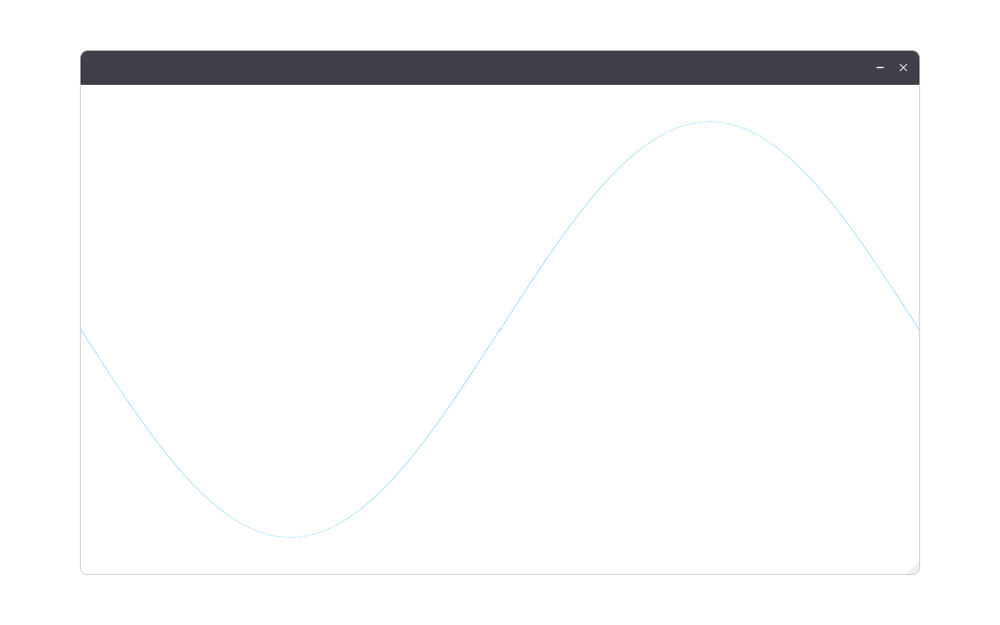](docs/public/images/scene-gallery/01-line-plot.png)
<!-- scene-example:01-line-plot:end -->

<!-- scene-example:02-lit-surface:start -->
### 02 · [Illuminated surface](examples/scene_gallery/02-lit-surface/app.vkf)

```vkf
: .ui.display
display: Display(dim:2)
frame: display.add_frame(pos:[0.08, 0.08], size:[0.84, 0.84])
frame.set_geom_options(background:[0.012, 0.018, 0.038, 1.0], unified_renderer:true)
frame.add_camera(pos:[4.2, -5.4, 3.5], target:[0, 0, 0.25], up:[0, 0, 1], fov:42)
frame.add_light(id:"sun", pos:[2.8, -2.6, 5.2], target:[0, 0, 0], color:[1.0, 0.88, 0.68, 1.0], intensity:24, range:18, casts_shadow:true)
frame.add(
    x:[[-1.5, 0, 1.5], [-1.5, 0, 1.5], [-1.5, 0, 1.5]],
    y:[[-1.5, -1.5, -1.5], [0, 0, 0], [1.5, 1.5, 1.5]],
    z:[[0, 0.25, 0], [0.2, 1.15, 0.35], [0, 0.3, 0.05]],
    id:"hill", color:[0.12, 0.58, 0.3, 1.0], receives_lighting:true, casts_shadow:true
)
```

[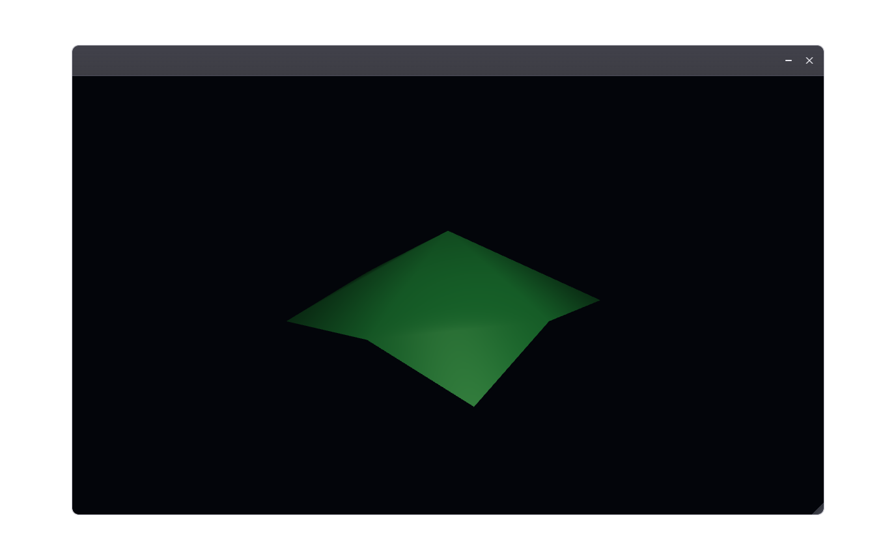](docs/public/images/scene-gallery/02-lit-surface.png)
<!-- scene-example:02-lit-surface:end -->

<!-- scene-example:03-mirror:start -->
### 03 · [Planar mirror](examples/scene_gallery/03-mirror/app.vkf)

```vkf
: .ui.display
display: Display(dim:2)
frame: display.add_frame(pos:[0.08, 0.08], size:[0.84, 0.84])
frame.set_geom_options(background:[0.01, 0.015, 0.03, 1], unified_renderer:true, combine_transparent:true)
frame.add_camera(pos:[5.2, -7.4, 4.2], target:[0, 1.2, 1.1], up:[0, 0, 1], fov:43)
frame.add_light(id:"key", kind:"point", pos:[-2.8, -2.6, 5.8], target:[0, 1, 0.8], color:[1, 0.72, 0.48, 1], intensity:34, range:18, casts_shadow:true)
frame.add(x:[[-4, 4], [-4, 4]], y:[[-2, -2], [4.2, 4.2]], z:[[0, 0], [0, 0]], id:"floor", color:[0.13, 0.18, 0.28, 1], roughness:0.72, receives_lighting:true)
frame.add(x:[[-1.5, 0.4], [-1.1, 0.8]], y:[[0.3, 1.0], [0.3, 1.0]], z:[[0.2, 0.5], [2.7, 3.0]], id:"sculpture", color:[0.96, 0.22, 0.08, 1], roughness:0.24, specular_strength:0.78, casts_shadow:true, receives_lighting:true)
frame.add(
    x:[[-3.2, 3.2], [-3.2, 3.2]], y:[[4.1, 4.1], [4.1, 4.1]], z:[[0.1, 0.1], [3.8, 3.8]],
    id:"mirror", color:[0.72, 0.84, 1, 1], alpha:1, transparent:true, reflectivity:0.9, roughness:0.04,
    surface_system:(kind:"screen", reflectivity:0.9, reverse_facing:true, flip_y:true, scale:[1, 1], camera:(fov:43, up:[0, 0, 1], mirror_of:(frame_id:"frame_0", mesh_id:"mirror", reflect_eye_only:true, lock_aperture_camera:true, controls_enabled:false))),
    casts_shadow:true, receives_shadow:true, receives_lighting:true
)
```

[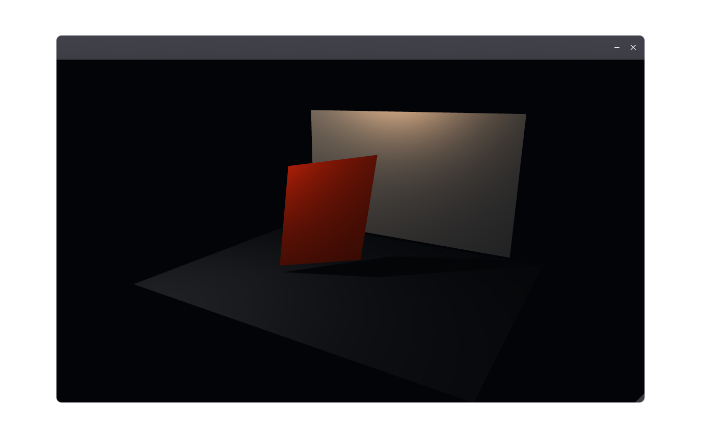](docs/public/images/scene-gallery/03-mirror.png)
<!-- scene-example:03-mirror:end -->

<!-- scene-example:04-tinted-glass:start -->
### 04 · [Tinted glass](examples/scene_gallery/04-tinted-glass/app.vkf)

```vkf
: .ui.display
display: Display(dim:2)
frame: display.add_frame(pos:[0.08, 0.08], size:[0.84, 0.84])
frame.set_geom_options(background:[0.012, 0.018, 0.032, 1], unified_renderer:true, combine_transparent:true)
frame.add_camera(pos:[4.8, -7.2, 3.8], target:[0, 1.1, 1.1], up:[0, 0, 1], fov:42)
frame.add_light(id:"key", kind:"point", pos:[-2.5, -2.8, 5.5], target:[0, 1, 1], color:[1, 0.82, 0.62, 1], intensity:32, range:18, casts_shadow:true)
frame.add(x:[[-4, 4], [-4, 4]], y:[[-2, -2], [4, 4]], z:[[0, 0], [0, 0]], id:"floor", color:[0.08, 0.12, 0.2, 1], roughness:0.72, receives_lighting:true)
frame.add(x:[[-2.5, 2.5], [-2.5, 2.5]], y:[[3.5, 3.5], [3.5, 3.5]], z:[[0.2, 0.2], [3.4, 3.4]], id:"backdrop", color:[0.9, 0.22, 0.08, 1], roughness:0.45, receives_lighting:true)
frame.add(
    x:[[-1.8, 2.1], [-1.8, 2.1]], y:[[0.2, 0.7], [0.2, 0.7]], z:[[0.25, 0.25], [3.0, 3.0]],
    id:"glass", color:[0.08, 0.78, 0.96, 0.52], alpha:0.52, transparent:true, depth_write:false,
    reflectivity:0.28, roughness:0.1, specular_strength:0.84, casts_shadow:true, receives_lighting:true
)
```

[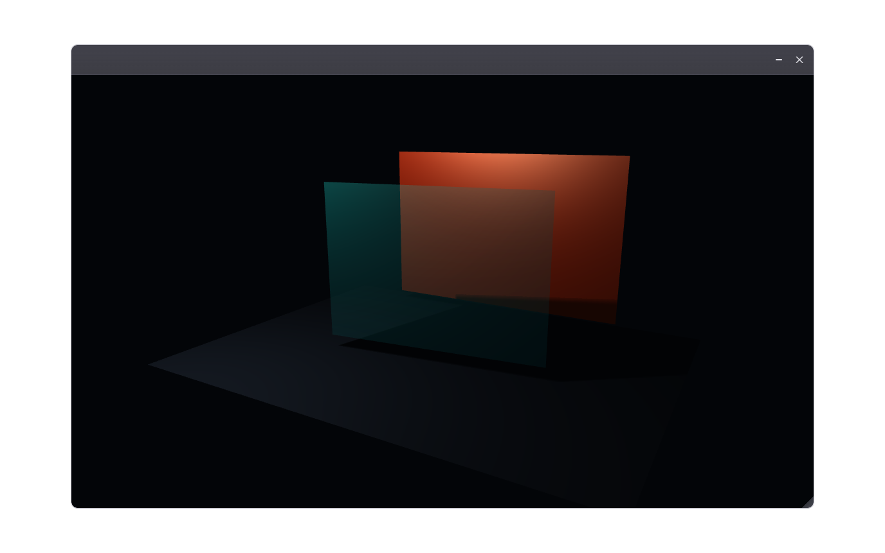](docs/public/images/scene-gallery/04-tinted-glass.png)
<!-- scene-example:04-tinted-glass:end -->

<!-- scene-example:05-checker-texture:start -->
### 05 · [Checker texture](examples/scene_gallery/05-checker-texture/app.vkf)

```vkf
: .ui.display
display: Display(dim:2)
frame: display.add_frame(pos:[0.08, 0.08], size:[0.84, 0.84])
frame.set_geom_options(background:[0.012, 0.018, 0.032, 1], unified_renderer:true)
frame.add_camera(pos:[4.8, -6.8, 4.5], target:[0, 0.8, 0], up:[0, 0, 1], fov:43)
frame.add_light(id:"sun", kind:"point", pos:[-2.5, -2.2, 5.6], target:[0, 0.8, 0], color:[1, 0.82, 0.62, 1], intensity:30, range:18, casts_shadow:true)
frame.add(
    x:[[-4, 4], [-4, 4]], y:[[-2, -2], [4, 4]], z:[[0, 0], [0, 0]],
    id:"checker", color:[1, 1, 1, 1],
    texture:(kind:"checker", scale:[7, 6], color_a:[0.03, 0.05, 0.09, 1], color_b:[0.28, 0.55, 0.9, 1]),
    roughness:0.62, specular_strength:0.32, receives_lighting:true
)
```

[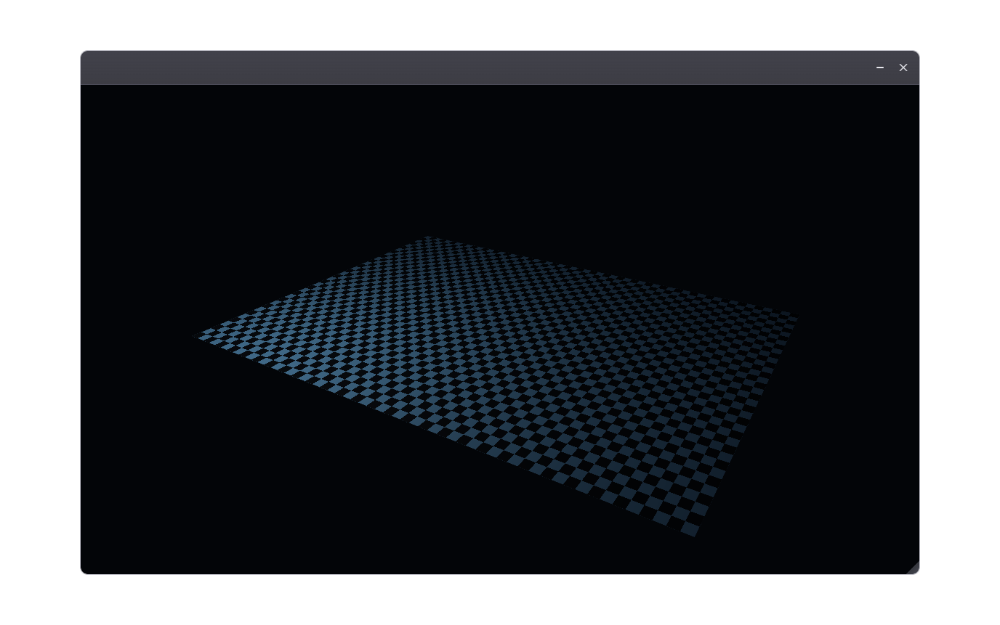](docs/public/images/scene-gallery/05-checker-texture.png)
<!-- scene-example:05-checker-texture:end -->

<!-- scene-example:06-shadows:start -->
### 06 · [Cast shadows](examples/scene_gallery/06-shadows/app.vkf)

```vkf
: .ui.display
display: Display(dim:2)
frame: display.add_frame(pos:[0.08, 0.08], size:[0.84, 0.84])
frame.set_geom_options(background:[0.012, 0.018, 0.032, 1], unified_renderer:true)
frame.add_camera(pos:[5.2, -7.0, 4.8], target:[0, 1, 0.8], up:[0, 0, 1], fov:43)
frame.add_light(id:"sun", kind:"point", pos:[-3.8, -3.2, 6.5], target:[0, 1, 0], color:[1, 0.82, 0.58, 1], intensity:38, range:20, casts_shadow:true, source_radius:0.12)
frame.add(x:[[-4, 4], [-4, 4]], y:[[-2, -2], [4.5, 4.5]], z:[[0, 0], [0, 0]], id:"floor", color:[0.3, 0.38, 0.5, 1], roughness:0.72, receives_shadow:true, receives_lighting:true)
frame.add(x:[[-1.8, -0.2], [-1.8, -0.2]], y:[[0.3, 0.3], [0.3, 0.3]], z:[[0.1, 0.1], [2.7, 2.7]], id:"caster_a", color:[0.92, 0.2, 0.08, 1], casts_shadow:true, receives_lighting:true)
frame.add(x:[[0.5, 2.0], [0.5, 2.0]], y:[[1.3, 1.3], [1.3, 1.3]], z:[[0.1, 0.1], [2.1, 2.1]], id:"caster_b", color:[0.1, 0.5, 0.96, 1], casts_shadow:true, receives_lighting:true)
```

[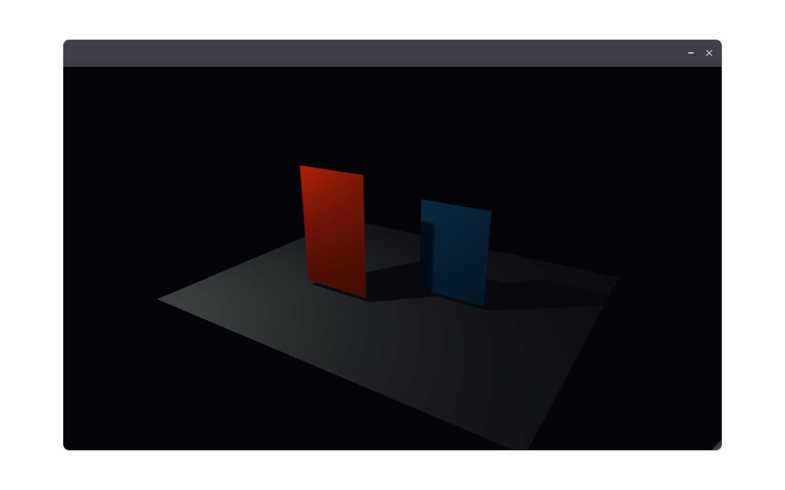](docs/public/images/scene-gallery/06-shadows.png)
<!-- scene-example:06-shadows:end -->

<!-- scene-example:07-multiple-lights:start -->
### 07 · [Warm and cool lights](examples/scene_gallery/07-multiple-lights/app.vkf)

```vkf
: .ui.display
display: Display(dim:2)
frame: display.add_frame(pos:[0.08, 0.08], size:[0.84, 0.84])
frame.set_geom_options(background:[0.008, 0.012, 0.025, 1], unified_renderer:true)
frame.add_camera(pos:[4.6, -6.4, 3.8], target:[0, 0.5, 0.6], up:[0, 0, 1], fov:42)
frame.add_light(id:"warm", kind:"point", pos:[-3.2, -2.5, 4.8], target:[0, 0.5, 0.6], color:[1, 0.35, 0.08, 1], intensity:30, range:16, casts_shadow:true)
frame.add_light(id:"cool", kind:"point", pos:[3.6, 0.2, 3.6], target:[0, 0.5, 0.6], color:[0.08, 0.45, 1, 1], intensity:26, range:16, casts_shadow:false)
frame.add(
    x:[[-1.8, 0, 1.8], [-1.8, 0, 1.8], [-1.8, 0, 1.8]],
    y:[[-1, -1, -1], [0.5, 0.5, 0.5], [2, 2, 2]],
    z:[[0, 0.4, 0], [0.2, 1.4, 0.3], [0, 0.5, 0.1]],
    id:"surface", color:[0.72, 0.72, 0.76, 1], roughness:0.24, specular_strength:0.8, receives_lighting:true, casts_shadow:true
)
```

[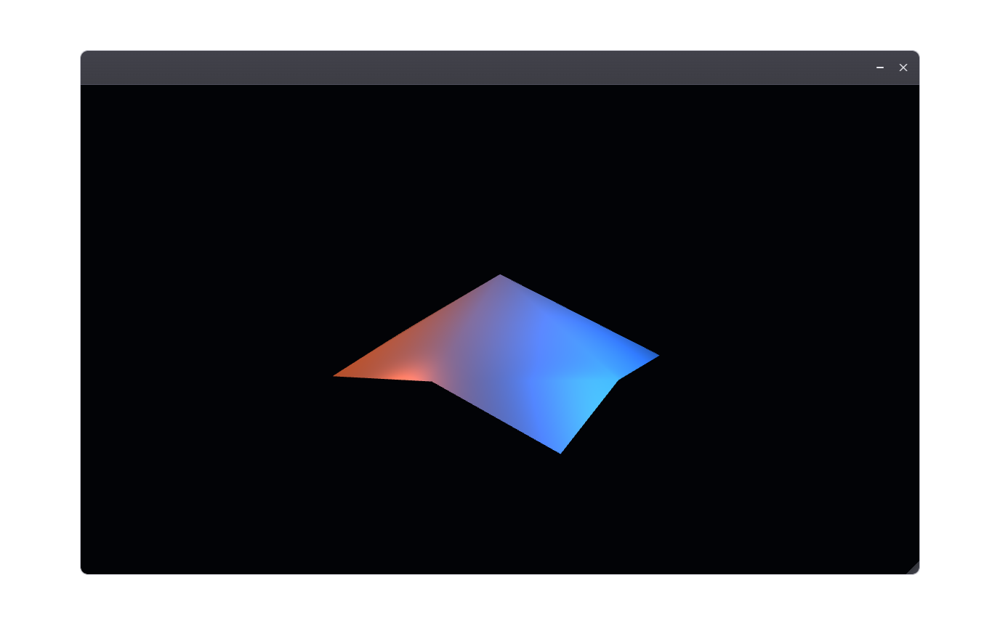](docs/public/images/scene-gallery/07-multiple-lights.png)
<!-- scene-example:07-multiple-lights:end -->

<!-- scene-example:08-grass:start -->
### 08 · [Grass material](examples/scene_gallery/08-grass/app.vkf)

```vkf
: .ui.display
display: Display(dim:2)
frame: display.add_frame(pos:[0.08, 0.08], size:[0.84, 0.84])
frame.set_geom_options(background:[0.22, 0.48, 0.78, 1], unified_renderer:true)
frame.add_camera(pos:[0, -5.6, 2.0], target:[0, 2.5, 0], up:[0, 0, 1], fov:60)
frame.add_light(id:"sun", kind:"point", pos:[0, 50, 35], target:[0, 0, 0], color:[1, 0.98, 0.82, 1], intensity:2800, range:140, casts_shadow:true)
frame.add(
    x:[[-9, 9], [-9, 9]], y:[[-2, -2], [14, 14]], z:[[0, 0], [0, 0]],
    id:"grass", color:[1, 1, 1, 1],
    texture:(kind:"grass", scale:[7, 7], color_a:[0.025, 0.13, 0.02, 1], color_b:[0.28, 0.54, 0.09, 1], roughness:0.99, blade_length:1.1, clump_density:1.2, micro_shadow:0.52),
    specular_strength:0, casts_shadow:true, receives_shadow:true, receives_lighting:true
)
```

[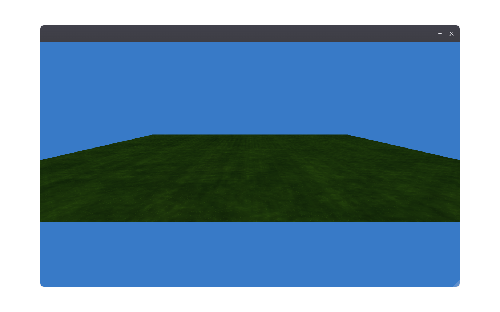](docs/public/images/scene-gallery/08-grass.png)
<!-- scene-example:08-grass:end -->

<!-- scene-example:09-html-controls:start -->
### 09 · [HTML controls](examples/scene_gallery/09-html-controls/app.vkf)

```vkf
: .ui.display
display: Display(dim:2)
frame: display.add_frame(pos:[0.04, 0.07], size:[0.68, 0.84])
frame.set_geom_options(background:[0.01, 0.015, 0.03, 1], unified_renderer:true, combine_transparent:true)
frame.add_camera(pos:[4.4, -6.4, 3.4], target:[0, 1, 1], up:[0, 0, 1], fov:42)
frame.add_light(id:"key", pos:[-2.8, -2.4, 5.2], target:[0, 1, 1], color:[1, 0.76, 0.52, 1], intensity:32, range:18, casts_shadow:true)
frame.add(x:[[-2.6, 2.6], [-2.6, 2.6]], y:[[3.2, 3.2], [3.2, 3.2]], z:[[0.2, 0.2], [3.2, 3.2]], id:"back", color:[0.92, 0.2, 0.08, 1], receives_lighting:true)
panel: frame.add(x:[[-1.8, 2], [-1.8, 2]], y:[[0.2, 0.6], [0.2, 0.6]], z:[[0.2, 0.2], [2.8, 2.8]], id:"panel", color:[0.08, 0.74, 0.96, 0.52], alpha:0.52, transparent:true, depth_write:false, reflectivity:0.22, receives_lighting:true)
controls: display.add_frame(pos:[0.75, 0.07], size:[0.21, 0.84])
controls.load("ui/main.html")
tone: Button(id:"tone")
alpha: Input(id:"alpha")
(tone_event: tone.events.get())??>
    ButtonClicked => panel.alpha: 0.9
(alpha_event: alpha.events.get())??>
    SliderValueChanged => panel.alpha: alpha_event.value
```

[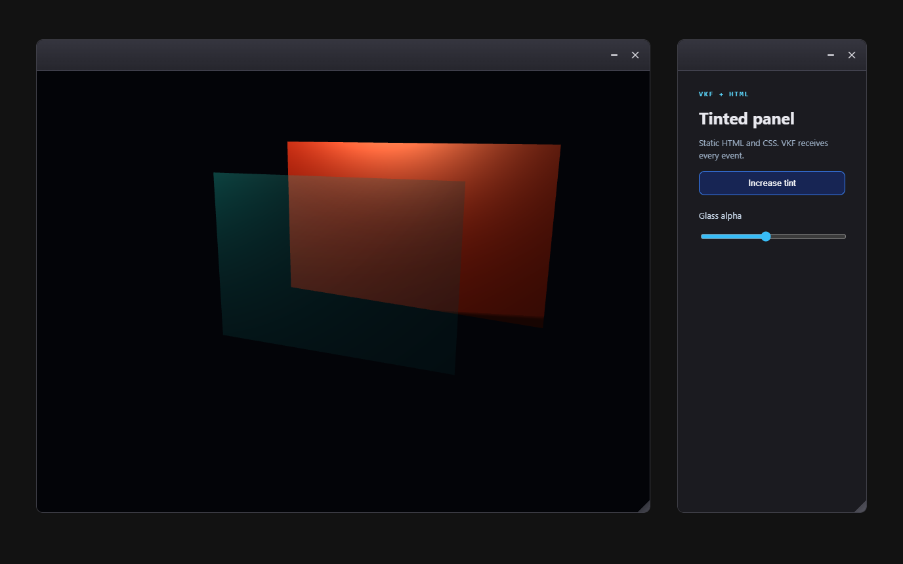](docs/public/images/scene-gallery/09-html-controls.png)
<!-- scene-example:09-html-controls:end -->

<!-- scene-example:10-sun-reflection:start -->
### 10 · [Sun reflection](examples/scene_gallery/10-sun-reflection/app.vkf)

```vkf
ui:.ui
ui.set_mode("overlay")

native_scene:(
    kind:"scene_3d",
    frame_id:"solkatt_frame",
    title:"Sun reflection",
    rect:[0.08, 0.08, 0.84, 0.84],
    aspect:"equal",
    camera:(pos:[0, -4.8, 2.8], target:[0, 0.7, 1], fov:34, up:[0, 0, 1]),
    show_light_markers:true,
    light_marker_size:0.24,
    timing:(fps:30, duration_seconds:14, boundary:"repeat"),
    surfaces:[(
        id:"mirror",
        center:[0.73, 2.17, 1.1],
        size:[2.6, 2.2],
        rotation:[90, 0, 0],
        color:[0.7, 0.76, 0.86, 1],
        casts_shadow:true,
        receives_shadow:true,
        no_backface_specular:true,
        surface_system:(
            kind:"screen",
            reverse_facing:true,
            flip_y:true,
            scale:[1, 1],
            camera:(
                fov:34,
                up:[0, 0, 1],
                mirror_of:(
                    frame_id:"solkatt_frame",
                    mesh_id:"mirror",
                    reflect_eye_only:true,
                    lock_aperture_camera:true,
                    controls_enabled:false
                )
            )
        )
    )],
    cubes:[],
    plane:(
        id:"receiver",
        center:[0, 0],
        size:6,
        z:0,
        color:[1, 1, 1, 1],
        roughness:0.02,
        specular_strength:1,
        texture:(
            kind:"checker",
            scale:[1, 1],
            color_a:[0.12, 0.14, 0.18, 1],
            color_b:[0.9, 0.92, 0.96, 1]
        )
    ),
    lights:[
        (
            id:"sun",
            kind:"point",
            motion:"orbit",
            radius:4.35,
            height:3.3,
            theta:-0.98,
            angular_velocity:0.55,
            target:[0, 0.4, 0.9],
            model:"blinn_phong",
            color:[1, 0.94, 0.8, 1],
            intensity:22,
            range:18,
            casts_shadow:true,
            show_marker:true,
            source_radius:0.14,
            spread:1
        ),
        (
            id:"solkatt",
            kind:"projected",
            reflect_of_light_id:"sun",
            reflect_mirror_mesh_id:"mirror",
            model:"blinn_phong",
            color:[1, 0.94, 0.8, 1],
            intensity:80,
            range:18,
            casts_shadow:true,
            show_marker:false,
            source_radius:0.14,
            spread:1,
            aperture_face_id:"mirror"
        )
    ],
    shadow:(enabled:true, color:[0, 0, 0, 0.3], lift:0.002)
)
```

[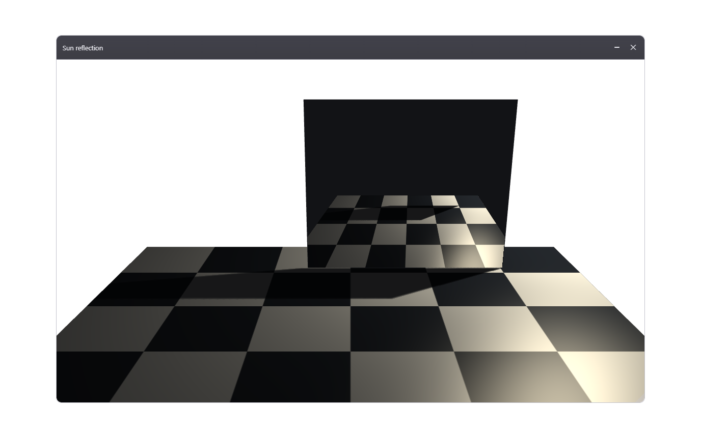](docs/public/images/scene-gallery/10-sun-reflection.png)
<!-- scene-example:10-sun-reflection:end -->

<!-- scene-example:11-roughness:start -->
### 11 · [Roughness](examples/scene_gallery/11-roughness/app.vkf)

```vkf
ui:.ui
ui.set_mode("overlay")

native_scene:(
    kind:"scene_3d",
    frame_id:"roughness_frame",
    title:"Roughness",
    rect:[0.08, 0.08, 0.84, 0.84],
    background:[0.012, 0.018, 0.032, 1],
    camera:(pos:[5.6, -8, 4.6], target:[0, 1, 1.1], up:[0, 0, 1], fov:42),
    plane:(center:[0, 0], size:9, z:0, color:[0.08, 0.11, 0.18, 1]),
    surfaces:[],
    cubes:[
        (id:"rough", center:[-2, 1, 0.9], size:1.6, face_color:[0.32, 0.4, 0.55, 1], roughness:0.95, specular_strength:1, casts_shadow:true, receives_shadow:true),
        (id:"satin", center:[0, 1, 0.9], size:1.6, face_color:[0.32, 0.4, 0.55, 1], roughness:0.35, specular_strength:1, casts_shadow:true, receives_shadow:true),
        (id:"polished", center:[2, 1, 0.9], size:1.6, face_color:[0.32, 0.4, 0.55, 1], roughness:0.02, specular_strength:1, casts_shadow:true, receives_shadow:true)
    ],
    lights:[
        (id:"key", kind:"point", pos:[-3.5, -3, 5.8], target:[0, 1, 1], color:[1, 0.88, 0.7, 1], intensity:42, range:20, casts_shadow:true),
        (id:"rim", kind:"point", pos:[4, 1.5, 4.2], target:[0, 1, 1], color:[0.4, 0.65, 1, 1], intensity:22, range:16)
    ],
    shadow:(enabled:true, color:[0, 0, 0, 0.3], lift:0.002)
)
```

[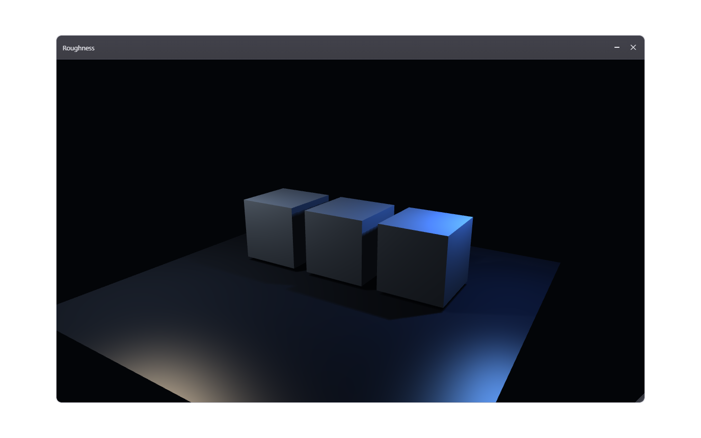](docs/public/images/scene-gallery/11-roughness.png)
<!-- scene-example:11-roughness:end -->

<!-- scene-example:12-layered-glass:start -->
### 12 · [Layered glass](examples/scene_gallery/12-layered-glass/app.vkf)

```vkf
ui:.ui
ui.set_mode("overlay")

native_scene:(
    kind:"scene_3d",
    frame_id:"layered_frame",
    title:"Layered glass",
    rect:[0.08, 0.08, 0.84, 0.84],
    background:[0.01, 0.016, 0.03, 1],
    camera:(pos:[5.4, -7.8, 4.2], target:[0, 1.1, 1.2], up:[0, 0, 1], fov:42),
    plane:(center:[0, 0], size:9, z:0, color:[0.06, 0.1, 0.18, 1]),
    surfaces:[
        (id:"backdrop", center:[0, 3.8, 1.8], size:[5.6, 3.3], rotation:[90, 0, 0], color:[0.94, 0.22, 0.06, 1]),
        (
            id:"layered_glass",
            center:[0, 0.7, 1.8],
            size:[4.6, 3.2],
            rotation:[90, 0, 0],
            color:[0.08, 0.76, 0.96, 0.48],
            alpha:0.48,
            transparent:true,
            depth_write:false,
            texture:(kind:"checker", scale:[6, 4], color_a:[0.05, 0.7, 0.95, 0.42], color_b:[0.3, 0.95, 0.72, 0.58]),
            reflectivity:0.42,
            roughness:0.08,
            specular_strength:0.9,
            surface_system:(kind:"screen", reflectivity:0.42, reverse_facing:true, flip_y:true, scale:[1, 1], camera:(fov:42, up:[0, 0, 1], mirror_of:(frame_id:"layered_frame", mesh_id:"layered_glass", reflect_eye_only:true, lock_aperture_camera:true, controls_enabled:false))),
            casts_shadow:true,
            receives_shadow:true
        )
    ],
    cubes:[],
    lights:[(id:"key", kind:"point", pos:[-3, -2.8, 5.8], target:[0, 1, 1], color:[1, 0.78, 0.52, 1], intensity:38, range:20, casts_shadow:true)],
    shadow:(enabled:true, color:[0, 0, 0, 0.28], lift:0.002)
)
```

[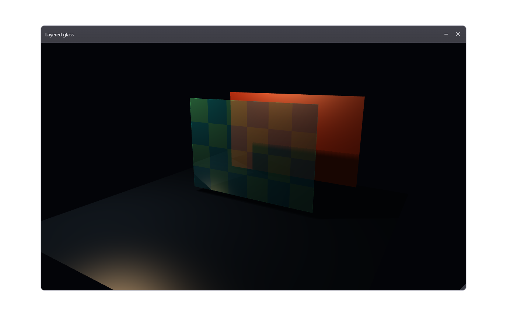](docs/public/images/scene-gallery/12-layered-glass.png)
<!-- scene-example:12-layered-glass:end -->

<!-- scene-example:13-saddle-plot:start -->
### 13 · [Saddle plot](examples/scene_gallery/13-saddle-plot/app.vkf)

```vkf
: .ui.display
display: Display(dim:2)
frame: display.add_frame(pos:[0.08, 0.08], size:[0.84, 0.84])
frame.set_geom_options(background:[0.01, 0.016, 0.035, 1], unified_renderer:true)
frame.add_camera(pos:[5.4, -6.8, 4.8], target:[0, 0, 0], up:[0, 0, 1], fov:40)
frame.add_light(id:"sun", pos:[-3.5, -3.2, 6.4], target:[0, 0, 0], color:[1, 0.82, 0.58, 1], intensity:34, range:20, casts_shadow:true)
frame.add(
    x:[[-2, -1, 0, 1, 2], [-2, -1, 0, 1, 2], [-2, -1, 0, 1, 2], [-2, -1, 0, 1, 2], [-2, -1, 0, 1, 2]],
    y:[[-2, -2, -2, -2, -2], [-1, -1, -1, -1, -1], [0, 0, 0, 0, 0], [1, 1, 1, 1, 1], [2, 2, 2, 2, 2]],
    z:[[2, 1, 0, -1, -2], [1, 0.5, 0, -0.5, -1], [0, 0, 0, 0, 0], [-1, -0.5, 0, 0.5, 1], [-2, -1, 0, 1, 2]],
    id:"saddle", color:[0.14, 0.48, 0.96, 1], roughness:0.24, specular_strength:0.78, receives_lighting:true, casts_shadow:true
)
```

[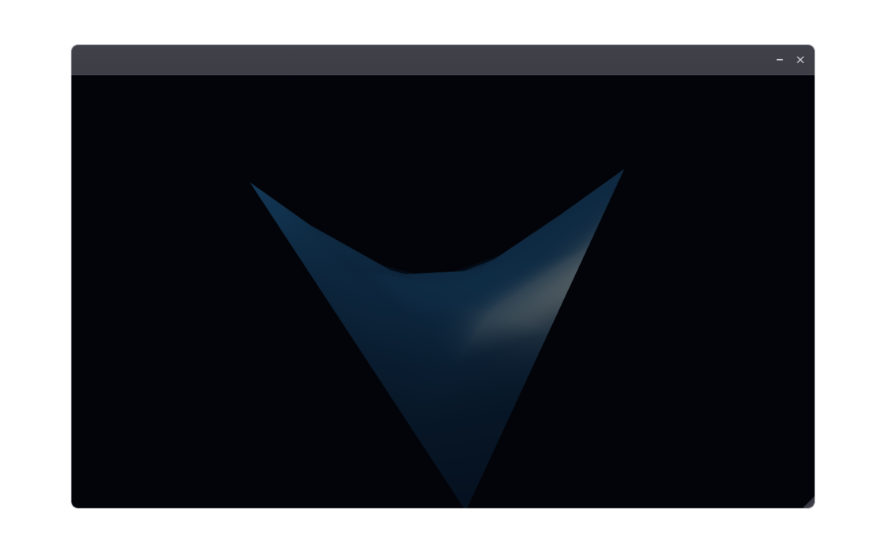](docs/public/images/scene-gallery/13-saddle-plot.png)
<!-- scene-example:13-saddle-plot:end -->

<!-- scene-example:14-layered-bands:start -->
### 14 · [Layered bands](examples/scene_gallery/14-layered-bands/app.vkf)

```vkf
: .ui.display
display: Display(dim:2)
frame: display.add_frame(pos:[0.08, 0.08], size:[0.84, 0.84])
frame.set_geom_options(background:[0.015, 0.022, 0.05, 1], unified_renderer:true)
frame.add(
    x:[[-3, -2, -1, 0, 1, 2, 3], [-3, -2, -1, 0, 1, 2, 3]],
    y:[[-1.5, -1.25, -1.42, -1.1, -1.3, -0.98, -1.12], [-0.82, -0.62, -0.78, -0.5, -0.7, -0.4, -0.52]],
    z:[[0, 0, 0, 0, 0, 0, 0], [0, 0, 0, 0, 0, 0, 0]],
    id:"lower_band", color:[0.1, 0.5, 0.98, 1]
)
frame.add(
    x:[[-3, -2, -1, 0, 1, 2, 3], [-3, -2, -1, 0, 1, 2, 3]],
    y:[[-0.45, -0.25, -0.38, -0.02, -0.2, 0.08, -0.04], [0.18, 0.4, 0.24, 0.62, 0.42, 0.72, 0.58]],
    z:[[0.01, 0.01, 0.01, 0.01, 0.01, 0.01, 0.01], [0.01, 0.01, 0.01, 0.01, 0.01, 0.01, 0.01]],
    id:"middle_band", color:[0.18, 0.82, 0.5, 1]
)
frame.add(
    x:[[-3, -2, -1, 0, 1, 2, 3], [-3, -2, -1, 0, 1, 2, 3]],
    y:[[0.55, 0.8, 0.62, 1.02, 0.82, 1.16, 1.02], [1.18, 1.42, 1.26, 1.65, 1.46, 1.78, 1.64]],
    z:[[0.02, 0.02, 0.02, 0.02, 0.02, 0.02, 0.02], [0.02, 0.02, 0.02, 0.02, 0.02, 0.02, 0.02]],
    id:"upper_band", color:[0.98, 0.38, 0.14, 1]
)
```

[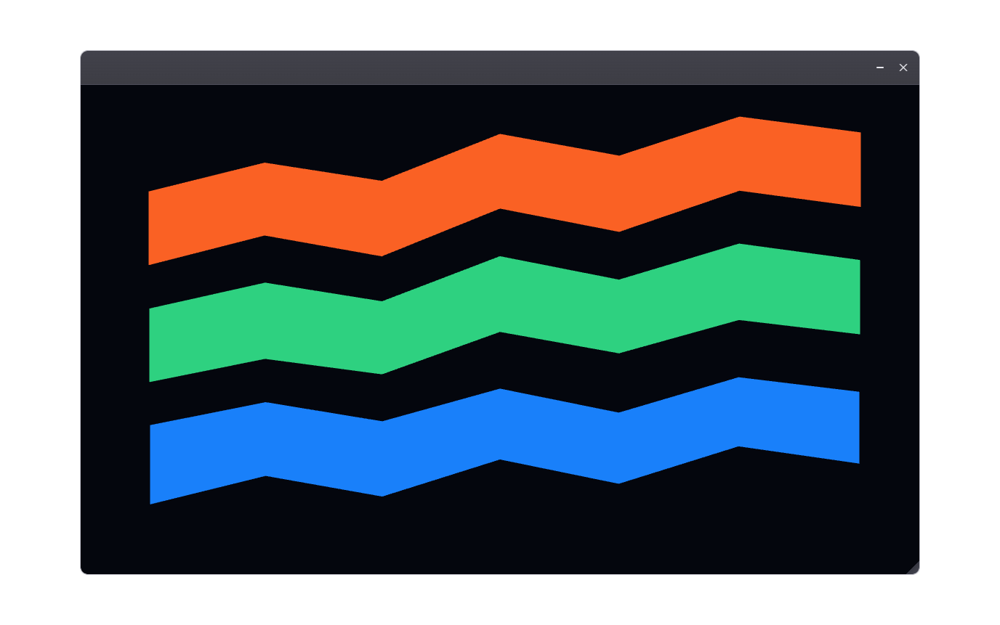](docs/public/images/scene-gallery/14-layered-bands.png)
<!-- scene-example:14-layered-bands:end -->

<!-- scene-example:15-spot-light:start -->
### 15 · [Spot light](examples/scene_gallery/15-spot-light/app.vkf)

```vkf
ui:.ui
ui.set_mode("overlay")

native_scene:(
    kind:"scene_3d",
    frame_id:"spot_frame",
    title:"Spot light",
    rect:[0.08, 0.08, 0.84, 0.84],
    background:[0.006, 0.009, 0.02, 1],
    camera:(pos:[5.4, -7.2, 4.8], target:[0, 0.7, 0.7], up:[0, 0, 1], fov:42),
    plane:(center:[0, 0], size:9, z:0, color:[0.12, 0.16, 0.24, 1]),
    surfaces:[],
    cubes:[
        (id:"subject", center:[0, 1, 1], size:1.8, face_color:[0.8, 0.14, 0.06, 1], roughness:0.28, specular_strength:0.72, casts_shadow:true, receives_shadow:true),
        (id:"side", center:[2.2, 2, 0.65], size:1.1, face_color:[0.1, 0.35, 0.9, 1], roughness:0.5, casts_shadow:true, receives_shadow:true)
    ],
    lights:[(
        id:"spot",
        kind:"spot",
        pos:[-2.8, -2.4, 5.8],
        target:[0, 1, 0.4],
        color:[1, 0.84, 0.56, 1],
        intensity:65,
        range:18,
        inner_cone_deg:12,
        outer_cone_deg:24,
        casts_shadow:true,
        source_radius:0.08
    )],
    shadow:(enabled:true, color:[0, 0, 0, 0.36], lift:0.002)
)
```

[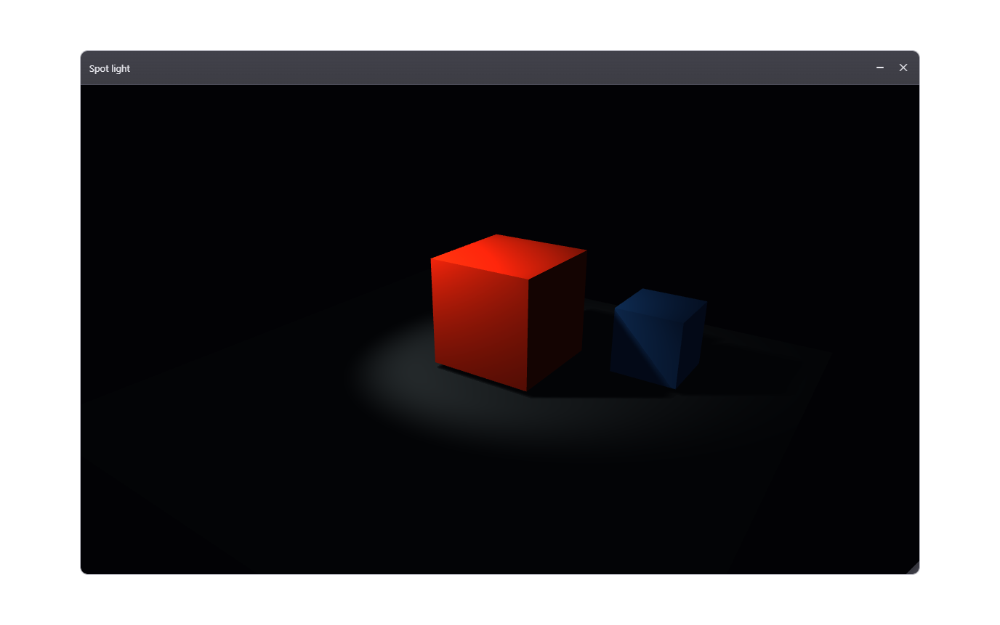](docs/public/images/scene-gallery/15-spot-light.png)
<!-- scene-example:15-spot-light:end -->

<!-- scene-example:16-dice-texture:start -->
### 16 · [Procedural dice](examples/scene_gallery/16-dice-texture/app.vkf)

```vkf
ui:.ui
ui.set_mode("overlay")

native_scene:(
    kind:"scene_3d",
    frame_id:"dice_frame",
    title:"Procedural dice",
    rect:[0.08, 0.08, 0.84, 0.84],
    background:[0.012, 0.018, 0.035, 1],
    camera:(pos:[4.8, -6.8, 4.4], target:[0, 0.4, 0.8], up:[0, 0, 1], fov:40),
    plane:(center:[0, 0], size:8, z:0, color:[0.16, 0.22, 0.2, 1], texture:(kind:"checker", scale:[1, 1], color_a:[0.09, 0.14, 0.13, 1], color_b:[0.32, 0.42, 0.36, 1])),
    surfaces:[],
    cubes:[(
        id:"die",
        center:[0, 0.5, 1.1],
        size:1.8,
        rotation:[24, -18, 32],
        face_color:[0.98, 0.98, 1, 1],
        texture:(kind:"dice", color_a:[0.98, 0.98, 1, 1], color_b:[0.025, 0.025, 0.035, 1], graph_width_px:3),
        roughness:0.22,
        specular_strength:0.72,
        casts_shadow:true,
        receives_shadow:true
    )],
    lights:[(id:"key", kind:"point", pos:[-3, -3.2, 5.6], target:[0, 0.5, 0.8], color:[1, 0.9, 0.72, 1], intensity:36, range:18, casts_shadow:true, source_radius:0.12)],
    shadow:(enabled:true, color:[0, 0, 0, 0.34], lift:0.002)
)
```

[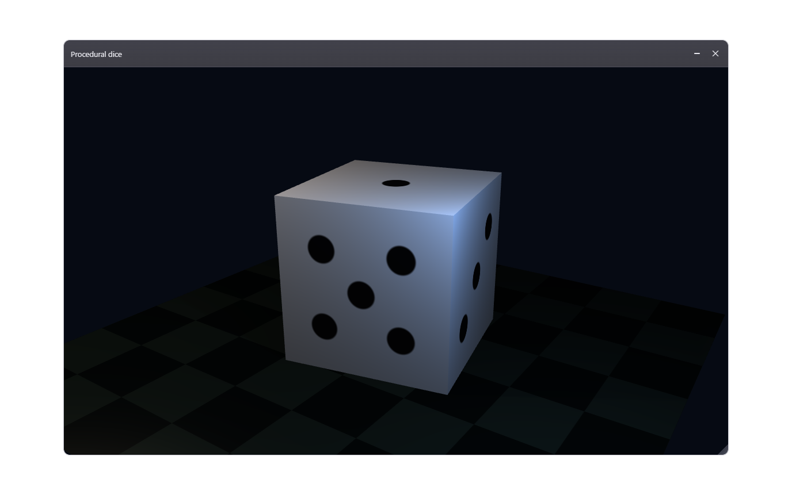](docs/public/images/scene-gallery/16-dice-texture.png)
<!-- scene-example:16-dice-texture:end -->

<!-- scene-example:17-world-embedding:start -->
### 17 · [World embedding](examples/scene_gallery/17-world-embedding/app.vkf)

```vkf
: .ui.display
: .physics

Particle(position:[num:2], color:[num:4], radius:num, mass:num):
    (position:position, color:color, radius:radius, mass:mass)

embedding(particle:Particle):
    (
        p_u:[particle.position],
        c_uc:[particle.color],
        s_u:[particle.radius * 2],
        s_mode:data
    )

w: World(dim:2, em:false, gravity:false, rigid_collisions:false)
w.add(Particle([0, 0], [0.12, 0.72, 1, 1], 0.35, 1))

d: Display(dim:2)
view: d.append_world(w, embedding)
d.show()
```

[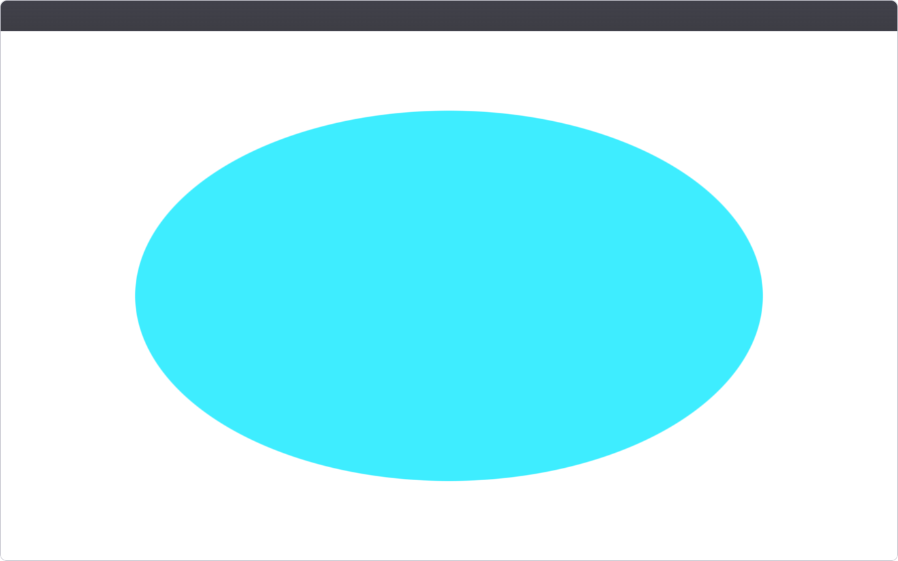](docs/public/images/scene-gallery/17-world-embedding.png)
<!-- scene-example:17-world-embedding:end -->

<!-- scene-example:18-polar-ribbon:start -->
### 18 · [Polar ribbon](examples/scene_gallery/18-polar-ribbon/app.vkf)

```vkf
: .ui.display
display: Display(dim:2)
frame: display.add_frame(pos:[0.08, 0.08], size:[0.84, 0.84])
frame.set_geom_options(background:[0.01, 0.02, 0.045, 1], unified_renderer:true)
frame.add(
    x:[[0.22, 0.24, 0.24, 0.217, 0.168, 0.094, 0, -0.109, -0.225, -0.339, -0.44, -0.518, -0.566, -0.574, -0.54, -0.461, -0.34, -0.184, 0, 0.199, 0.398, 0.583, 0.739, 0.852, 0.911], [0.3, 0.318, 0.31, 0.273, 0.208, 0.115, 0, -0.13, -0.265, -0.395, -0.509, -0.596, -0.646, -0.651, -0.609, -0.518, -0.38, -0.204, 0, 0.219, 0.438, 0.64, 0.808, 0.93, 0.991]],
    y:[[0, 0.064, 0.139, 0.217, 0.29, 0.352, 0.393, 0.407, 0.39, 0.339, 0.254, 0.139, 0, -0.154, -0.312, -0.461, -0.59, -0.685, -0.738, -0.741, -0.689, -0.583, -0.427, -0.228, 0], [0, 0.085, 0.179, 0.273, 0.36, 0.429, 0.473, 0.484, 0.459, 0.395, 0.294, 0.16, 0, -0.175, -0.352, -0.518, -0.659, -0.763, -0.818, -0.818, -0.759, -0.64, -0.467, -0.249, 0]],
    z:[[0, 0, 0, 0, 0, 0, 0, 0, 0, 0, 0, 0, 0, 0, 0, 0, 0, 0, 0, 0, 0, 0, 0, 0, 0], [0, 0, 0, 0, 0, 0, 0, 0, 0, 0, 0, 0, 0, 0, 0, 0, 0, 0, 0, 0, 0, 0, 0, 0, 0]],
    id:"polar_ribbon", color:[0.65, 0.22, 1, 1]
)
```

[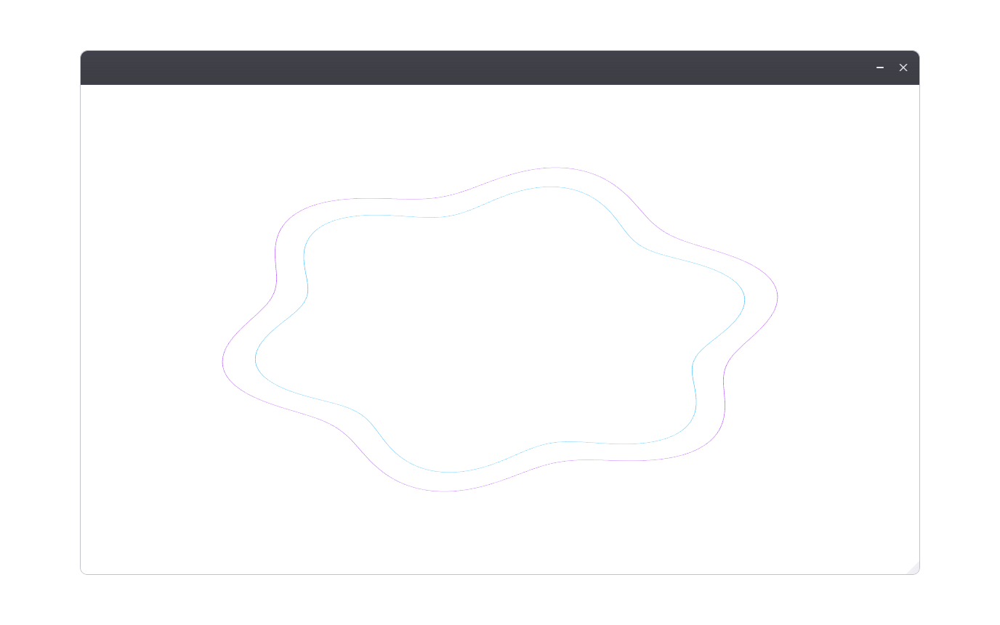](docs/public/images/scene-gallery/18-polar-ribbon.png)
<!-- scene-example:18-polar-ribbon:end -->

<!-- scene-example:19-wireframe-points:start -->
### 19 · [Wireframe points](examples/scene_gallery/19-wireframe-points/app.vkf)

```vkf
native_scene:(
    kind:"scene_3d", frame_id:"wireframe_points", title:"Wireframe points",
    rect:[0.08, 0.08, 0.84, 0.84], background:[0.008, 0.018, 0.04, 1],
    camera:(pos:[4, -6, 3.5], target:[0, 0, 0.7], up:[0, 0, 1], fov:38),
    meshes:[(
        id:"wireframe", kind:"field_mesh",
        vertices:[-1.4, -0.8, 0, 0, 0, 1, 0.1, 0.72, 1, 1, 1.4, -0.8, 0, 0, 0, 1, 0.1, 0.72, 1, 1, 1.4, 0.8, 0, 0, 0, 1, 0.1, 0.72, 1, 1, -1.4, 0.8, 0, 0, 0, 1, 0.1, 0.72, 1, 1, 0, 0, 2, 0, 0, 1, 1, 0.34, 0.12, 1],
        indices:[0, 1, 1, 2, 2, 3, 3, 0, 0, 4, 1, 4, 2, 4, 3, 4],
        topology:"line-list", render_mode:"line", mode3d:true, color:[0.1, 0.72, 1, 1]
    )]
)
```

[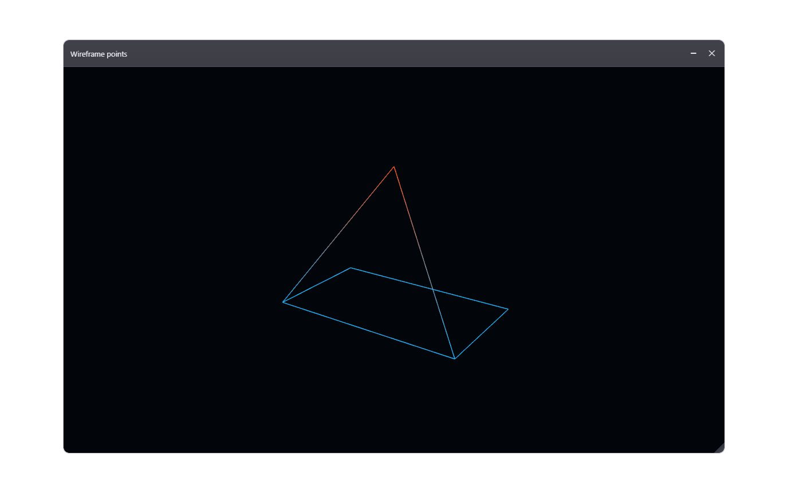](docs/public/images/scene-gallery/19-wireframe-points.png)
<!-- scene-example:19-wireframe-points:end -->

<!-- scene-example:20-rigid-body-snapshot:start -->
### 20 · [Rigid-body snapshot](examples/scene_gallery/20-rigid-body-snapshot/app.vkf)

```vkf
native_scene:(
    frame_id:"rigid_snapshot", title:"Rigid-body snapshot",
    rect:[0.08, 0.08, 0.84, 0.84], background:[0.008, 0.018, 0.04, 1],
    camera:(pos:[0, 0, 12], target:[0, 0, 0], up:[0, 1, 0], projection:"orthographic", ortho_scale:6),
    lights:[(id:"key", kind:"point", pos:[-3, -3, 8], color:[1, 0.94, 0.82, 1], intensity:32, range:24)],
    timing:(fps:60, duration_seconds:8, boundary:"repeat"),
    rigid_world_2d:(width:10, height:6, gravity:[0, -3], solver_iterations:10, step_dt:0.008333, max_substeps:8),
    rigid_bodies_2d:[
        (id:"floor", contours:[[[-4, -0.3], [4, -0.3], [4, 0.3], [-4, 0.3]]], position:[0, -2.2], static:true, color:[0.12, 0.58, 0.92, 1]),
        (id:"spinner", contours:[[[0, 0.72], [0.62, 0], [0, -0.72], [-0.62, 0]]], position:[-2, 1.4], velocity:[2.4, 0], angular_velocity:2.8, density:1, e_n:0.86, color:[1, 0.38, 0.12, 1])
    ]
)
```

[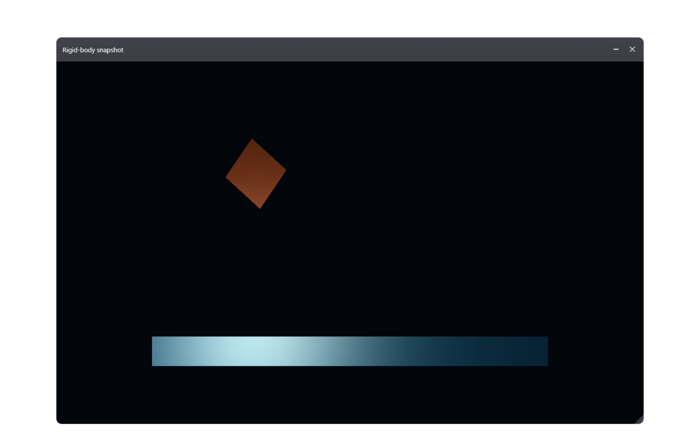](docs/public/images/scene-gallery/20-rigid-body-snapshot.png)
<!-- scene-example:20-rigid-body-snapshot:end -->
<!-- scene-gallery:end -->

## Install VKF 0.4.1

When the release gates complete, downloads will be published on the
[0.4.1 GitHub release](https://github.com/svenviktorjonsson/vektor-flow/releases/tag/v0.4.1).
Until that tag exists, 0.4.1 remains a release candidate rather than a
published download.

| Platform | Recommended download | Installation |
| --- | --- | --- |
| Windows x64 | `vektor-flow-windows-x64-setup.exe` | Run it; optionally add VKF to `PATH`. |
| Linux x64 (Debian/Ubuntu) | `vektor-flow-linux-x64.deb` | `sudo apt install ./vektor-flow-linux-x64.deb` |
| macOS Apple Silicon | `vektor-flow-macos-arm64.pkg` | Open it and follow the installer. |

Portable `.zip` and `.tar.gz` archives are on the same release page. Linux and
macOS archives include a per-user `install.sh`; do not run it with `sudo`.

Open a new terminal:

```bash
vkf -e ':: "hello, world"'
```

The installed compiler directly emits PE, ELF, or Mach-O executables. Compiling
and running a VKF program requires no Python, C++ compiler, assembler, or
separate linker.

### Commands

| Command | Result |
| --- | --- |
| `vkf program.vkf` | Build beside the source if changed, then run. |
| `vkf program.vkf -o app` | Build or reuse the named executable, then run. |
| `vkf -b program.vkf` | Build only. |
| `vkf -b program.vkf -o app` | Build only with an explicit output name. |
| `vkf -e ':: 2 + 2'` | Evaluate inline source. |
| `vkf -t tests.vkf` | Run native tests in a file or directory. |
| `vkf -v` | Print the compiler release version. |

`-b` is build, `-e` is evaluate, `-t` is test, `-v` is version, and `-o`
names the executable.
Passing a `.vkf` file is the run command; there is no `-r`. A fingerprint of
source, imports, target, compiler, and output choice allows unchanged programs
to reuse their executable.

## Basic Syntax

VKF uses indentation for blocks and keeps control flow postfix and compact.

| Form | Meaning |
| --- | --- |
| `name: value` | Declare a new binding. |
| `.name: value` | Update an existing binding. |
| `condition? expression` | Run once when the condition is true. |
| `condition?>` | Repeat while the condition is true. |
| `value??` | Match a value or type using `=>` arms. |
| `value??>` | Repeatedly match a changing value. |
| `values >> expression` | Pipe each vector/range element through an expression; `$` is the current value. |
| `first; second` | End one row and begin another at the same logical indentation. |
| `@:` / `@` | Return a value / return `null`. |
| `@>` / `@\|` | Continue / break the nearest loop or pipe. |
| `:: value` | Print a value and newline. |

Pipes are eager: their bodies run at the pipe statement, even when the result is
discarded or read later. An indented body runs once for each input. Its final
value becomes `$` for the next `>>` stage, and a dotted assignment can update an
existing outer binding. A bare range remains a range object; a completed finite
range pipe materializes a tuple by default.
As the sole unparenthesized value inside `[]` or `{}`, a pipe generates that
container: `[a >> $]` equals `[:a]`, and `{a >> $}` equals `{:a}`. Parentheses
suppress generation, so `[(a >> $)]` contains the result tuple as one element.

Semicolons are useful for short multi-row pipe stages. Spaces after `;` do not
change indentation. For a longer pipeline, prefer an indented value-producing
block such as `result:` over wrapping the complete pipeline in parentheses.

This complete program uses a range pipe for fixed counting and a repeated
match (switch) loop:

<!-- readme-example: core/33-loops.vkf -->
```vkf
loop_total() -> int:
    total: 0
    ..4 >>
        .total+: $
    total

switch_loop() -> int:
    k: 0
    k??>
        0 =>
            .k: k + 1
            @>
        1 =>
            .k: k + 1
            @>
        2 => @|
    k

:: loop_total()
:: switch_loop()
```

<!-- readme-evidence:start core/33-loops.vkf -->

**Recorded stdout (exit code `0`; stderr empty), all platforms:**

```text
10
2
```

<!-- readme-evidence:end -->

The [complete language guide](docs/language-guide.md) covers values, functions,
vectors, ranges, errors, operator overloads, modules, axes, and every native
standard library with runnable examples. The [VKF style guide](docs/style-guide.md)
records the compact canonical forms used by public VKF programs.

## Performance Evidence—And Its Limits

All published timings in this section are measurements from VKF 0.3.0. VKF
0.4.1 adds the UI and retained-rendering work described above, but those later
capabilities do not relabel the earlier-version performance evidence. VKF 0.5.0
will rerun the complete benchmark matrix before publishing new comparisons.

The 0.3.0 release gate compiles every documented program 10 times from fresh
paths and executes it 10 times in fresh operating-system processes on Windows
x64, Linux x64, and macOS ARM64. All 10 rounds must produce the same exit code
and byte-identical stdout and stderr. This is an output-stability check, not a
per-example timing claim.

The comparative timings below were produced by the 0.3.0 compiler from its
canonical compact benchmark sources. Every reported VKF compile forces a fresh
policy search; search time is included in total compile time and separately
recorded in the laboratory evidence.

<!-- readme-platform-evidence:start -->
| Detail | Windows x64 | Linux x64 | macOS ARM64 |
| --- | --- | --- | --- |
| Measured UTC | `2026-08-24T12:57:36.182Z` | `2026-08-24T12:55:53.931Z` | `2026-08-24T12:54:48.630Z` |
| OS | `win32 10.0.26100` | `linux 6.8.0-1064-azure` | `darwin 24.6.0` |
| Architecture | `x64` | `x64` | `arm64` |
| CPU | AMD EPYC 7763 64-Core Processor | AMD EPYC 9V74 80-Core Processor | Apple M1 (Virtual) |
| Logical CPUs | 4 | 4 | 3 |
| Compiler size | 4,310,528 bytes | 5,472,440 bytes | 2,423,080 bytes |
| Compiler SHA-256 | `57a1345207d192f64cd0adaf9af18bad5977071362e7d75b253bba17e26ea2fc` | `dfcad593ec22f58345a70644d2d1988439983ba8074fffd7ca7abe86ea7d0559` | `3368be26fe7ee8d19d633761a2d618c00b91f1df934c36e1fe39b3f453be8f17` |
<!-- readme-platform-evidence:end -->

These narrow 0.3.0 checks prove reproducibility and expose regressions. They
do **not** prove that VKF is generally faster than C, Rust, Zig, Go, Julia, or
Python.

### Adaptive Optimizer Policy Landscape

VKF represents lowering choices as data, verifies multiple legal variants,
deduplicates identical machine code, and retains a policy for the exact program
and x64 host. Normal search is bounded by the compilation-time budget;
exhaustive search is an explicit benchmark mode.

The latest committed [256-policy spectral-norm landscape](benchmarks/policy-landscape/evidence/windows-x64-v0.3.0-ci.md)
was produced by the strict 0.3.0 Windows x64 compiler. All 256 policies were
correct and collapsed to 36 distinct binaries. The run selected `mask-c` at
2.26 ± 0.03 ms; the default `mask-ff` measured 2.28 ± 0.04 ms, a 0.7%
same-host mean improvement. The fastest measured mean was 5.33× faster than
the slowest, but the high sample variance means this landscape proves policy
correctness and exposes optimization basins rather than a universal speedup.

### Reproducible Language Comparison

This is the controlled **0.3.0** comparison produced by the current compiler
and the exact VKF snippets shown below.

Rows marked **matched** use the same algorithm. The spectral-norm row is
**idiomatic**, so each native compiler may use its normal optimized route. VKF
is the only code displayed; the exact C, Rust, and Zig implementations are
linked. Tool versions, source hashes, work counts, output parity, compile
models, and all 1,000 raw timing samples are retained in the evidence report.

<!-- readme-comparison-evidence:start -->
Measured on `linux 6.17.0-1022-azure`, `x64`, AMD EPYC 9V74, 4 logical CPUs, at `2026-08-28T09:27:34.381Z`.

Only the three substantial optimization kernels are timed. VKF provides the absolute reference; C, Rust, and Zig are represented by same-host VKF/competitor ratios. Absolute times are never compared across machines. Each raw lane contains 1000 measured runs after 50 warmups and excludes process launch.

Evidence: [all samples and hashes](benchmarks/core-comparison/results/linux-x64-030.json) and [readable laboratory report](benchmarks/core-comparison/results/linux-x64-030.md).

### Current compile and raw-kernel comparison

Every ratio is `VKF mean / competitor mean` from the same Linux x64 runner. Raw runtime uses 1,000 measured runs; compile time uses 100 fresh compiles. VKF compile time includes its fresh policy search. A value above `1` means VKF took longer.

| Kernel | Measurement | VKF mean ± std | VKF / C | VKF / Rust | VKF / Zig |
| --- | --- | ---: | ---: | ---: | ---: |
| Spectral norm | Raw runtime | 4.76 ± 0.13 ms | 0.30× | 0.28× | 0.29× |
| Spectral norm | Compile | 299.62 ± 1.47 ms | 1.59× | 3.23× | 1.68× |
| Fannkuch | Raw runtime | 22.58 ± 0.12 ms | 0.97× | 1.13× | 0.99× |
| Fannkuch | Compile | 109.53 ± 0.21 ms | 1.27× | 1.24× | 0.66× |
| N-body | Raw runtime | 3.51 ± 0.11 ms | 1.05× | 1.49× | 0.77× |
| N-body | Compile | 122.09 ± 0.39 ms | 1.12× | 1.21× | 0.70× |

### spectral norm by power method — large, scale 500

Mode: **idiomatic**. Benchmarks Game power method.

```vkf
:.math

multiply_av(values:[num:500]) -> [num:500]:
    output: [0:500]
    ..500 - 1 >>
        i: $
        total: 0
        ..500 - 1 >>
            j: $
            diagonal: i + j
            .total+: (1 / (diagonal * (diagonal + 1) / 2 + i + 1)) * values.(j)
        output.(i): total
    @: output

multiply_atv(values:[num:500]) -> [num:500]:
    output: [0:500]
    ..500 - 1 >>
        i: $
        total: 0
        ..500 - 1 >>
            j: $
            diagonal: j + i
            .total+: (1 / (diagonal * (diagonal + 1) / 2 + j + 1)) * values.(j)
        output.(i): total
    @: output

multiply_at_av(values:[num:500]) -> [num:500]:
    multiply_atv(multiply_av(values))

spectral_norm() -> num:
    state: (u:[1:500], v:[0:500])
    ..9 >>
        state.v: multiply_at_av(state.u)
        state.u: multiply_at_av(state.v)
    u: state.u
    v: state.v
    result: (numerator:0, denominator:0)
    ..500 - 1 >>
        result.numerator +: u.($) * v.($)
        result.denominator +: v.($) * v.($)
    @: sqrt(result.numerator / result.denominator)

:: spectral_norm()
```

**Exact output (all implementations):**

```text
1.2742241159529069
```

Exact implementations: VKF [source](benchmarks/core-comparison/published/spectral-norm-large/vkf.vkf); C [source](benchmarks/core-comparison/published/spectral-norm-large/c.c); Rust [source](benchmarks/core-comparison/published/spectral-norm-large/rust.rs); Zig [source](benchmarks/core-comparison/published/spectral-norm-large/zig.zig).

### fannkuch-redux permutations — large, scale 9

Mode: **matched**. Benchmarks Game permutation order, checksum, and maximum-flip algorithm.

```vkf
fannkuch(n:int) -> int:
    permutation: [0, 1, 2, 3, 4, 5, 6, 7, 8, 9, 10, 11]
    working: [0:12]
    rotations: [0:12]
    control: (r:n, running:1, searching:0)
    result: (permutation_index:0, checksum:0, maximum_flips:0)
    flip: (left:0, right:0, temporary:0, head:0, count:0)
    control.running > 0?>
        control.r > 1?>
            rotations.(control.r - 1): control.r
            control.r -: 1

        ..n - 1 >> working.($): permutation.($)

        flip.count: 0
        flip.head: working.0
        flip.head != 0?>
            flip.left: 0
            flip.right: flip.head
            flip.left < flip.right?>
                flip.temporary: working.(flip.left)
                working.(flip.left): working.(flip.right)
                working.(flip.right): flip.temporary
                flip.left +: 1
                flip.right -: 1
            flip.count +: 1
            flip.head: working.0

        flip.count > result.maximum_flips?
            result.maximum_flips: flip.count
        result.permutation_index % 2 = 0?
            result.checksum +: flip.count
        result.permutation_index % 2 != 0?
            result.checksum -: flip.count

        control.searching: 1
        control.searching > 0?>
            control.r = n?
                control.running: 0
                control.searching: 0
            control.searching > 0?
                flip.temporary: permutation.0
                ..control.r - 1 >> permutation.($): permutation.($ + 1)
                permutation.(control.r): flip.temporary
                rotations.(control.r) -: 1
                rotations.(control.r) > 0?
                    control.searching: 0
                rotations.(control.r) = 0?
                    control.r +: 1
        control.running > 0?
            result.permutation_index +: 1
    @: result.checksum * 100 + result.maximum_flips

:: fannkuch(9)
```

**Exact output (all implementations):**

```text
862930
```

Exact implementations: VKF [source](benchmarks/core-comparison/published/fannkuch-redux-large/vkf.vkf); C [source](benchmarks/core-comparison/published/fannkuch-redux-large/c.c); Rust [source](benchmarks/core-comparison/published/fannkuch-redux-large/rust.rs); Zig [source](benchmarks/core-comparison/published/fannkuch-redux-large/zig.zig).

### five-body symplectic integration — large, scale 50,000

Mode: **matched**. Benchmarks Game Jovian-body constants and pairwise symplectic integrator.

```vkf
:.math

System: (positions:[[num:3]:5], velocities:[[num:3]:5], masses:[num:5])

offset_momentum(system:System, solar_mass:num) -> System:
    :system
    momentum: [0, 0, 0]
    ..4 >>
        i: $
        .momentum+: velocities.(i) * masses.(i)
    velocities.0: momentum * (-1 / solar_mass)
    @: (positions:positions, velocities:velocities, masses:masses)

advance(system:System, timestep:num) -> System:
    :system
    ..3 >>
        i: $
        (i + 1)..4 >>
            j: $
            [num:3] displacement: positions.(i) - positions.(j)
            magnitude: timestep / |displacement|^3
            velocities.(i) -: displacement * masses.(j) * magnitude
            velocities.(j) +: displacement * masses.(i) * magnitude
    ..4 >>
        i: $
        positions.(i) +: velocities.(i) * timestep
    @: (positions:positions, velocities:velocities, masses:masses)

system_energy(system:System) -> num:
    :system
    totals: (kinetic:0, potential:0)
    ..4 >>
        i: $
        totals.kinetic +: 0.5 * masses.(i) * |velocities.(i)|^2
    ..3 >>
        i: $
        (i + 1)..4 >>
            j: $
            [num:3] displacement: positions.(i) - positions.(j)
            totals.potential -: masses.(i) * masses.(j) / |displacement|
    @: totals.kinetic + totals.potential

n_body(steps:num) -> num:
    constants: (
        solar_mass:39.478417604357434,
        days_per_year:365.24,
        timestep:0.01
    )
    system: (
        positions:[
            [0, 0, 0],
            [4.841431442464721, -1.1603200440274284, -0.10362204447112311],
            [8.34336671824458, 4.124798564124305, -0.4035234171143214],
            [12.894369562139131, -15.111151401698631, -0.22330757889265573],
            [15.379697114850917, -25.919314609987964, 0.17925877295037118]
        ],
        velocities:[
            [0, 0, 0],
            [0.001660076642744037, 0.007699011184197404, -0.0000690460016972063] * constants.days_per_year,
            [-0.002767425107268624, 0.004998528012349172, 0.000023041729757376393] * constants.days_per_year,
            [0.002964601375647616, 0.0023784717395948095, -0.000029658956854023756] * constants.days_per_year,
            [0.0026806777249038932, 0.001628241700382423, -0.00009515922545197159] * constants.days_per_year
        ],
        masses:[
            constants.solar_mass,
            0.0009547919384243266 * constants.solar_mass,
            0.0002858859806661308 * constants.solar_mass,
            0.00004366244043351563 * constants.solar_mass,
            0.000051513890204661146 * constants.solar_mass
        ]
    )
    .system: offset_momentum(system, constants.solar_mass)
    ..steps - 1 >>
        .system: advance(system, constants.timestep)
    @: system_energy(system)

:: n_body(50000)
```

**Exact output (all implementations):**

```text
-0.16907807065935543
```

Exact implementations: VKF [source](benchmarks/core-comparison/published/n-body-large/vkf.vkf); C [source](benchmarks/core-comparison/published/n-body-large/c.c); Rust [source](benchmarks/core-comparison/published/n-body-large/rust.rs); Zig [source](benchmarks/core-comparison/published/n-body-large/zig.zig).

<details>
<summary>Exact toolchains and compile models</summary>

- VKF: `VKF 0.3.0; built with Ubuntu clang version 18.1.3 (1ubuntu1)`; fresh VKF process + fresh empirical policy search + Python-free integrated frontend + compiler-owned direct x64 artifact
- C: `Ubuntu clang version 18.1.3 (1ubuntu1)`; Clang -O3 -march=native native link
- Rust: `rustc 1.98.0 (88d9e12ae 2026-08-18)`; rustc -O -C target-cpu=native native link
- Zig: `0.16.0`; zig build-exe -O ReleaseFast -mcpu native -lc

</details>
<!-- readme-comparison-evidence:end -->

The [comparative benchmark laboratory](benchmarks/core-comparison/README.md)
contains reproduction commands and interpretation limits. Results are narrow
evidence, not a universal speed ranking.

Every displayed program keeps its exact verified output. Per-example
compile/runtime tables are intentionally omitted from this landing page; the
single table above summarizes the current comparative measurements.

## Status And Native Scope

The 0.3.0 native release includes `math`, `stat`, `random`, `time`, `io`,
`collections`, `errors`, `system`, `process`, `regex`, `linalg`, `physics`,
`physics.units`, `physics.units.si`, and `symbolic`. Only fully native,
verified libraries ship in a release; `ui` remains future work.

`.linalg` has 28 direct behavioral tests over ordinary rectangular nested
vectors. Its reproducible [linear-algebra benchmark laboratory](benchmarks/linalg-comparison/README.md)
compares seven validated kernels with Eigen, faer, and SciPy. The committed
[100-run Windows x64 release evidence](benchmarks/linalg-comparison/results/windows-x64-030.md)
keeps every VKF/competitor ratio strictly below `1.5×`; the worst measured
ratio is `1.228×` for Cholesky versus faer. Every accepted sample first passes
its operation-specific numerical accuracy gates.

Physics covers rigid dynamics, contacts, materials, and dimensioned SI units.
Symbolic covers exact expressions, domains and constraints, equations,
differential and recurrence solving, transforms, and numeric compilation.
Eleven scientific fixtures run identical source through native x64 and
standalone WASM, with 10/10 identical results on each target. The
[symbolic benchmark laboratory](benchmarks/symbolic-comparison/README.md)
retains its exact kernels, samples, and competitor ratios. The current
[0.3.0 Linux x64 evidence](benchmarks/symbolic-comparison/results/linux-x64-030.md)
keeps all 12 VKF/SymEngine, VKF/SymPy, and VKF/Symbolics.jl ratios strictly
below `1.5×`; the worst measured ratio is `0.233×` for the larger expansion
against SymEngine.

The main-branch verification suite includes dedicated compact-index and
range-pipe regressions plus 67 documented-program checks. Exact output stays
beside the examples; controlled comparative timing remains separate.

## Additional Punctuation

The basic-syntax table above covers control flow, pipes, returns, and output.
These less common forms complete the quick reference:

| Syntax | Meaning |
| --- | --- |
| `::: value` | Print a labelled value. |
| `error!` / `expression!?` | Raise a typed error / catch errors. |
| `: .module` | Spill a module into the current scope. |

`!` is never factorial. Only error types and error values may be raised.

## Safety

The compiler refuses to overwrite an unrecognized existing file or a
symbolic-link output. Installers reject unsafe roots, non-VKF installation
folders, and unrelated existing `vkf` commands.

VKF programs still run with the current user's permissions. `io` can modify
files and `process` can launch programs. `process.run` passes an exact argument
vector; `process.shell` invokes a platform shell and must be treated as unsafe.

## 0.4.0 Changes

0.4.0 makes visual VKF programs native release artifacts on Windows:

- compiled applications carry the transparent WebView2 overlay and retained
  WebGPU runtime without Python, Node, a compiler, or a bundled third-party DLL;
- UI components use HTML names, can be authored through VKF or loaded from
  static HTML/CSS, and deliver events through compiled owner queues;
- 20 minimal 2D/3D scene programs cover plots, lights, shadows, reflections,
  transparency, textures, symbolic surfaces, interaction, and rigid bodies;
- every gallery image is a hidden-browser full-compositor capture, while the
  material gallery also retains separate renderer captures and an interaction
  animation;
- the correctness-gated large-scene comparison records five comparable ratios
  below the 0.4 `<1.5x` ratchet; the retained-cloud frame-pacing study remains
  an explicitly non-ratcheted diagnostic baseline.

See the [0.4.0 release notes](docs/releases/0.4.0.md).

## 0.3.0 Changes

0.3.0 completes the first native scientific stack and strengthens its proof:

- `linalg`, `physics`, dimensioned SI units, and `symbolic` now ship as native
  standard libraries;
- ordinary rectangular nested vectors remain the matrix and tensor
  representation, with numeric and symbolic solvers sharing the same public
  operations;
- native/WASM parity covers eleven scientific fixtures with repeated identical
  output;
- the linalg comparison validates solve, least-squares, LU, QR, Cholesky, SVD,
  and symmetric eigen results against exact numerical gates;
- x64 LU uses 16-column blocked AVX2/FMA trailing updates, while Cholesky uses
  AVX2 prefix-dot reductions;
- paired N-body interactions share packed distance chains, coordinates,
  retained velocity state, and mass factors without changing source-order
  arithmetic;
- the 100-run Windows comparison keeps all 21 VKF/competitor ratios below
  `1.5×` against Eigen, faer, and SciPy; its worst ratio is `1.228×`;
- the 1,000-run core comparison keeps all nine VKF/C, VKF/Rust, and VKF/Zig
  raw-runtime ratios below `1.5×`; its worst ratio is `1.489×`;
- the symbolic comparison keeps all 12 ratios below `1.5×` against SymEngine,
  SymPy, and Symbolics.jl;
- the embedded linalg machine-code kernel is reproducibly generated from its
  reviewed source;
- aliased standard-library dependencies now lower before their importers,
  preserving default arguments across nested native modules;
- all portable packages include the complete native `linalg` source dependency;
- editor grammars recognize the complete released native library surface and
  the `type` builtin.

See the [0.3.0 release notes](docs/releases/0.3.0.md).

## 0.2.1 Changes

0.2.1 closes two correctness gaps found by exact documented-output checks and
makes compact integer and three-component vector kernels faster:

- compound vector updates inside functions retain their established
  fixed-vector type across consecutive operations;
- macOS ARM64 indexed access converts fixed integer locals through the numeric
  value ABI instead of reinterpreting integer bits as floating-point data;
- the documented-program harness now compares known high-value examples
  against committed exact stdout, in addition to checking repeated-run
  stability;
- discarded indexed pipe results no longer round-trip through a temporary, and
  fall-through-only pipe labels are removed before native lowering;
- fixed vector copies and bounded shifts are recognized directly from compact
  range-pipe IR;
- proven prefix-reversal indices remain in registers across the hot loop;
- scalar fields in structured integer locals can remain in registers while
  true indexed storage stays memory-backed;
- constant small-vector indices use direct frame addresses, and statically
  unrolled three-component interactions keep adjacent `x` and `y` lanes packed;
- the tuner validates a shape-guided small-vector policy against scalar output
  and uses a conservative policy when no search budget remains;
- Fannkuch uses its exact `int -> int` contract and is verified below `1.5×` C,
  Rust, and Zig on the controlled Linux runner;
- the native suite contains 333 passing VKF tests, with all documented outputs
  reverified on all three release platforms.

See the [0.2.1 release notes](docs/releases/0.2.1.md).

## 0.2.0 Changes

0.2.0 makes the compact vector model explicit and improves the native optimizer:

- implicit typed-function application descends recursively through vectors
  only; tuples and records remain whole values;
- nested vector sums and axis reductions are verified language behavior;
- public programs use range pipes, evaluated computed indices, vector
  arithmetic, and grouped records;
- unchanged aggregate results no longer produce identity self-copies in hot
  loops;
- integral index origins, direct integer branches, power-of-two remainders,
  and guarded fixed shifts receive dedicated lowering;
- hot loop headers are aligned and proven two-pointer fixed-vector reversals
  lower as one tight native loop;
- packed spectral-norm reductions survive compact range-pipe continuation
  labels;
- fixed-vector frame indices lower directly, while three-component affine,
  scaled-update, and symmetric pair interactions use compact packed/FMA
  kernels;
- optimizer profiles retain the exact tested policy, and runtime proof binds
  the executable and raw entry to the same canonical policy and code
  fingerprint;
- comparative compile figures include a fresh empirical policy search instead
  of reusing cached profiles;
- transferred string multisets keep owned operands alive across native calls;
- lexical shadowing, complex small powers, and nested-vector literal updates
  are fixed in machine lowering;
- the native suite contains 332 passing VKF tests;
- the landing README and numbered language guide no longer duplicate
  installation and release material;
- GitHub Pages deployment is removed; this README is the landing page.

See the [0.2.0 release notes](docs/releases/0.2.0.md).

## 0.1.8 Changes

0.1.8 makes compact indexing and looping executable language rules instead of
documentation style alone:

- a literal index uses `values.0`; every evaluated or special index uses
  `values.(expression)`;
- inline indexed assignment is valid in a pipe, including
  `..n - 1 >> target.($): source.($)`;
- an indexed assignment pipes its stored value onward to a following `>>`;
- Fannkuch and the other public VKF sources use canonical compact indexing;
- discarded finite range pipes lower directly to counted loops without
  constructing result vectors;
- terminal-error numeric functions may retain hot scalar locals in registers,
  while index operands that require stack-backed addressing are excluded from
  the floating cache;
- call-free SysV numeric functions use XMM8 through XMM15 for hot locals,
  leaving XMM0 through XMM7 to expression and scratch lowering;
- the landing README now introduces bindings, conditionals, while loops,
  repeated matches, pipes, return, continue, and break;
- the native release suite reports 323 passing VKF tests on Windows x64;
- every documented example is compiled and executed 10 times per release
  platform with byte-identical output required; per-example timing is no longer
  presented as release evidence;
- the controlled Linux x64 comparison records 1,000 raw samples per lane, with
  every VKF/C, VKF/Rust, and VKF/Zig ratio below 2× for spectral norm,
  Fannkuch, and N-body.

See the [0.1.8 release notes](docs/releases/0.1.8.md).

## 0.1.7 Changes

0.1.7 improves the general SysV x64 numeric register cache:

- call-free numeric functions can retain hot locals in XMM6 through XMM15;
- high XMM register moves now use the correct REX encoding;
- Windows keeps its ABI-safe XMM6/XMM7 path because XMM6 through XMM15 are
  nonvolatile there;
- the controlled same-host comparison uses 1,000 measured raw-kernel runs after
  50 warmups;
- the front page keeps one timing table: VKF mean and sample standard
  deviation, plus same-host ratios to C, Rust, and Zig.

See the [0.1.7 release notes](docs/releases/0.1.7.md).

## 0.1.6 Changes

0.1.6 makes automatic function application strict and predictable:

- implicit lifting descends only through vector layers;
- lifted vector elements must match the parameter type exactly;
- tuples and records are atomic instead of being filtered field-by-field;
- tuple and record arithmetic requires an explicit operator overload;
- typed overload families are resolved before machine lowering, with no
  aggregate-shape guessing;
- `stat.sum` recursively reduces all vector dimensions by default;
- `stat.sum(axis:)` accepts an integer or tuple of integers, including negative
  axes, for fixed rectangular numeric vectors;
- integer vector sums retain their integer leaf type;
- invalid conversions, tuple/record lifting, duplicate axes, out-of-range axes,
  and tuple sums have dedicated compile-error coverage;
- the native VKF suite contains 320 passing tests;
- public benchmark tables report measurements without exposing internal
  acceptance limits.

See the [0.1.6 release notes](docs/releases/0.1.6.md).

## 0.1.5 Changes

0.1.5 makes optimizer choices explicit, testable, and program-specific:

- eight legal lowering switches form a 256-policy search space;
- every timed candidate must match the scalar policy's result;
- byte-identical candidates are deduplicated before timing;
- a time-bounded search can retain a policy for the exact program and x64 host;
- fixed numeric matrix and dual-dot reductions receive safe packed x64 kernels;
- aggregate borrowing, direct aggregate results, native integer induction and
  addressing, parity specialization, and fused multiply-add are independently
  selectable lowering decisions;
- a dedicated integer-function tier safely unrolls recognized fixed copies and
  bounded overlapping vector shifts;
- explicit definitions and dotted updates strengthen induction/range proofs;
- Windows XMM6/XMM7 and x64 callee-saved integer registers use ABI-safe frame
  slots, while error-capable mixed numeric functions avoid unsafe caching;
- thirteen optimizer-focused VKF tests cover results, scalar remainders,
  resource ownership, bounded shifts, and index-error behavior.

The complete [0.1.5 policy landscape](benchmarks/policy-landscape/evidence/windows-x64-v0.1.5.md)
records all 256 policies, 18 distinct binaries, correctness, code hashes, exact
conditions, and timing dispersion. Its 6.16× fastest-to-slowest spread is a
useful result; its latest 0.4% selected/default difference is explicitly
reported as noise-sensitive rather than a proven advantage. See the
[0.1.5 release notes](docs/releases/0.1.5.md).

## 0.1.4 Changes

0.1.4 replaces ad-hoc comparison programs with cited, recognizable kernels:

- spectral norm, n-body, and fannkuch-redux come from the Computer Language
  Benchmarks Game;
- every language implementation has exact published source and checked output;
- raw in-process kernel timing now covers VKF, C, Rust, and Zig;
- x64 lowering eliminates proven fixed-vector bounds checks, keeps hot indices
  in integer registers, and evaluates long numeric expressions in registers;
- literal-only call parameters propagate conservatively in numeric-scalar
  functions when every call agrees;
- Linux numeric output no longer writes a duplicate line;
- the native suite adds scalar-recurrence and fractional-index regression
  coverage.

The benchmark report remains evidence, not a universal speed claim. See the
[benchmark policy](docs/performance-benchmarks.md) and [0.1.4 release notes](docs/releases/0.1.4.md).

## 0.1.3 Changes

0.1.3 closes the numeric runtime gaps exposed by the comparison suite:

- aggregate-return numeric helpers now inline into hot loops;
- x64 lowering fuses arithmetic, comparisons, branches, stores, and repeated
  local loads;
- supported x64 hosts use AVX2/FMA for recognized four-lane affine recurrences;
- the SysV four-field record recurrence stays entirely in registers;
- pure numeric Linux programs launch through a minimal executable shell;
- that shell uses dedicated numeric conversion plus a direct write syscall;
- detected x64 CPU features are included in build fingerprints, preventing
  unsafe cache reuse;
- two native VKF optimizer regression tests preserve vector and record results.

The fixed workloads and comparison implementations were not changed to obtain
the improvement. See the [0.1.3 release notes](docs/releases/0.1.3.md).

## 0.1.2 Changes

0.1.2 closes these gaps from 0.1.1:

- `name: value` only declares; duplicate declarations in one scope are errors;
- `.name: value` only updates an existing reachable binding;
- compound updates require the dot, such as `.name +: value`;
- declarations and updates are value-returning expressions;
- parameters count as existing declarations and may only be updated with dot
  syntax;
- compound vector arithmetic updates vector elements; tuple and record
  arithmetic requires an explicit operator overload;
- `: .errors` exposes bare error types, `Error!` raises a default error, and
  ordinary values such as `2!` are rejected;
- `vkf -t` verifies exact expected compile failures as well as successful tests;
- `vkf -v` identifies the embedded compiler release, and proof rejects
  package/compiler version mismatches;
- every documented program has source-hash-bound exact output and retained
  three-platform 100-run evidence reports.

See the [complete release history and packaging contract](RELEASES.md).

## Documentation

- [Full numbered language guide](docs/language-guide.md)
- [Installation and source builds](INSTALL.md)
- [Testing guide](TESTING.md)
- [Release process and artifact contract](RELEASES.md)
- [Issue tracker](https://github.com/svenviktorjonsson/vektor-flow/issues)

## Development History

The language was designed by Viktor Jonsson, and the implementation has been
completely vibe coded. That history is disclosed here rather than presented as
a quality guarantee. Trust should come from readable source, reproducible
tests, exact artifacts and hashes, independent review, and clearly stated
limitations.
