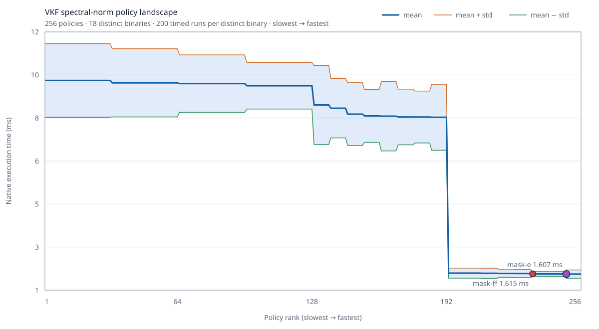

# VKF 0.1.5 Optimizer Policy Landscape



This experiment compiles the exact [spectral-norm medium VKF program](../../core-comparison/published/spectral-norm-medium/vkf.vkf) under every combination of eight legal optimizer switches. It checks every candidate against the scalar policy, deduplicates byte-identical machine code, and times each distinct binary 200 times in interleaved rounds.

| Result | Value |
| --- | ---: |
| Correct policies | 256 / 256 |
| Distinct machine-code binaries | 18 |
| Actual executions | 3636 |
| Search time | 42605.3 ms |
| Slowest policy mean | 12.021 ms |
| Fastest measured policy | `mask-4c` |
| Fastest measured mean | 2.304 ± 0.074 ms |
| Default `mask-ff` mean | 2.350 ± 0.158 ms |
| Fastest/slowest spread | 5.22× |
| Selected/default difference | 2.0% |

The complete machine-readable evidence, including all 256 policy records, hashes, output, compiler identity, and host conditions, is [windows-x64-v0.1.5.json](./windows-x64-v0.1.5.json).

## What The Policy Bits Mean

| Bit | Policy |
| ---: | --- |
| 0 | Borrow aggregate parameters instead of copying them. |
| 1 | Forward aggregate results directly into their destination. |
| 2 | Use packed matrix-reduction kernels when the exact safe loop shape is proven. |
| 3 | Keep proven integer locals as native integers. |
| 4 | Address proven vector indices with native integer registers. |
| 5 | Specialize parity checks. |
| 6 | Fuse multiply-add where target support and numeric rules permit it. |
| 7 | Use packed dual-dot reductions when the exact safe loop shape is proven. |

## The Idea

A single global optimization recipe is rarely best for every program. VKF represents lowering choices as data, emits several legal machine-code variants, verifies their result, and can retain the best policy for the exact program and host. A compilation time limit bounds the search in normal use; exhaustive search is an explicit benchmark mode.

Code-identical policies are timed once. Here, 256 logical policies collapse to 18 binaries, so the experiment performs 3636 executions rather than naively timing every alias independently.

## Honest Interpretation

The robust result is the large policy landscape: the best basin is about 5.22× faster than the slowest legal policy. The exact 2.0% lead of `mask-4c` over `mask-ff` is smaller than run-to-run variance and was not stable in a separate order-reversed check. It is a measured winner, not proof that it is universally faster. Release defaults therefore remain conservative, while profiles and future selectors can learn from the larger, repeatable policy effects.

## Reproduce

```powershell
node benchmarks/policy-landscape/run.mjs --compiler=build/native-compiler-clang/bin/vkf-strict.exe --runs=200 --output=benchmarks/policy-landscape/evidence/windows-x64-v0.1.5
```

The command is a benchmark tool only. Compiling or running VKF programs does not require Node, Python, a C++ compiler, assembler, or external linker.
