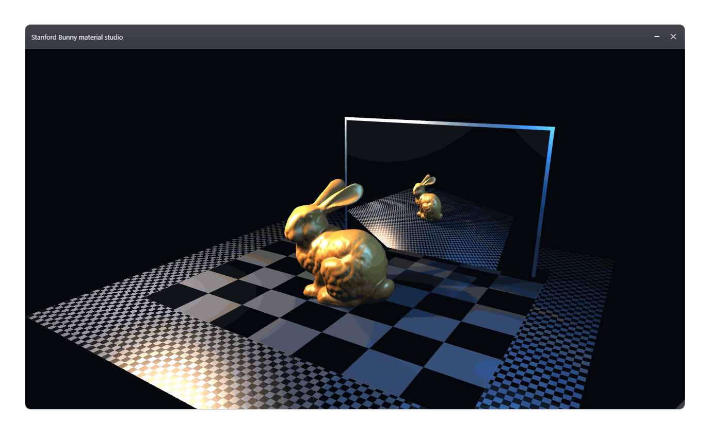

# 0.4 transparent overlay acceptance evidence

## Receipt

- Branch: `codex/0.4/040-transparent-overlay-audit`
- Base: `830b90ec2d7791157c1f53f8b8b1877c4af91f78`
- Slider queues: `5a844232d05e0214bed5d783fe7c804f8050e0b6`
- Static HTML bridge: `bb09d2238dcb81566119c3e6ec2e2991c144be5f`
- Capture media: `48a992158c5992c5c76c9038d48c2425a095d066`

## RED to GREEN

RED was established with:

```text
node --test tests/compiler/slider-event-parity.test.mjs
```

The compiler left `Input(id: "detail").events.get()` as generic `any`, so the
test could not observe the approved `SliderEvent|null` owner contract.

GREEN was reached one behavior at a time:

1. Native lowering recognizes an `Input` owner and emits a `SliderEvent|null`
   poll plus `SliderEvent`/`SliderValueChanged` arms.
2. Native and WASM queue runtimes deliver the same numeric event to component,
   frame, and display owners, preserve FIFO order, prefer the specific arm, and
   return `null` after drain.
3. The static HTML adapter emits `ButtonClicked` and `SliderValueChanged` from
   real DOM input without application JavaScript.
4. A real hidden Edge run loads the same nested HTML/CSS/SVG graph from native
   and WASM bundles, applies button and slider events, drags the retained frame,
   and leaves points outside declared hit regions non-interactive.

Affected suite:

```text
node --test \
  tests/compiler/frame-load-static-html-parity.test.mjs \
  tests/compiler/slider-event-parity.test.mjs \
  tests/compiler/owner-event-poll-lowering.test.mjs \
  tests/compiler/owner-event-loop-lowering.test.mjs \
  tests/compiler/owner-event-queues-parity.test.mjs \
  tests/js/vf-frame-drag-handle.test.cjs \
  tests/js/vf-media-capture.test.mjs \
  tests/js/transparent-overlay-media-freshness.test.mjs \
  tests/js/vf-compiled-ui-module-registry-seams.test.cjs \
  tests/js/vf-shared-rect-demo-compiled-runtime.test.cjs \
  tests/js/vf-shared-rect-demo-rendering.test.cjs
```

Result: **24 passed, 0 failed**. The compiler/stager and native owner-queue
executables were supplied through the focused environment variables documented
by their tests.

## Compiled application evidence

The native compiled UI demo was built as an actual DLL and loaded into a native
machine-code host test. Its update wrote the expected retained transform and
four geometry vertices:

```text
vf-compiled-ui-demo-loader-test passed
vf-shared-rect-demo compiled runtime tests passed
vf-shared-rect-demo rendering tests passed
```

The reusable acceptance fixture compiles two queue-drain loops from
`app.vkf`, one for the `Button` and one for the range `Input`. Native and WASM
static-resource artifacts contain byte-identical HTML, CSS, and SVG assets.

The hidden browser acceptance uses a test adapter to apply the compiled
fixture's observable view/value changes after consuming real runtime queue
events. It does not claim that the complete VKF action body is executed by the
browser's JavaScript engine.

## Off-screen capture

All capture execution used Edge `--headless=new`; no visible browser window was
created. Five compiled VKF interactions were each captured twice: the renderer
texture through `VfDisplay.__test.captureGeomFrameDataUrl(frameId)` and the
complete viewport through DevTools `Page.captureScreenshot`. The 1002x708
renderer capture contains only the WebGPU result. The 1376x861 compositor
capture includes that canvas, both frame headers, and the separate static
HTML/CSS controls.

The paired sequence covers four `ButtonClicked` view changes and one
`SliderValueChanged` alpha update. Every manifest pair records distinct
renderer and compositor hashes plus positive `static_html`, `frame_chrome`,
and `webgpu_canvas` observations. Build/test-only Pillow converts both
sequences into looping five-frame GIFs; the shipped application has no Pillow,
JavaScript library, or media-tool dependency.



The independent renderer-only oracle is
[`ui-transparent-overlay-offscreen-renderer.gif`](../public/images/readme-ui/ui-transparent-overlay-offscreen-renderer.gif).

The freshness manifest pins all relevant source and media SHA-256 hashes:
`docs/public/images/readme-ui/ui-transparent-overlay-offscreen.manifest.json`.
Its executable test validates both capture APIs, all paired layer observations,
source and media hashes, PNG/GIF signatures, dimensions, GIF loop metadata,
and frame counts.

## Transparent host audit

The native host remains the minimal Windows/WebView2 adapter: compiled UI
bootstrap, transparent-overlay geometry/hit-test messages, and runtime packet
transport stay below application semantics. Existing source establishes that
points outside explicit hit regions return transparent input behavior; the
hidden browser fixture independently proves that the generated geometry leaves
an outside point uncovered while its frame remains draggable.

The exact full `vf-overlay.exe` was not rebuilt in this worktree because neither
Visual Studio nor Ninja is installed on the host. This is a build-environment
limitation, not a failed behavior: native queue code and the compiled UI DLL
were built and executed with Clang, and all browser work ran hidden. The packet
does not touch G02's native host or portable-launch owned paths.

## Owned paths

- `compiler/native/vkf_ast_to_ir_smoke.cpp`
- `compiler/native/vkf_wasm_artifact_smoke.cpp`
- `native/VfOverlay/ui_owner_event_queues_test.cpp`
- `native/VfOverlay/vf/ui_runtime_contract.cpp`
- `native/VfOverlay/vf/ui_runtime_contract.hpp`
- `web/vf-ui/vf-runtime-packet-contract.js`
- `web/vf-ui/vf-static-html-loader.js`
- `tests/compiler/frame-load-static-html-parity.test.mjs`
- `tests/compiler/owner-event-loop-lowering.test.mjs`
- `tests/compiler/owner-event-queues-parity.test.mjs`
- `tests/compiler/slider-event-parity.test.mjs`
- `tests/fixtures/transparent-overlay-acceptance/**`
- `tests/js/transparent-overlay-media-freshness.test.mjs`
- `docs/plans/040-transparent-overlay-acceptance.md`
- `docs/public/images/readme-ui/ui-transparent-overlay-offscreen.*`
- `docs/evidence/040-transparent-overlay-acceptance.md`
