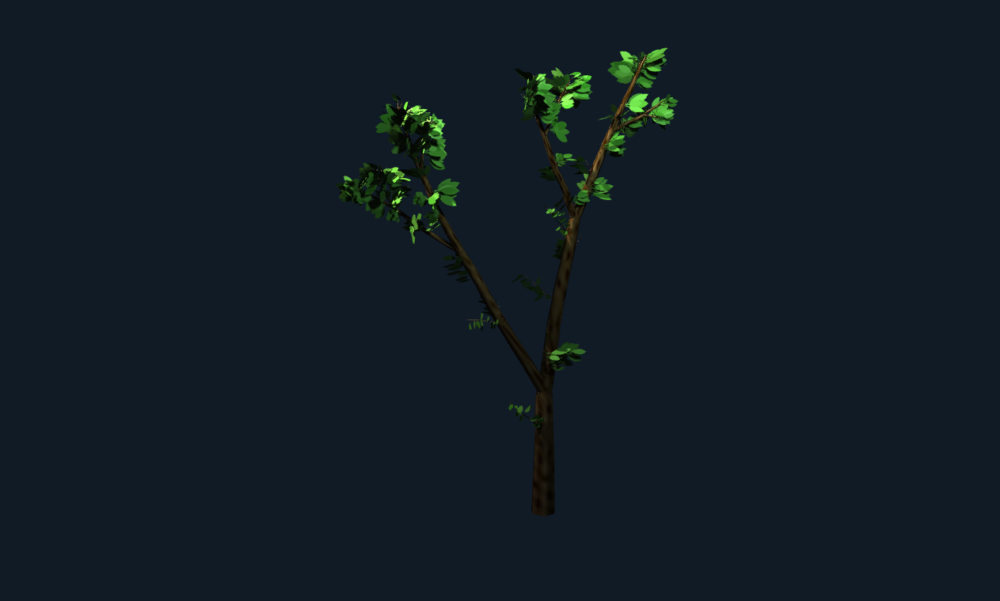
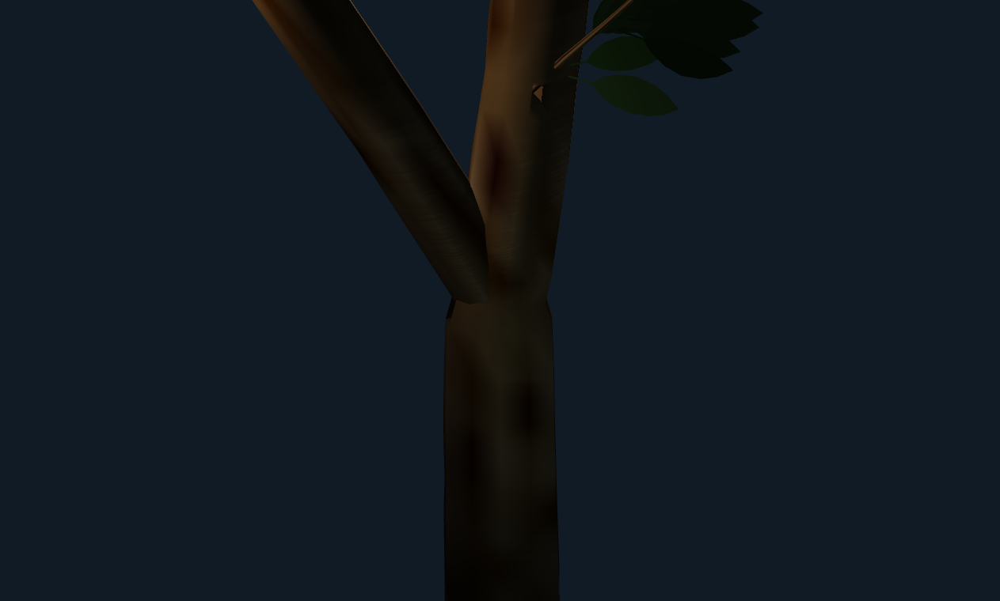
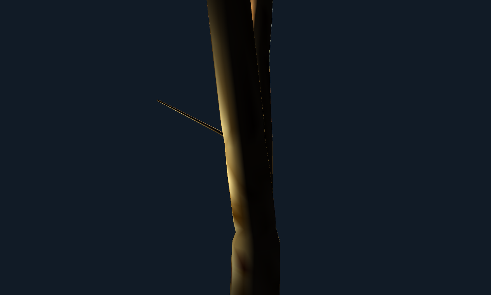
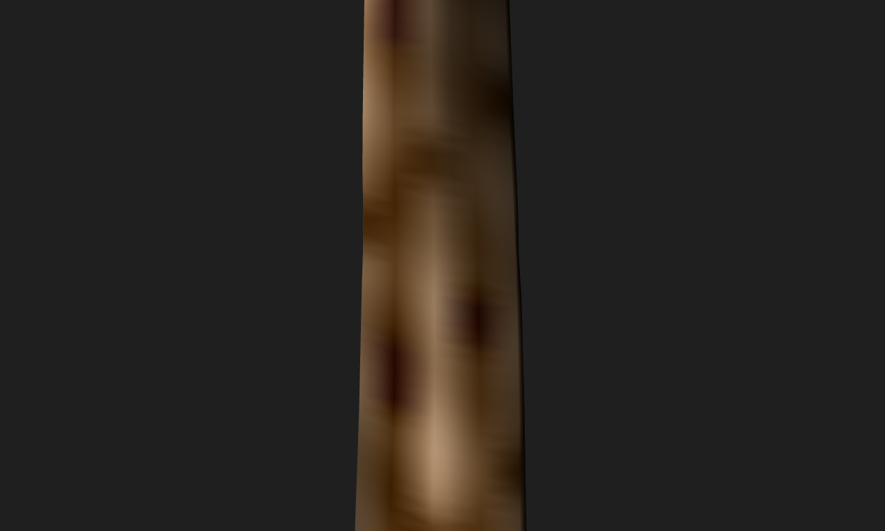

# R6 deterministic static tree WebGPU candidate (rejected)

Date: 2026-09-06. Base: `6cbbb22d4162349782e4bc9b0f5e33237e1beffb`.
Branch: `pre-gen`.

Status: **CANDIDATE / REJECTED by independent visual QA.** The full-tree
silhouette and main fork passed specimen review. The twig-graft proof failed
because the shoot reads as a thin spike and a lower parent bump remains. The
neutral-light bark proof failed because broad blurred albedo bands do not make
the intended ridge/fissure relief readable. These captures are retained as
negative evidence for R7, not as accepted static-tree proof.









## Scope

This private reference packet carries one deterministic specimen through the
existing forest population, geometry, material, retained-packet, and real
WebGPU renderer chain. It changes no VKF syntax, public constructor, schema,
ABI, default, or diagnostic. Physics, wind, motion, and animation remain zero.

The implementation is an evidence-backed subset, not a claimed reproduction of
any paper. The immutable private species profile owns path-length, split,
apical-control, area-loss, crown-envelope, curvature, shoot, leaf, and bark
statistics so later species configuration is data-driven rather than embedded
throughout the algorithms.

## Growth model

The generator samples 72 deterministic attraction points inside one sampled,
rotated crown ellipsoid. Each bud selects nearby compatible points, scores
light, free-space, incoming alignment, and species apical control, and steers
toward their aggregate direction. Consumed branch-path arc length—not vertical
height—is the termination budget. Candidate spans are shortened or bent at the
ellipsoid boundary. Correlated bounded turn noise produces seven-step trunk,
five-step branch, and three-step twig centerlines. The mesh transports its ring
frame along those curves using parallel transport.

Every structural branch point ends the incoming segment and emits two
non-collinear children. The continuation child receives the larger area share
and the smaller deviation. Child radii use the generalized allometric relation
with exponent 2 and a deterministic loss factor q strictly below 1, so
`sum(r_child^2) < r_parent^2` at every split. Path-specific length budgets,
bud vigor, taper, and envelope attraction vary deterministically while all
paths remain finite.

Lateral shoots follow golden-angle phyllotaxis with bounded jitter. Their
emission probability is low but nonzero on thick parents and increases
monotonically as parent radius decreases. Leaves attach only to these shoots or
terminal twig-class paths. Attachments are stratified continuously from 0.05
through 0.82 of twig arc length, so proximal and middle leaves dominate while
terminal leaves remain possible. Each leaf is a double-sided pointed-ovate mesh
with a narrow petiole, broad interior, sharp apex, finite normals/UVs, and
bounded approximately-normal variation.

## Connected fork skin and bark

All 270 woody paths are tapered conic/frustum spans. There are no sphere,
collar, bead, ball, ring-cover, or other standalone connector primitives.
At each of 206 junctions, the parent and child rings are partitioned and
stitched into the same indexed fork skin. Internal caps are zero; boundary and
non-manifold edges are zero. Junction radial scale stays from 0.96 through
1.00 of the local port radius, connector component count is zero, and
parallel-transported tangents/normals and path-relative bark V continue through
the common surface.

Bark is produced in the real material/mesh path from a species-weighted feature
grammar of longitudinal ridge, furrow, fissure, and lenticel signals. Coupled
multi-scale fields modulate albedo, roughness, and radial depth/displacement.
The neutral-light capture disables cast/receive shadows and confirms numeric
material variation reaches the renderer. Visual QA nevertheless rejects it:
the current broad albedo bands do not resolve as readable bark relief.

The pinned specimen contains 2,236 retained primitives: one trunk, one
non-rendered coarse crown envelope, 30 structural branches, 239 twigs, and
1,965 individual leaves. The WebGPU packet contains 63,628 vertices and
334,596 indices: 32,188/193,116 wood and 31,440/141,480 foliage. It remains
inside explicit 65,536-vertex, 393,216-index, and 2,400-primitive limits.

## RED to GREEN

Focused tests prove:

- deterministic same-seed replay, visible alternate-seed variation, and bounded
  inter-tree and intra-path variation;
- attraction-point/bud metadata, finite consumed path budgets, and every path
  endpoint and rendered vertex within its sampled ellipsoid;
- exact parent-ending binary linkage, nonzero ordered child angles, strict
  lossy allometric area decrease, taper, and terminal convergence;
- multi-step correlated curvature with bounded per-step turns and monotonically
  increasing turn variance as radius decreases;
- nonzero thick-parent shoots, higher thin-parent frequency, a pinned
  trunk-origin shoot, twig-only leaves, more than 80% nonterminal attachments,
  and multi-bin height/radius/azimuth crown occupancy;
- pointed-ovate non-card leaf topology, centered bounded variation, finite
  normals/UVs, positive area, and bounded blade size;
- zero internal caps, zero boundary/non-manifold edges, no duplicate coplanar
  triangles, no standalone connector, 0.96--1.00 junction radial scale,
  bounded tangent transition, and continuous bark coordinates;
- bark albedo, roughness, and depth variation with periodic grain continuity
  and explicit primitive/vertex/index/RAM ceilings.

## Gates and capture

| Gate | Result |
| --- | --- |
| Geometry/species + retained packet + WebGPU tests | 18/18 GREEN |
| All tree/forest/wood JavaScript tests | 77/82; five pre-existing wood-material identity/energy assertions fail independently of R6 tree modules |
| `git diff --check` | GREEN |
| Four Headless Edge real-WebGPU captures | Execution GREEN, exit 0 each; visual QA REJECTED twig graft and neutral bark |

All captures are 1,263 by 760 from the real WebGPU renderer at 4x MSAA.
The full frame uses a 2.35 key and 1.45 fill to expose leaf form and bark
without a fake canvas/image fallback. The twig and neutral-bark proofs disable
cast/receive shadows on their isolated wood views. No capture uses physics.

| Capture | Bytes | SHA-256 |
| --- | ---: | --- |
| `060-static-tree-webgpu-review6.png` | 132,819 | `BA70FC7B003A1357F5D8E2C2BE12576521DF8873876273E1550DB3AE2324A16F` |
| `060-static-tree-webgpu-review6-main-fork.png` | 155,849 | `C73CF25025900D1F1A3664D848CADE3BB2431EBFEEA2E9E9B9F243DB1657BAE0` |
| `060-static-tree-webgpu-review6-twig-junction.png` | 99,943 | `44B69E779517D4E1EFFE147B036B253B56CB790B226309BE3BE724C87B21AEC2` |
| `060-static-tree-webgpu-review6-bark-neutral.png` | 171,835 | `60801AC84532CFC036C89A98EB50259FD199A3C67422FEA136490E1BDDAA72F4` |

Reproduce:

```text
node --test tests/js/vf-tree-geometry-plan.test.mjs tests/js/vf-tree-renderer-packets.test.mjs tests/js/vf-tree-webgpu-packets.test.mjs
node tests/helpers/capture_mirror_scene.js tests/fixtures/tree-webgpu-static-smoke.html docs/evidence/060-static-tree-webgpu-review6.png 0 9380 tree_webgpu_static_frame
node tests/helpers/capture_mirror_scene.js tests/fixtures/tree-webgpu-static-smoke.html docs/evidence/060-static-tree-webgpu-review6-main-fork.png 0 9381 tree_webgpu_junction_frame
node tests/helpers/capture_mirror_scene.js tests/fixtures/tree-webgpu-static-smoke.html docs/evidence/060-static-tree-webgpu-review6-twig-junction.png 0 9382 tree_webgpu_twig_junction_frame
node tests/helpers/capture_mirror_scene.js tests/fixtures/tree-webgpu-static-smoke.html docs/evidence/060-static-tree-webgpu-review6-bark-neutral.png 0 9383 tree_webgpu_bark_neutral_frame
```

## Research basis

- Runions, Lane, and Prusinkiewicz (2007), space colonization:
  https://doi.org/10.2312/NPH/NPH07/063-070
- Palubicki et al. (2009), self-organizing trees and bud competition:
  https://algorithmicbotany.org/papers/selforg.sig2009.html
- Eloy (2011), generalized Leonardo allometry:
  https://www.irphe.fr/~eloy/assets/pdf/PRL2011.pdf
- Mäkelä (2002), pipe-model taper and supported foliage:
  https://pubmed.ncbi.nlm.nih.gov/12204846/
- Smooth centerline/cross-section branch volumes:
  https://arxiv.org/abs/2607.05421
- Layered procedural bark feature grammar:
  https://doi.org/10.13203/j.whugis20250189

## Static review boundary

R6 is preserved as a rejected candidate. R7 must replace the spike-like twig
graft and blurred bark proof before static acceptance. Branch elasticity, free
leaf response, wind coupling, and all other physics remain prohibited pending
later approval.
