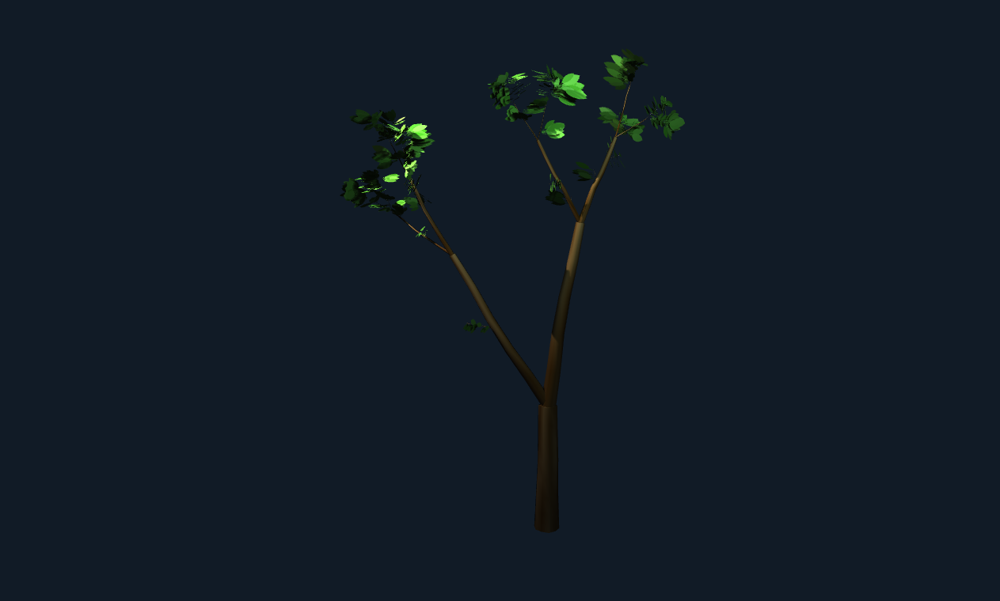

# Deterministic static tree WebGPU demonstration

Date: 2026-09-06. Base: `694798ca31ac122c8d0564dd3561bb60557d1f95`.
Branch: `pre-gen`.



## Scope

This private reference packet carries one tree through the existing conditioned
forest population, tree geometry, tree material, retained packet, and real
WebGPU renderer chain. It changes no VKF syntax, public constructor, schema,
ABI, default, or diagnostic. Physics, wind, and animation remain excluded.

The generator is driven by an internal immutable species profile. Profiles
contain distribution statistics for root-to-tip path length, split angles and
ratios, apical dominance, cross-sectional area loss, crown ellipsoid axes and
orientation, local attraction, twig and leaf density, and bark texture
mixtures. The current five profiles are private implementation data intended to
make later species configuration possible without hardcoding one species into
the algorithms.

Every woody parent ends at its split and has exactly two deviating children.
The larger child deviates less. At every split, the sum of child squared radii
is strictly less than the parent squared radius. Segment length consumes a
deterministic root-to-tip arc-length budget; child budgets condition from the
parent remainder. A sampled rotated ellipsoid bounds growth. A candidate that
would escape is shortened or terminated deterministically. This prevents
horizontal paths from escaping a height-only budget.

Woody paths are no longer straight chords. Each trunk, branch, and twig is a
seven-, five-, or three-step curve respectively. Deterministic correlated
yaw/pitch turn signals persist from step to step, remain below a profile-owned
maximum turn, and have monotonically greater variance as radius decreases.
Ring centers and averaged tangents follow the same retained curve in the real
WebGPU tube mesh, giving smooth tangent transitions without a jagged zigzag.

The selected tree has 1,157 retained primitives: one trunk, one non-rendered
coarse crown envelope, fourteen structural branches, seventy-nine thin twigs,
and 1,062 individual leaf sites. Forty-eight twigs are recursive terminal
topology; thirty-one are much thinner lateral shoots from structural parents.
The shoot probability is low but nonzero at trunk radius and rises smoothly as
parent radius decreases; there is no hard eligibility threshold. Across the
pinned four-seed cohort, trunk/thick-parent shoots occur but remain less
frequent than thin-parent shoots, and pinned tree 3 has a trunk-origin shoot.

Leaves never attach directly to trunk or structural branch. Each leaf is one
continuously positioned, stratified site along an eligible twig arc, rather
than a multi-leaf terminal cluster anchor. More than 80% of the pinned tree's
leaves lie before normalized twig position 0.72, while some terminal leaves
remain. Blade scale is reduced from the previous capture and bounded to
0.038--0.065 of sampled crown height. The 1,062 leaves use real pointed-ovate meshes:
a thin petiole, rounded broad blade body, and sharp apex. Conditioned
approximately-normal samples vary dimensions, roundness, asymmetry, petiole,
camber, attachment, orientation, and color within finite physical bounds.

All visible wood uses procedural vertex geometry and material variation in the
real WebGPU path. Periodic longitudinal grain/ridges deform multiple axial
rings, while bounded vertex color and roughness vary from one coherent
tree-wide bark field. No bark image, raster stand-in, canvas fallback, or fake
renderer is used.

Exact output is 19,428 vertices and 89,952 indices: 2,436/13,488 wood and
16,992/76,464 foliage. It remains below explicit 32,768-vertex and
131,072-index fixture budgets. A complete tree is bounded to 1,690 retained
primitives; the adapter independently caps 65,536 vertices and 393,216 indices.

## RED to GREEN

The review began at focused 3/9 GREEN: six assertions still described the old
fixed attachment/count model. The replacement tests now prove:

- exact end-of-parent binary linkage and no cylinder protrusion past a split;
- nonzero child deviations and larger-radius child angle ordering;
- strict squared-radius area loss and taper toward terminal epsilon;
- strictly consumed finite arc-length budgets and bounded termination;
- every segment endpoint and every emitted WebGPU vertex inside the ellipsoid;
- deterministic replay, seed variation, whole-tree envelope variance, and
  path-local conditioned variance;
- leaf parents are eligible twigs and nonterminal attachment positions exist;
- trunk and thick-parent lateral-twig frequency is nonzero yet below the
  aggregate thin-parent frequency across a fixed multi-seed cohort;
- leaf occupancy spans at least three height bins, three radial bins, and four
  angular bins, eliminating terminal-only pom-pom placement;
- finite nondegenerate pointed-ovate leaf triangles, normals, UVs, and centered
  bounded distribution statistics;
- multi-step nonzero curved paths, monotonically rising radius-band turn
  variance, correlated turns, bounded per-step angles, and envelope-contained
  endpoints under the original arc-length budgets;
- reduced bounded blade area and a pinned majority of leaves before the
  terminal twig band;
- nonuniform procedural bark color/roughness, periodic seam continuity, and
  hard primitive/vertex/index/RAM bounds.

## Gates and capture

| Gate | Result |
| --- | --- |
| Geometry/species tests | 8/8 GREEN |
| Focused geometry + renderer-packet + WebGPU + wood tests | 18/18 GREEN |
| All tree/forest/wood JavaScript tests | 34/34 GREEN |
| Headless Edge real WebGPU capture | GREEN |
| `git diff --check` | GREEN |

Headless Edge initialized WebGPU at 1,263 by 760 with two lit renderer parts,
4x MSAA, and two active clustered lights. A warm key at 2.25 and front fill at
1.25 reveal bark ridges and leaf silhouettes without visible clipping.
Initialization failures, provider errors,
runtime failures, and WebGPU errors were empty. Both parts reported no physics
runtime; physics particles and steps were zero. The tracked 100,689-byte PNG is
`docs/evidence/060-static-tree-webgpu-review4.png`, SHA-256
`B61EFC6FA3C3102ED400FCCB61223FF5B22CB9D4C31C975DF5AE3CB9FDEE4E59`.

Reproduce:

```text
node --test tests/js/vf-tree-geometry-plan.test.mjs tests/js/vf-tree-renderer-packets.test.mjs tests/js/vf-tree-webgpu-packets.test.mjs
node tests/helpers/capture_mirror_scene.js tests/fixtures/tree-webgpu-static-smoke.html docs/evidence/060-static-tree-webgpu-review4.png 0 9366 tree_webgpu_static_frame
```

## Static review boundary

This packet stops at Viktor's requested static review gate. Branch elasticity,
leaf motion, wind response, and physics coupling require separate approval.
