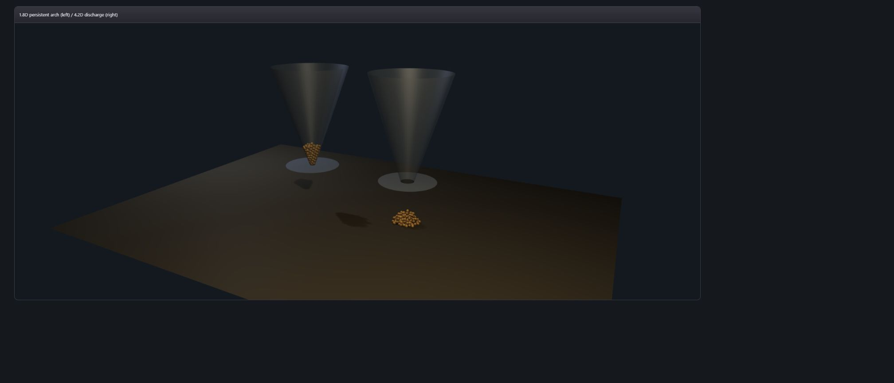

# Dry-sand outlet arch diagnostic evidence

Status: private deterministic reference packet. No public VKF syntax or semantic change. No performance claim.

## Contract

The hopper solver reports `no-flow-arch` only after its existing small-outlet throat lock has held for 24 fixed steps without any change in discharged mass. The diagnostic records outlet diameter in mean-grain diameters, throat population, lock/confirmation steps and discharged count. Once locked, an undischarged grain already marginally below the crossing plane is returned to the physical plate boundary; this removes the former post-lock leak while retaining the same authoritative particle state used by rendering.

Reset restores the flowing diagnostic. Same seed and options reproduce the diagnostic exactly.

## Measured outlet cohort

Seed `0x3129`, 512 grains, four simulated seconds:

| Outlet / mean grain | Status | Discharged | Mean rate | State hash |
| ---: | --- | ---: | ---: | --- |
| 1.8 | no-flow-arch | 0 | 0 | `6ae3b456` |
| 2.2 | no-flow-arch | 0 | 0 | `f20989a0` |
| 2.5 | no-flow-arch | 0 | 0 | `92835215` |
| 2.8 | flowing | 284 | 74.086958 | `d0029dc7` |
| 3.2 | flowing | 391 | 103.612329 | `b58516cc` |
| 4.5 | flowing | 512 | 238.139524 | `97c77997` |

This is measured behavior of the bounded authored reference, not a universal granular-flow law.

Pinned no-flow case (`0x3129`, 512 grains, 1.8D): 10 throat grains; lock step 15; confirmation step 38; discharged count remains zero.

## Gates

- RED: persistent-arch test initially had no solver diagnostic.
- GREEN: hopper 20/20; aggregate/BCRE 5/5; total relevant 25/25.
- Exact replay: pinned diagnostic deep-equal after independent realization.
- Outlet response: 1.8D/2.2D/2.5D no-flow; 2.8D/3.2D/4.5D flowing with increasing measured rate.
- WebGPU fixture test: blocked and flowing worlds use the same ellipsoid grain packet and visible physical outlet hardware; no canvas fallback.

## Real WebGPU capture

- 2016x865 PNG, 28,572 bytes
- SHA-256 `835ad7ca88ff8ce538eeaa19adb8312db0fd9d43ae2189d21475e8abf664e38d`
- Visual QA: left 1.8D throat retains a compact grain arch beneath the hopper; right 4.2D outlet has discharged a visible pile. Both scenes show the physical plate opening and share the canonical solver-derived render path.
