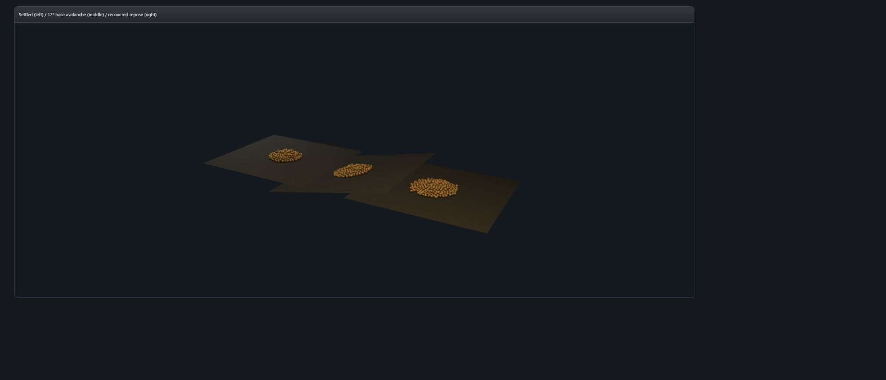

# Dry-sand base-disturbance avalanche evidence

Status: private deterministic reference packet. No public VKF syntax or semantic change. No performance claim.

## Contract

The canonical grain world owns a bounded planar base tilt (`+/-28` degrees). Changing tilt carries already-discharged contacting grains with the support rotation before fixed-step integration resumes. This avoids injecting a penetration impulse or ballistic launch. Gravity, grain contacts, Coulomb friction, rolling resistance, restitution, and the existing projection loop then produce the downslope response. Restoring zero tilt rotates the supported state back with the base and lets the same solver recover.

The stability measurement reads the authoritative particle SoA directly: conserved discharged/active counts, RMS grain speed, downslope centroid, maximum grain height, and the existing repose estimator. Rendering snapshots are generated from those exact states through the existing ellipsoid packet path.

## Pinned measurement

Seed `0xa71a`, 256 standard grains, 4.5D outlet:

| Phase | Fixed steps | Speed RMS | Downslope centroid | Maximum height | Repose |
| --- | ---: | ---: | ---: | ---: | ---: |
| settled flat base | 480 | 0.023929 | 0.000714 | 0.147301 | 17.7835 deg |
| 12-degree tilted base | 96 | 0.036970 | 0.040486 | 0.144054 | 47.2233 deg |
| restored flat base | 360 | 0.021117 | 0.032425 | 0.118134 | 31.7511 deg |

All phases retain exactly 256 grains with zero count-based mass error. Two independent realizations produce deep-equal recovered metrics and byte-identical final positions.

The tilted phase raises RMS speed by 54.5% and shifts the grain centroid 0.03977 units downslope without exceeding the settled maximum height. After restoring the base, RMS speed falls below 65% of the disturbed value and repose returns to the accepted 24-39 degree band.

## RED to GREEN

1. RED: no base-disturbance or pile-stability reference interface existed.
2. GREEN: bounded deterministic tilt, canonical-state measurements, conservation, downslope motion, damping, and repose recovery.
3. Visual RED: abrupt plane replacement launched a ballistic grain column.
4. GREEN: support-frame rotation precedes release; the maximum-height gate prevents recurrence.

Final relevant gates: hopper 22/22 and aggregate/BCRE 5/5, total 27/27.

## Real WebGPU capture

- 2016x865 PNG, 26,323 bytes
- SHA-256 `5e03a3159273a36e06d1b454eb054edcf3e86e304cdb440b3bd99b8d1466c76c`
- Visual QA: the left pile is compact on a flat support; the middle state has migrated and elongated down the 12-degree support without airborne grains; the right pile is stationary and spread at recovered repose. All three are canonical grain-state WebGPU packets, not fallback imagery.
