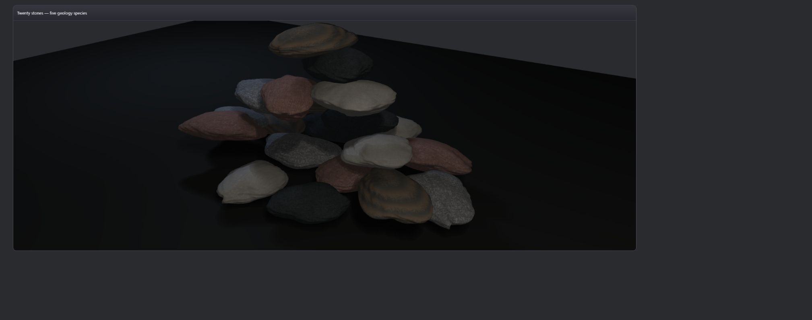

# Stone species relief spectra

Status: private deterministic material refinement. No public VKF syntax or semantic change. No performance claim. High-frequency relief adds no geometry.

## Gap closed

The five stone species already owned distinct shape proportions, mineral palettes, and roughness bounds, but their per-fragment normal and horizon-shadow paths all sampled one granite relief spectrum. This packet gives each internal species profile a bounded frequency/amplitude pair used by both the CPU evidence oracle and the real WebGPU normal/self-shadow path:

| Species | Frequency scale | Amplitude scale | Measured height deviation | Measured transition density | L/R shadow reversal |
| --- | ---: | ---: | ---: | ---: | ---: |
| gray granite | 1.00 | 1.00 | 0.002790 | 0.2606 | 0.5410 |
| red granite | 0.92 | 0.92 | 0.001947 | 0.3280 | 0.3945 |
| pale quartzite | 0.72 | 0.52 | 0.001113 | 0.2546 | 0.0996 |
| dark basalt | 1.80 | 0.68 | 0.001328 | 0.4894 | 0.4619 |
| banded gneiss | 1.12 | 0.84 | 0.002528 | 0.3164 | 0.4404 |

Measurements use one deterministic individual identity per species, a 32x32 object-triplanar probe, and footprint 0.0015. Basalt's transition density is 1.92x quartzite's; quartzite height deviation is 39.9% of gray granite's. Every maximum absolute height remains below 0.014, every species retains directional horizon-shadow reversal, same inputs replay byte-exact, and all five height hashes differ.

The shader applies the same profile to finite-difference normals, footprint filtering, horizon step spacing, and horizon height samples. Species color remains light-independent. Geometry positions, indices, and triangle counts are untouched.

## RED to GREEN

1. RED: no species relief oracle existed; all renderer relief calls were granite-only.
2. GREEN: five deterministic bounded spectra separate scale/amplitude while retaining directional response.
3. RED: renderer did not consume the species profile in normal/horizon paths.
4. GREEN: real receiver shader consumes species index for both paths.

Full relevant rock/stone/granite suite: **57/57 GREEN** across 14 files. Fresh-origin real WebGPU compilation produced no application shader, validation, or runtime error. Browser-extension-only diagnostics are excluded.

## Real WebGPU capture

- 2017x795 PNG, 39,448 bytes
- SHA-256 `2e54b45b36a9068e09d06db5ee09d696e304a2e16085cd8a40f94110c3068f03`
- Visual QA: five mineral families remain readable; pale quartzite carries subdued broad relief, basalt reads finer, granite families retain stronger granular relief, and gneiss keeps broader banded structure. Pile shape/contact state and camera are unchanged.
