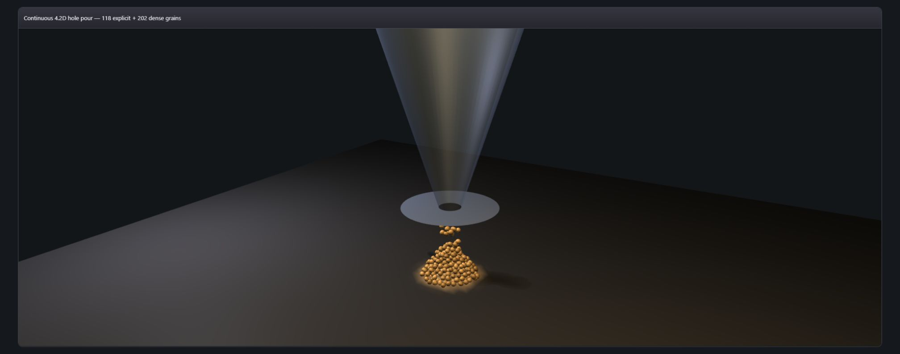

# Continuous dry-sand hole-pour handoff

Status: private deterministic integration packet. No public VKF syntax or semantic change. No performance claim.

## Gap closed

Earlier receipts independently proved explicit-grain discharge and a conservative one-time transfer into dense aggregate state. This packet adds one fixed-step orchestration that advances the existing hopper/contact solver, transfers only settled discharged grains, and performs one BCRE relaxation step. It returns a conservation receipt measured throughout the pour. Rendering still derives explicit ellipsoids and the dense surface from those same two linked states; an aggregated grain has zero explicit render radius and cannot be drawn twice.

## Pinned completion

Seed `0x6a11`, 320 standard grains, 4.2 mean-grain-diameter outlet, 720 fixed steps:

- transferred: 320
- explicit: 0
- dense grain equivalent: 320
- maximum count error across all steps: 0
- maximum physical mass error: `2.842170943040401e-14 kg`
- final dense mass: `37.223372508843035 kg`
- per-grain mass: `0.11632303909013442 kg`
- final maximum slope: `31.00000000888692 degrees`
- configured repose: `31 degrees`
- final height hash: `93bb698c`

Independent replay produces deep-equal receipts and byte-identical explicit positions and aggregate heights. The maximum mass residual is below one millionth of one grain mass.

The visual phase at step 240 is also measured, not authored: 118 explicit grains plus 202 dense grain equivalents, count error zero, maximum mass error `1.4210854715202004e-14 kg`, maximum slope `31.48955236161356 degrees`, height hash `2fd65b11`.

## RED to GREEN

1. RED: no continuous coupled pour/handoff operation or whole-run conservation receipt existed.
2. GREEN: one deterministic fixed-step path conserves count/mass while sharing canonical physics and render state.
3. RED: no fixture consumed that operation in real WebGPU.
4. GREEN: fixture shows the physical circular opening, active grain stream, explicit contact grains, and dense repose surface with no canvas/image fallback.

Final relevant result: hopper 22/22 plus aggregate/BCRE 7/7, **29/29 GREEN**.

## Real WebGPU capture

- 2016x795 PNG, 36,516 bytes
- SHA-256 `5589f626a4189898fc268aa81c246607ef7d97cd3bbf46a8b95f812f8318e98a`
- Visual QA: grains visibly cross the exact annular plate opening, contact the receiving pile, and coexist with the dense aggregate surface. The stream and pile remain readable; no floating duplicate dense/explicit population is visible. Fresh-origin capture produced no application renderer/WGPU error; browser-extension-only diagnostics are excluded.
