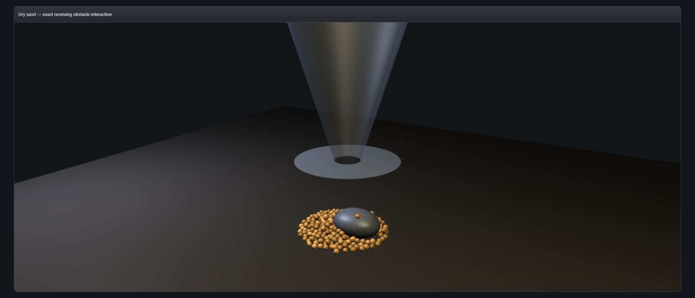

# 086 — Dry-sand pile interaction

Status: private deterministic reference proof. No public VKF syntax or semantics change.

The canonical fixed-step grain state now supports an exact configured receiving ellipsoid. Grain centers collide against the Minkowski-expanded surface, share the existing PBD position/velocity state, and render beside a mesh generated from the same center and radii. This is an explicit receiving ellipsoid, not a rock/material claim.

Pinned seed `0xb01d`, 256 grains, 600 steps:

- conserved grains: 256 discharged + 0 active; mass error 0
- unique grains contacting obstacle: 176
- minimum normalized expanded-surface clearance: 0.9999999711
- pile centroid X: -0.091833972 (obstacle center X is +0.10)
- mean pile radial distance: 0.2819455491
- replay: metrics and Float32 position SHA-256 byte-identical

## Real WebGPU capture

The frame uses `unified_renderer: true`, the canonical oriented-grain packet, the exact obstacle packet, and circular hopper hardware. Visual inspection: grains contact and wrap around the offset ellipsoid; no visible floating or obstacle penetration. Application/shader/WGPU errors: 0. A known Chrome WebGPU-devtools extension diagnostic was excluded because it is outside the application origin.

## Gates

- `node --test tests/js/vf-sand-hopper.test.mjs`: 25/25
- `node --test tests/js/vf-sand-aggregate-lod.test.mjs`: 7/7

No performance claim is made.
