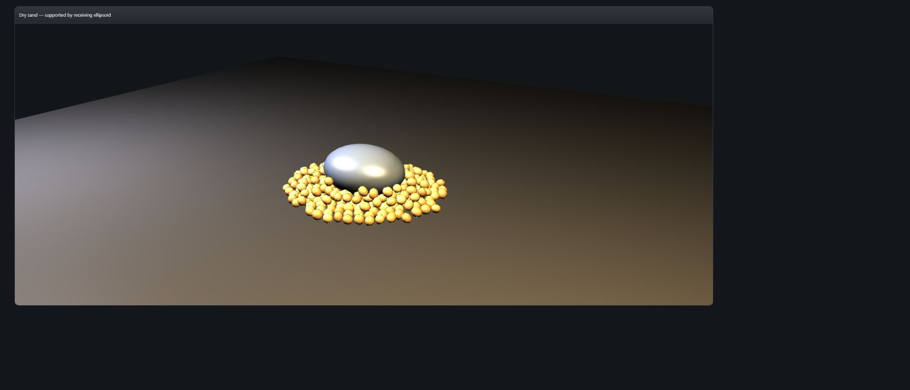
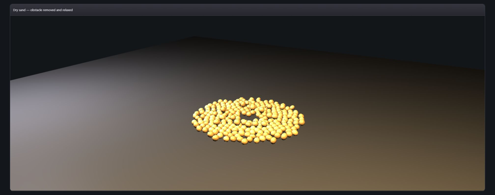

# 087 — Dry-sand support removal

Status: private deterministic object-interaction proof. No public VKF syntax or semantics change.

No existing cohesive/wet-sand model was present, so this packet does not invent moisture semantics. It instead advances the canonical dry-grain/object interaction: an exact receiving ellipsoid can be removed, after which the same fixed-step PBD grain state relaxes under gravity and contacts. No particle is created, deleted, or transferred to a separate render state.

Pinned seed `0xb01e`, 256 grains:

- supported height after 600 steps: 0.1368377054
- height 120 steps after removal: 0.1093681077
- relaxed height after another 360 steps: 0.0936850304
- RMS speed: 0.0255977198 supported; 0.0219222227 relaxed
- conserved grains: 256; mass error 0
- replay: relaxed metrics and Float32 positions byte-identical

The residual annular footprint is intentionally visible and documented: this bounded dry-grain reference demonstrates released support and geometric relaxation, not complete cavity infill or a continuum claim.

## Real WebGPU captures

Both frames use `unified_renderer: true` and render the canonical oriented-grain state. Visual inspection confirms supported grains drop after removal, height decreases, all grains remain on the plane, and no hidden replacement mesh appears. Application/shader/WGPU errors: 0; known Chrome-extension diagnostics excluded.

## Gates

- `node --test tests/js/vf-sand-hopper.test.mjs`: 27/27
- `node --test tests/js/vf-sand-aggregate-lod.test.mjs`: 7/7

No performance claim is made.
