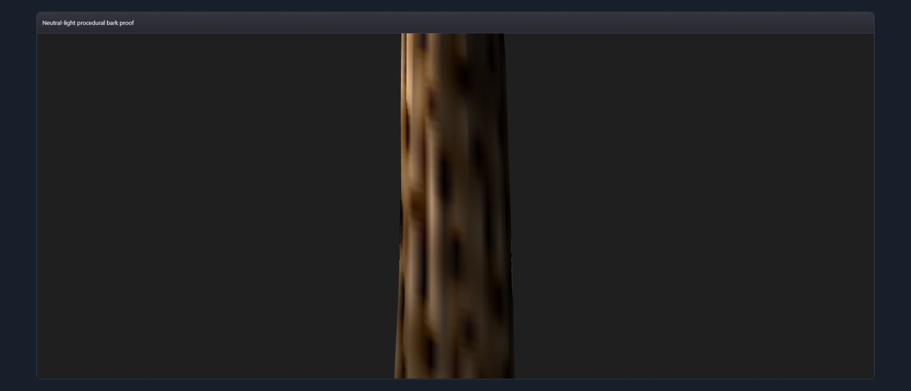
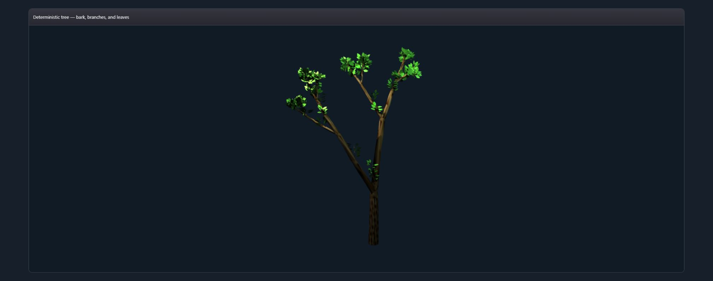

# 088 — Species-owned tree bark bandwidth

Status: private R7 bark refinement candidate. No public VKF syntax/semantics or performance claim. Static-tree visual acceptance remains open; physics remains absent.

## Gap narrowed

The preserved R6 evidence rejected broad blurred bark bands. R7 had added real vertex material/normal/displacement channels, but important frequencies and weights remained hardcoded inside the mesh adapter. This packet moves fissure sharpness, fissure/grain axial frequencies, micro-ridge weight, and micro-ridge frequency into the private species profile and consumes them through the same deterministic bark sampler.

Species profiles now bound 10–18 circumferential ridges, fissure sharpness 7–8.8, grain frequency at least twice fissure frequency, and micro-ridge weight 0.24–0.29. Actual output tests require dense roughness transitions across more than 12% of neighboring wood vertices. The existing 30×64 trunk sampling, complete leaf population, topology, geometry budget, replay identity, and junction contracts remain intact. Attempts to increase sampling were rejected by the established alternate-seed 65,536-vertex gate and were not retained.

## Real WebGPU proof

Visual QA: compared with the preserved R6 neutral proof, the trunk shows more numerous, narrower longitudinal ridges and irregular fissure breaks under neutral lights. The full-tree frame remains sparse/end-heavy and is included for context, not acceptance. This packet does not claim the twig-graft or complete static specimen is visually accepted.

Both frames use `unified_renderer: true`; application shader/validation/runtime errors: 0. Known Chrome-extension diagnostics are excluded.

## Gates

- seven tree suites: 33/33 GREEN
- alternate-seed replay and 65,536-vertex hard budget: GREEN
- connected fork skin, caps, taper, envelope, deterministic leaves: unchanged GREEN
- `git diff --check`: GREEN

No renderer fallback, motion, wind, elasticity, or public API change.
